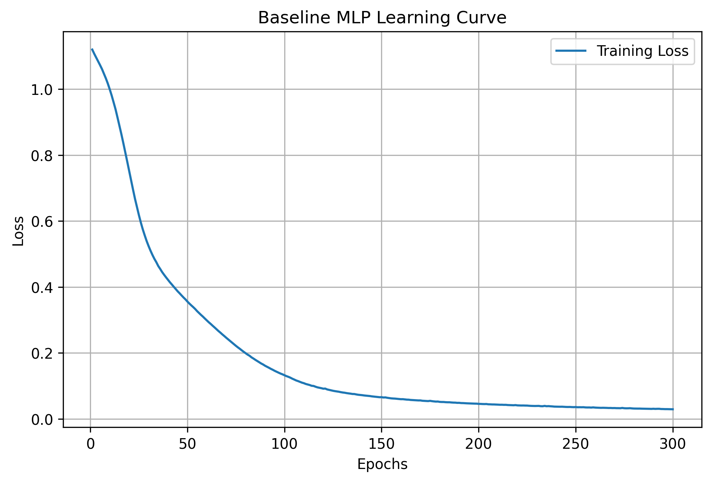
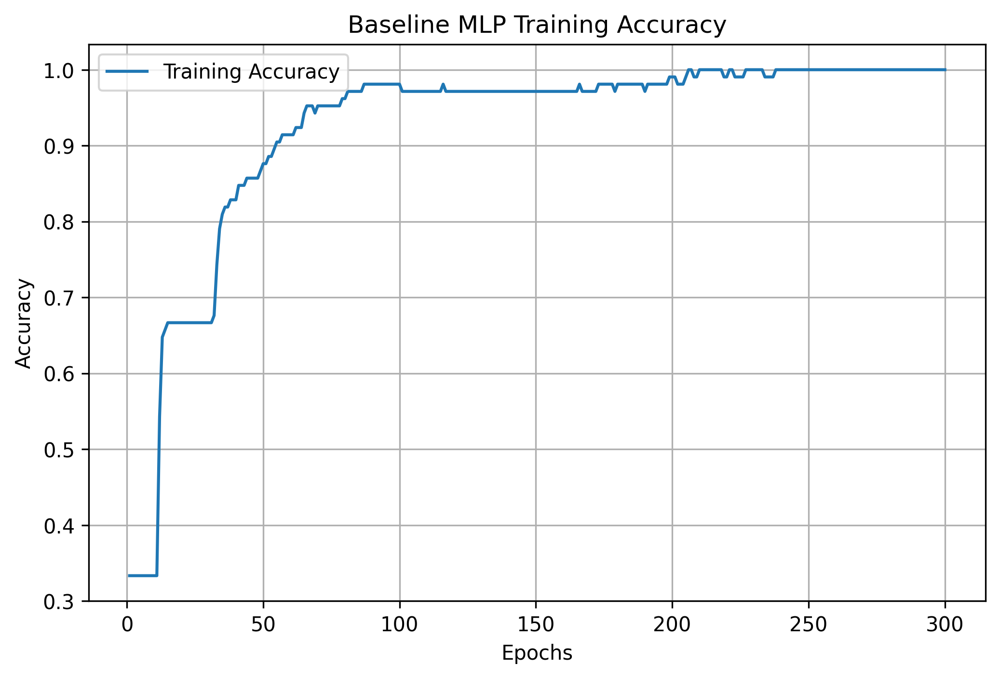
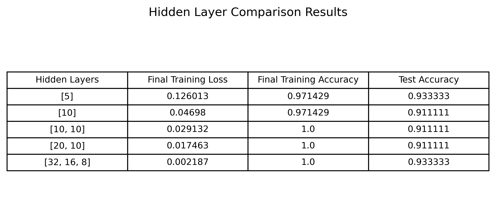
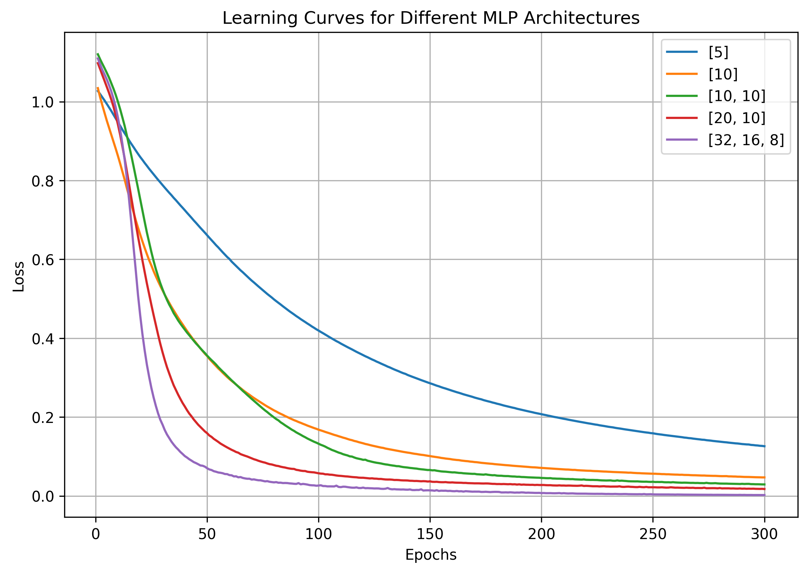
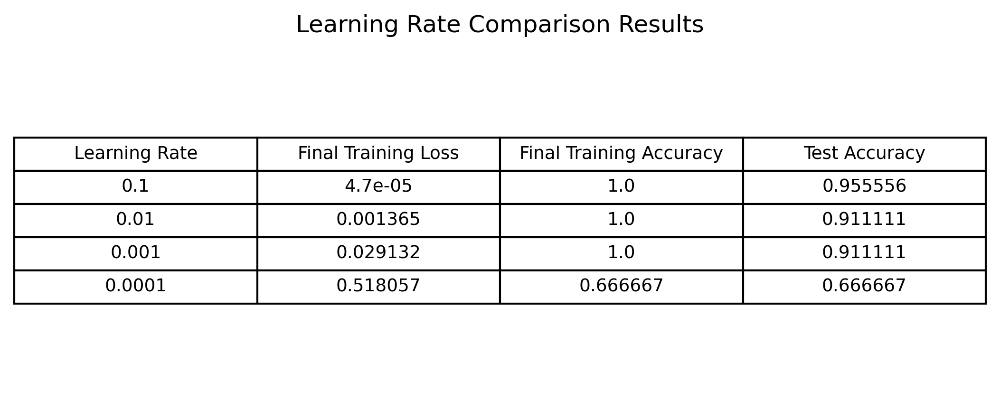
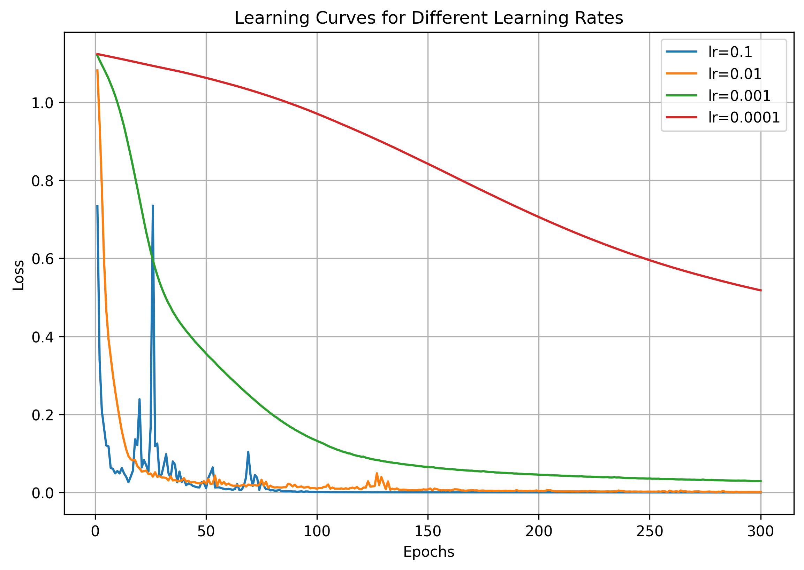

# Tutorial 02 — MLP Classifier

## Overview

This tutorial focuses on training a Multi-Layer Perceptron classifier on the Iris dataset. The original tutorial used an MLP classifier workflow, and I implemented the same idea using PyTorch.

The main purpose of this tutorial was to understand how a neural network with hidden layers is trained, how data scaling affects training, and how model architecture and learning rate affect the loss curve and accuracy.

## Objectives

The main objectives of this tutorial were:

- Train a Multi-Layer Perceptron model
- Scale the input data before training
- Train and evaluate the model
- Visualize the learning curve
- Modify the number of hidden layers and neurons
- Change the learning rate and observe convergence behavior

## Dataset

The Iris dataset was used for this tutorial. It contains 150 flower samples with four input features:

- Sepal length
- Sepal width
- Petal length
- Petal width

The model classifies each sample into one of three classes:

- Setosa
- Versicolor
- Virginica

Unlike Tutorial 01, where the problem was converted into binary classification, this tutorial uses all three classes.

## Data Scaling

Before training the model, the input features were scaled using StandardScaler.

Scaling is important in neural networks because the input features may have different ranges. If the data is not scaled, features with larger values can dominate the learning process. After scaling, the features have approximately zero mean and unit standard deviation, which helps the optimizer update the weights more smoothly.

## Baseline MLP Model

The baseline MLP model was implemented in PyTorch.

The baseline architecture was:

- Input layer: 4 input features
- Hidden layer 1: 10 neurons
- ReLU activation
- Hidden layer 2: 10 neurons
- ReLU activation
- Output layer: 3 output classes

CrossEntropyLoss was used because this is a multi-class classification problem.

## Baseline Learning Curve

The baseline learning curve shows that the training loss decreased steadily over the epochs. The loss dropped quickly during the initial epochs and then continued to decrease more slowly.

This shows that the model was learning properly. The smooth decrease in loss also indicates that the selected learning rate was stable for the baseline model.

## Baseline Training Accuracy

The training accuracy increased as training progressed. At the beginning, the accuracy was low, but after several epochs it improved quickly.

Near the end of training, the model reached almost perfect training accuracy. This means that the MLP was able to learn the Iris training data very well.

## Task 1 — Changing Hidden Layers and Neurons

The first task was to modify the MLP model by changing the number of hidden layers and neurons.

The following architectures were tested:

- [8]
- [16]
- [32]
- [16, 8]
- [32, 16]
- [64, 32]
- [64, 32, 16]
- [128, 64, 32]

The purpose of this experiment was to observe how increasing the number of layers or neurons affects the training loss, accuracy, and learning curve.

## Hidden Layer Comparison Results

From the results, all architectures performed reasonably well on the Iris dataset.

The smaller models, such as [8] and [16], were still able to learn the dataset, but their final training loss was higher compared to the larger models.

The larger models, such as [64, 32], [64, 32, 16], and [128, 64, 32], reached very low training loss and achieved 100% training accuracy.

However, the test accuracy did not improve much beyond 93.33%. Several architectures reached the same test accuracy of 93.33%, while some configurations gave 91.11%.

This shows that increasing the number of layers and neurons improves training performance, but it does not always improve test performance, especially on a small dataset like Iris.

## Architecture Learning Curves

The architecture learning curve shows that larger networks converged faster and reached lower final loss values.

The [8] neuron model had the slowest loss reduction. As the number of neurons and layers increased, the loss generally decreased faster.

The deeper and wider models had smoother and faster convergence. However, since the Iris dataset is small and simple, very large models are not necessary. A large model may reduce training loss, but the improvement in test accuracy is limited.

## Task 2 — Changing the Learning Rate

The second task was to change the learning rate and observe its effect on convergence.

The following learning rates were tested:

- 0.1
- 0.01
- 0.001
- 0.0001

The goal was to understand how the learning rate affects the loss curve, convergence speed, and final model performance.

## Learning Rate Results

The learning rate results show that the learning rate has a strong effect on training.

A very small learning rate trains slowly because the weight updates are very small. A very large learning rate can reduce the loss quickly, but it can also make the loss unstable.

## Learning Rate Curves

The learning rate comparison curve shows clear differences between the tested values.

The learning rate of 0.0001 decreased the loss very slowly and still had a relatively high loss after 300 epochs. This means the learning rate was too small for fast convergence.

The learning rate of 0.001 was stable but slower than 0.01.

The learning rate of 0.01 gave a fast and smooth decrease in loss. It provided a good balance between convergence speed and stability.

The learning rate of 0.1 reduced the loss quickly, but the curve showed sharp spikes. This indicates unstable training due to large weight updates.

## Best Configuration

Based on the architecture comparison, the larger networks achieved lower training loss, but the test accuracy remained similar for several configurations.

A practical architecture for this dataset is [64, 32] or [64, 32, 16]. These models achieved low training loss and good test accuracy without being unnecessarily large.

For the learning rate, 0.01 gave the best balance between speed and stability. It converged much faster than 0.001 and 0.0001, while being more stable than 0.1.

## Key Observations

- Data scaling helped the neural network train more effectively.
- The baseline MLP learned the Iris dataset successfully.
- Increasing the number of hidden layers and neurons reduced the final training loss.
- Larger models converged faster than smaller models.
- Test accuracy did not improve much after a certain model size.
- A very small learning rate caused slow convergence.
- A very large learning rate caused unstable training behavior.
- A moderate learning rate provided the best balance between convergence speed and stability.

## Conclusion

This tutorial helped in understanding how to build and train an MLP classifier in PyTorch.

The experiments showed that both model architecture and learning rate affect the training process. Increasing model size can improve training loss and convergence speed, but it does not always improve test accuracy on a small dataset.

For the Iris dataset, a moderate MLP architecture with a suitable learning rate is enough to achieve good performance.
