# Tutorial 03 — ANN for MNIST Handwritten Digit Classification

## Overview

This tutorial focuses on building an Artificial Neural Network for MNIST handwritten digit classification. The original tutorial was based on TensorFlow/Keras, but the complete implementation was done in PyTorch.

The main objective was to classify handwritten digit images from 0 to 9 using a neural network and then analyze the model performance using training and validation accuracy/loss curves.

## Objectives

The main objectives of this tutorial were:

- Load and preprocess the MNIST dataset
- Visualize sample handwritten digit images
- Build and train an ANN model
- Evaluate the model on test data
- Visualize training and validation accuracy/loss
- Make predictions on test images
- Experiment with different architectures and activation functions
- Compare different optimizers
- Observe overfitting and underfitting
- Implement early stopping
- Apply regularization techniques

## Dataset

The MNIST dataset was used for this tutorial. It contains grayscale handwritten digit images.

Each image has a size of 28 × 28 pixels. The model classifies each image into one of 10 classes:

- 0
- 1
- 2
- 3
- 4
- 5
- 6
- 7
- 8
- 9

In PyTorch, the images were converted into tensors and normalized to the range 0 to 1 using `transforms.ToTensor()`.

## Sample MNIST Images

The sample images show handwritten digits from the MNIST dataset. Each image is grayscale and has a 28 × 28 pixel resolution.

## Baseline ANN Model

The baseline ANN model was based on the tutorial architecture.

The model structure was:

- Flatten layer
- Fully connected layer with 128 neurons
- ReLU activation
- Fully connected layer with 64 neurons
- ReLU activation
- Output layer with 10 neurons

The output layer has 10 neurons because there are 10 digit classes.

CrossEntropyLoss was used for training because this is a multi-class classification problem. In PyTorch, one-hot encoding is not required when using CrossEntropyLoss because it expects the target labels as integer class indices.

## Baseline Model Summary

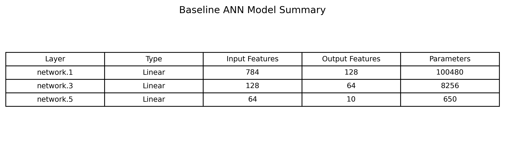

The model summary shows the linear layers and the number of trainable parameters. The first fully connected layer receives 784 input features because each 28 × 28 image is flattened into a 1D vector.

## Baseline Training Curves

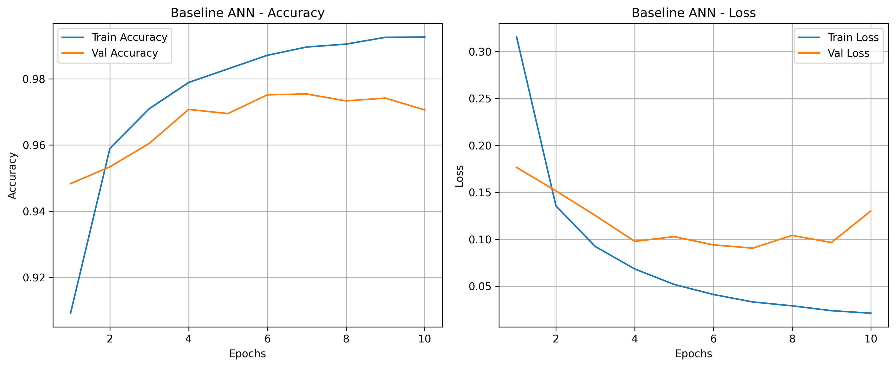

The baseline training accuracy increased steadily over the epochs. The validation accuracy also improved and remained close to the training accuracy for most of the training process.

The training loss decreased continuously. The validation loss also decreased at first, but near the later epochs it started to fluctuate and slightly increase. This suggests that the model began to show mild overfitting near the end of training.

The baseline model achieved strong performance, but the difference between training accuracy and validation accuracy indicates that improvement was still possible.

## Baseline Prediction Examples

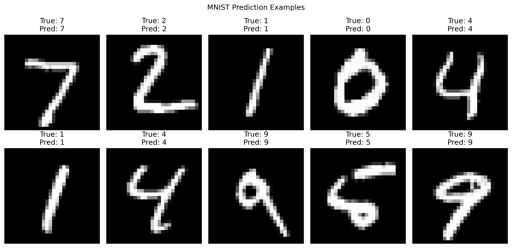

The prediction examples show test images along with their true labels and predicted labels. The model correctly predicted the displayed samples, showing that the trained ANN learned useful digit patterns from the MNIST dataset.

## Task 1 — Architecture and Activation Function Experiments

The tutorial required experimenting with different neural network architectures and activation functions.

The tested models were:

- Small_ReLU: [64]
- Baseline_ReLU: [128, 64]
- Deep_ReLU: [256, 128, 64]
- Tanh_Model: [128, 64]
- Sigmoid_Model: [128, 64]

The purpose was to observe how changing the number of layers, number of neurons, and activation function affects model performance.

## Architecture and Activation Comparison Results

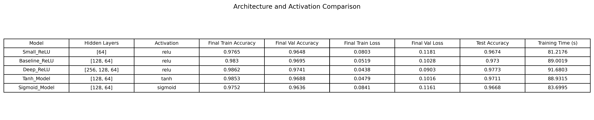

From the results, the Deep_ReLU model achieved the best test accuracy of 0.9773. This model used three hidden layers: [256, 128, 64].

The Baseline_ReLU model achieved a test accuracy of 0.9730, which is also strong. The Tanh model achieved 0.9711 test accuracy, while the Sigmoid model achieved 0.9668.

The Small_ReLU model had the lowest capacity and achieved 0.9674 test accuracy.

These results show that increasing the model depth and number of neurons improved performance slightly. However, the improvement was not extremely large because MNIST is a relatively clean and structured dataset.

## Architecture Accuracy Curves

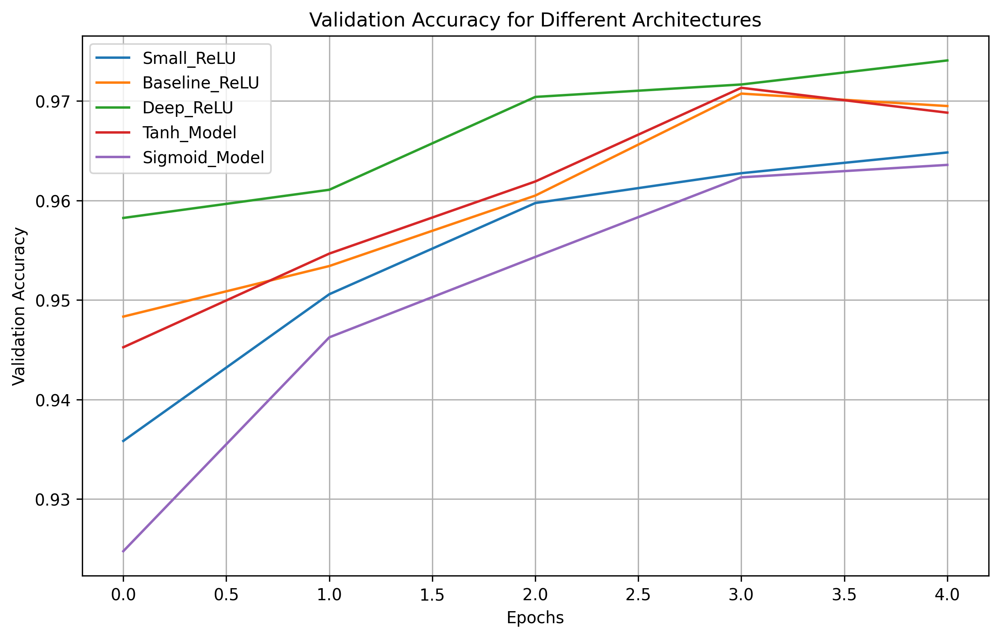

The validation accuracy curves show that all models learned the classification task reasonably well.

The ReLU-based models performed strongly, especially the deeper ReLU model. The Sigmoid model performed slightly worse, which is expected because sigmoid activation can suffer from vanishing gradient problems in hidden layers.

## Architecture Loss Curves

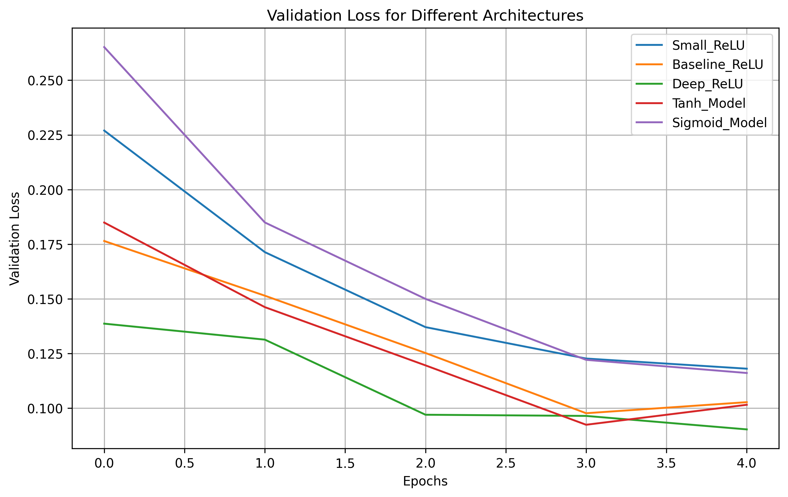

The validation loss curves show that the deeper ReLU model reached a lower validation loss compared to the smaller models.

The Sigmoid model had a slower and weaker learning trend compared to ReLU. This supports the idea that ReLU is generally more effective for hidden layers in deeper neural networks.

## Task 2 — Optimizer Comparison

The tutorial also required comparing different optimizers.

The tested optimizers were:

- SGD
- RMSprop
- Adam

The same ANN architecture was used for all optimizer tests so that the comparison was fair.

## Optimizer Results

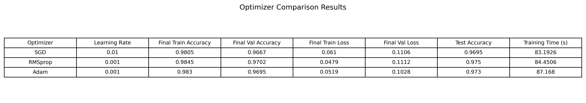

From the optimizer comparison table:

- SGD achieved a test accuracy of 0.9695
- RMSprop achieved a test accuracy of 0.9750
- Adam achieved a test accuracy of 0.9730

RMSprop gave the highest test accuracy in this experiment. Adam also performed very well and gave stable results. SGD performed slightly lower compared to RMSprop and Adam.

## Optimizer Accuracy Curves

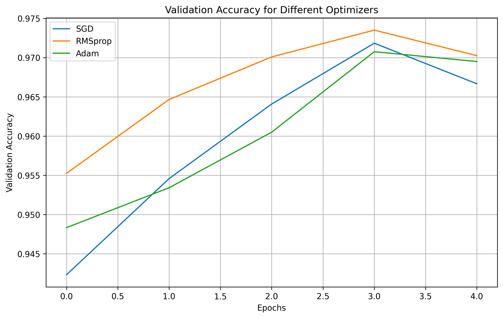

The optimizer accuracy curves show how validation accuracy changed during training.

RMSprop and Adam converged faster compared to SGD. This is because RMSprop and Adam adapt the learning process during training, while SGD updates parameters in a more basic way.

## Optimizer Loss Curves

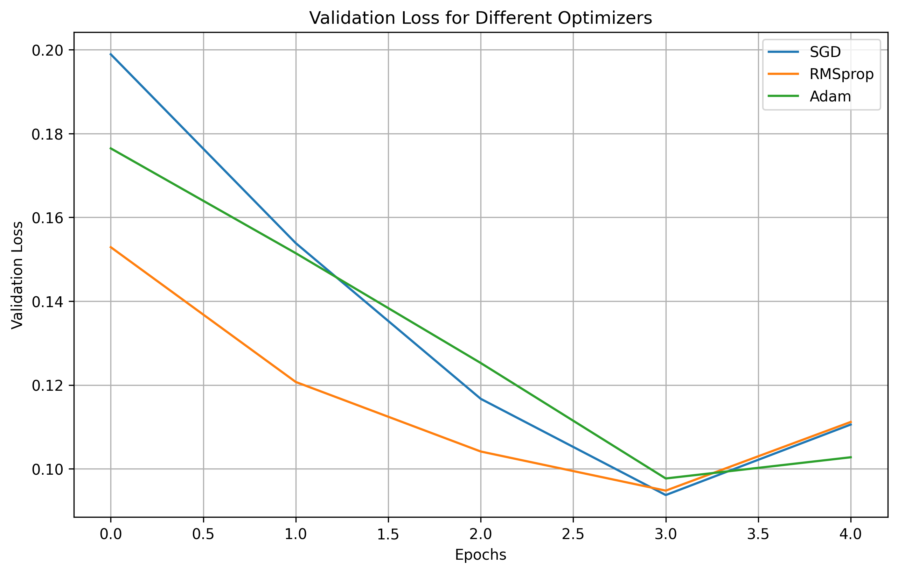

The optimizer loss curves show that RMSprop and Adam reduced validation loss more effectively than SGD.

SGD improved the model, but it converged more slowly. RMSprop gave the best final test accuracy in this experiment, while Adam gave a good balance of speed and stability.

## Task 3 — Effect of Epochs, Overfitting, and Underfitting

The tutorial required observing the training and validation curves to identify whether the model is overfitting, underfitting, or well-fitted.

## Effect of More Epochs

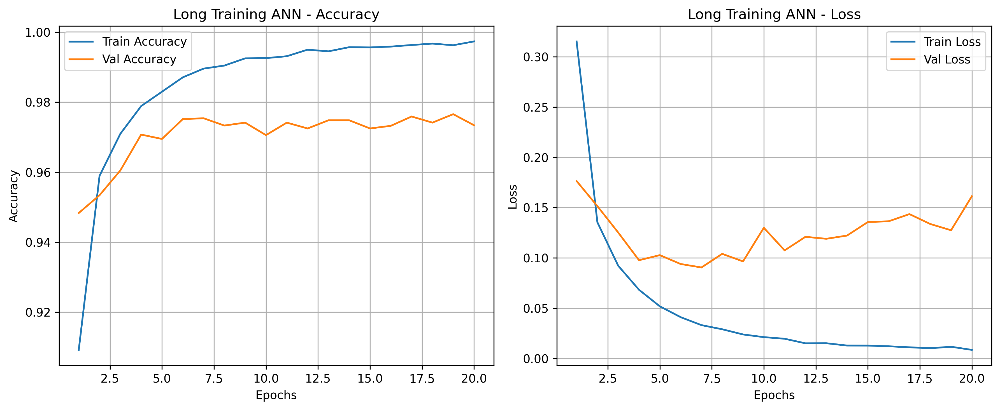

When training for more epochs, the training accuracy continued to improve and the training loss continued to decrease. However, the validation loss did not always decrease at the same rate.

If the training loss keeps decreasing while validation loss starts increasing or stagnating, this is a sign of overfitting.

In this case, the model learned the training data very well, but some difference between training and validation curves shows that regularization can help improve generalization.

## Task 4 — Early Stopping

Early stopping was implemented to stop training when the validation loss stopped improving.

## Early Stopping Curves

The early stopping curve shows that training stopped before the maximum number of epochs. This prevents unnecessary training and helps reduce overfitting.

Early stopping is useful because it keeps the model from continuing to improve only on the training data while validation performance stops improving.

## Task 5 — Regularization Techniques

Regularization was applied using:

- Dropout
- Weight decay
- Early stopping

The improved model used a deeper architecture with dropout and weight decay.

## Improved Model Curves

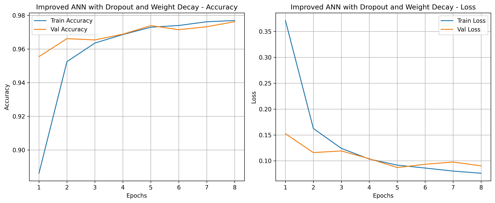

The improved model curves show that the training and validation accuracy stayed very close to each other.

The validation accuracy was close to the training accuracy, and the validation loss was also controlled better compared to the baseline model. This indicates that the improved model generalized better and reduced overfitting.

## Baseline vs Improved Model

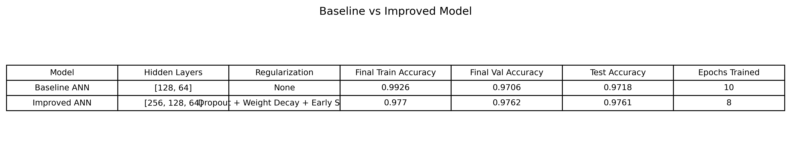

The baseline ANN achieved a test accuracy of 0.9718.

The improved ANN achieved a test accuracy of 0.9761.

The improved model also trained for only 8 epochs due to early stopping, compared to 10 epochs for the baseline model. This shows that early stopping and regularization helped improve generalization while avoiding unnecessary training.

## Overfitting, Underfitting, and Well-Fitted Model Interpretation

The baseline model was not underfitting because both training and validation accuracy were high.

However, the baseline model showed mild overfitting because the training accuracy became higher than the validation accuracy, and validation loss increased slightly near the later epochs.

The improved model was better fitted because the training and validation curves were closer together. This means the model performed well on both training data and unseen validation/test data.

## Best Model

Based on the experiments:

- Best architecture experiment: Deep_ReLU with [256, 128, 64]
- Best optimizer experiment: RMSprop
- Best final improved model: ANN with dropout, weight decay, and early stopping

The improved model gave better test accuracy than the baseline and had better generalization behavior.

## Key Observations

- The MNIST dataset can be classified effectively using a simple ANN.
- Flattening converts each 28 × 28 image into 784 input features.
- ReLU performed better than sigmoid for hidden layers.
- Increasing model depth improved performance slightly.
- RMSprop and Adam converged faster than SGD.
- The baseline model showed mild overfitting after several epochs.
- Early stopping helped avoid unnecessary training.
- Dropout and weight decay improved generalization.
- The improved model achieved better test accuracy than the baseline model.

## Conclusion

This tutorial helped in understanding how to build and train an ANN for handwritten digit classification using PyTorch.

The baseline ANN performed well on the MNIST dataset, but experiments showed that architecture, activation function, optimizer, epoch count, and regularization all affect performance.

The improved model with dropout, weight decay, and early stopping gave better generalization and a higher test accuracy than the baseline model.
