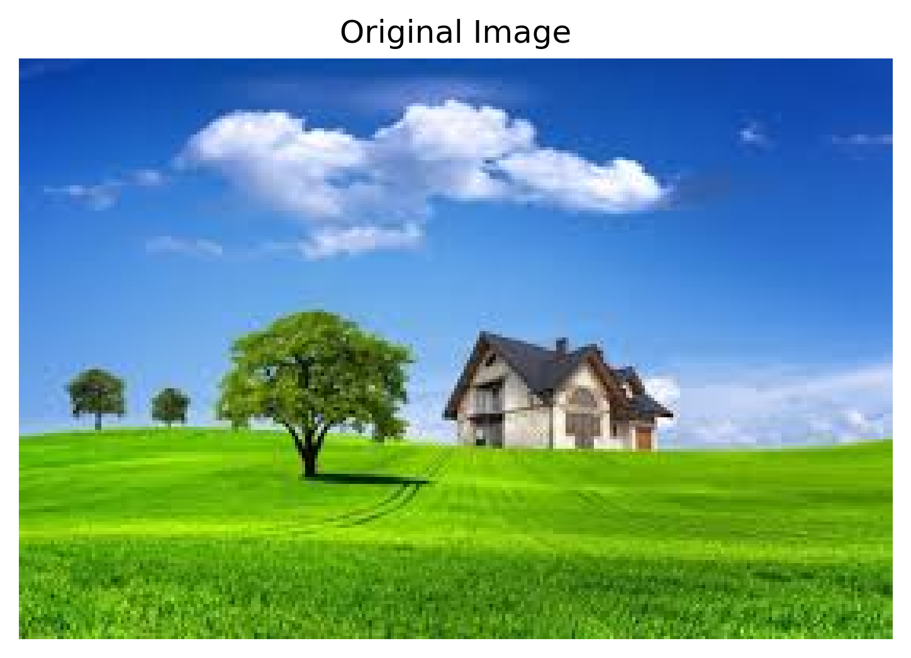
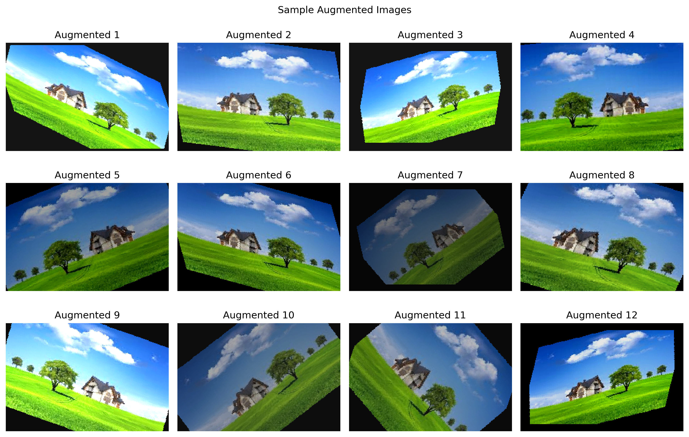
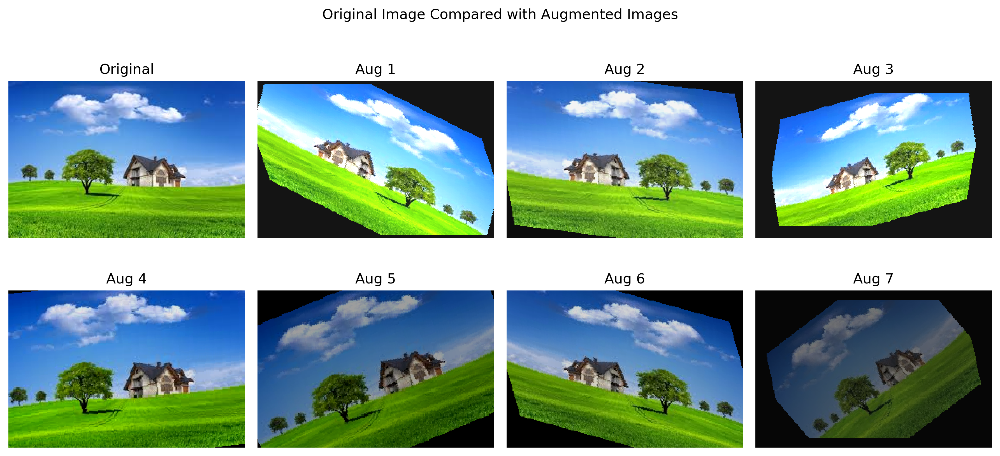

# Tutorial 04 — Data Augmentation

## Overview

This tutorial focuses on data augmentation. Data augmentation is used in deep learning to artificially increase the variety of training images without collecting new images.

The original tutorial used Keras ImageDataGenerator, but this implementation was done using PyTorch/torchvision transforms.

## Objectives

The main objectives of this tutorial were:

- Understand the need for data augmentation
- Apply different image augmentation operations
- Load a single JPEG image
- Generate augmented versions of the image
- Save the augmented images in a folder
- Visualize the augmented results

## Input Image

A single JPEG image was used as the input image for augmentation.

The original image contains a landscape scene with grass, trees, sky, clouds, and a house. This image was used to generate multiple transformed versions.

## Augmentation Techniques Used

The following augmentation operations were applied:

- Rotation
- Shear transformation
- Zooming / scaling
- Horizontal flipping
- Brightness adjustment
- Contrast and saturation adjustment

These transformations create variations of the same image and help make a dataset more diverse.

## Generated Augmented Images

The task required generating and saving 40 augmented images from a single JPEG image. The notebook generated 40 augmented images and saved them inside the `augmented_images` folder.

The saved images were named:

- augmented_01.jpeg
- augmented_02.jpeg
- augmented_03.jpeg
- ...
- augmented_40.jpeg

## Sample Augmented Images

The sample augmented images show different transformations applied to the original image. Some images are rotated, some are sheared, some are zoomed, and some have changed brightness.

The black regions around some images appear because rotation and shear transformations create empty areas around the image boundaries. This is expected behavior during geometric augmentation.

## Original vs Augmented Images

This comparison shows the original image beside several augmented versions.

The augmented images still contain the same main content, but their position, orientation, brightness, and scale have changed. These variations can help a deep learning model generalize better because the model learns to recognize the object or scene under different conditions.

## Why Data Augmentation is Useful

Deep learning models usually require large datasets. In many cases, collecting a very large number of images is difficult or time-consuming.

Data augmentation helps by creating new variations from existing images. This can:

- Increase dataset size
- Reduce overfitting
- Improve model generalization
- Make the model more robust to image changes
- Introduce variability in position, brightness, scale, and orientation

## Observations

The generated images show clear variations compared to the original image.

Rotation changed the angle of the image.  
Shear transformed the image geometry.  
Zooming changed the scale of the image content.  
Brightness adjustment made some images lighter or darker.  
Horizontal flipping changed the orientation of the scene.

These transformations increased the diversity of the dataset while still preserving the original image content.

## Task Completion

The task was to take a single JPEG image from the computer and generate 40 augmented images.

This was completed successfully. The 40 augmented images were saved in the `augmented_images` folder.

## Conclusion

This tutorial helped in understanding how data augmentation works and why it is useful in deep learning.

Using PyTorch/torchvision transforms, a single JPEG image was converted into 40 augmented images. The generated images showed different transformations such as rotation, shear, zoom, flipping, and brightness changes.

Data augmentation is useful because it increases image diversity and can help reduce overfitting when training deep learning models.
