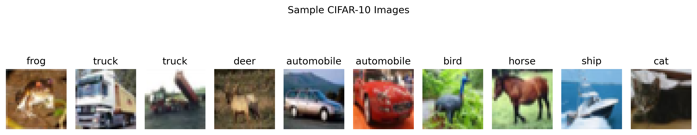
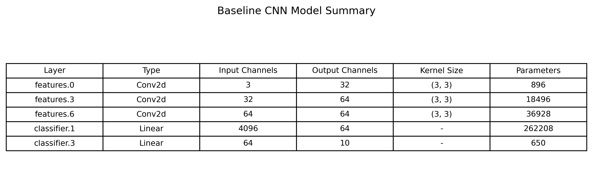
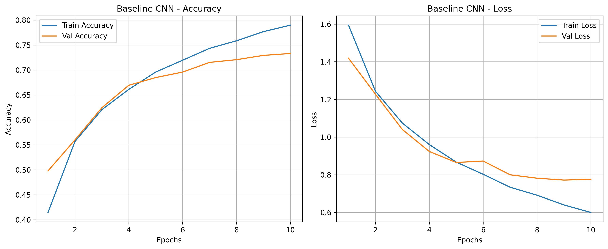
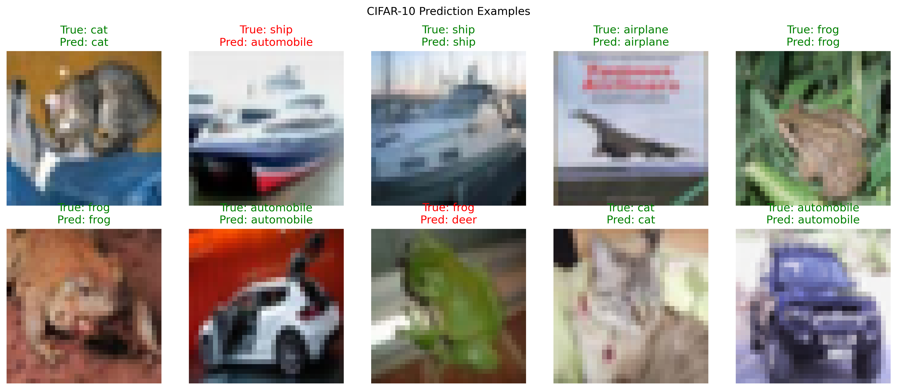
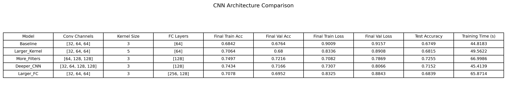
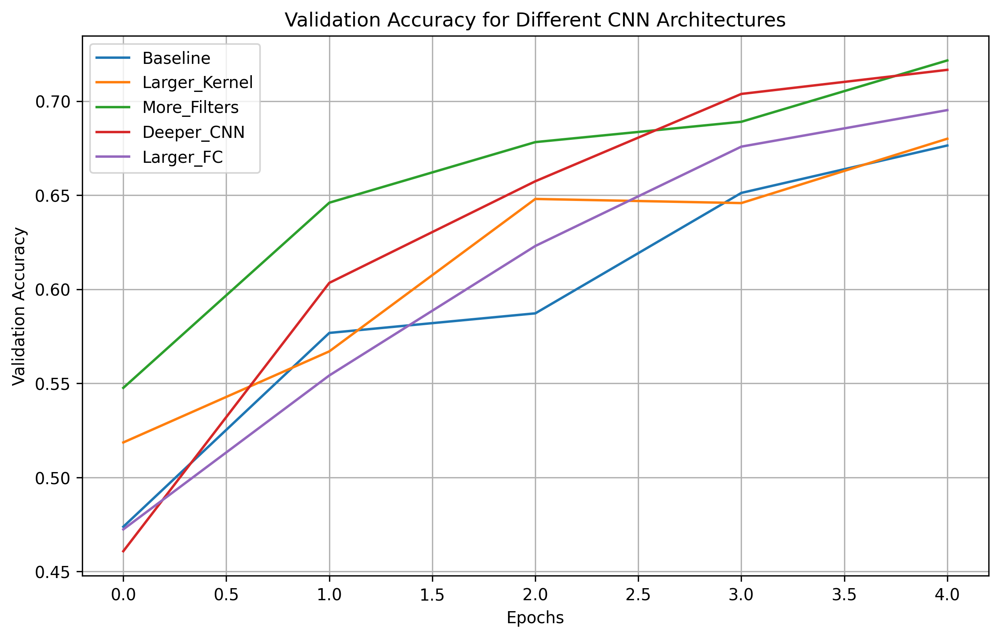
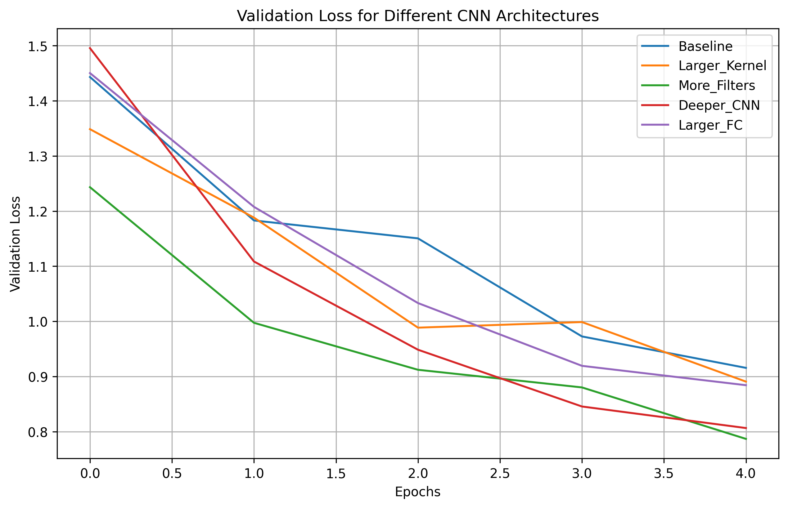
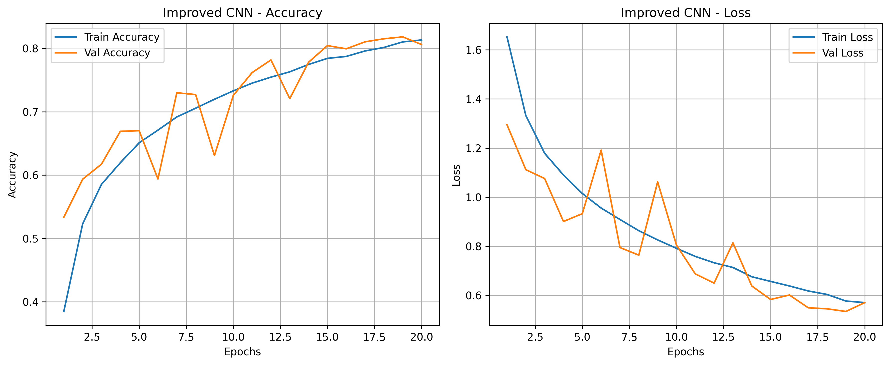
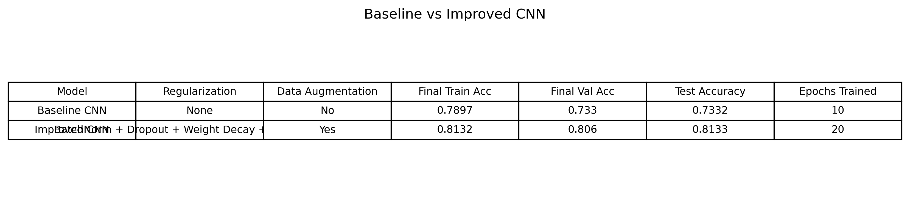

# Tutorial 05 — Convolutional Neural Network (CNN)

## Overview

This tutorial focuses on building and training a Convolutional Neural Network for image classification using the CIFAR-10 dataset. The original tutorial was based on TensorFlow/Keras, but the implementation was completed in PyTorch.

The main purpose of this tutorial was to understand how CNNs work, how convolution and pooling layers extract image features, and how model performance can be improved by changing architecture and reducing overfitting/underfitting.

## Objectives

The main objectives of this tutorial were:

- Understand Convolutional Neural Networks
- Load and preprocess the CIFAR-10 dataset
- Visualize image samples
- Build and train a CNN model
- Evaluate model performance
- Plot training and validation accuracy/loss
- Make predictions on test images
- Experiment with different CNN architectures
- Improve model accuracy
- Reduce overfitting/underfitting

## Dataset

The CIFAR-10 dataset was used for this tutorial. It contains color images with size 32 × 32 pixels.

The dataset has 10 classes:

- Airplane
- Automobile
- Bird
- Cat
- Deer
- Dog
- Frog
- Horse
- Ship
- Truck

The images were converted into tensors and normalized to the range 0 to 1.

## CIFAR-10 Sample Images

The sample images show examples from the CIFAR-10 dataset. The images are small and contain different object classes, which makes the classification task more difficult than MNIST.

## Baseline CNN Model

The baseline CNN model used convolutional layers, ReLU activation, max-pooling layers, and fully connected layers.

The baseline structure was:

- Conv2D layer with 32 filters
- ReLU activation
- Max pooling
- Conv2D layer with 64 filters
- ReLU activation
- Max pooling
- Conv2D layer with 64 filters
- ReLU activation
- Flatten layer
- Fully connected layer
- Output layer with 10 classes

## Baseline Model Summary

The model summary shows the convolutional and fully connected layers along with the number of trainable parameters. The convolutional layers are responsible for extracting spatial features from the images, while the fully connected layers perform final classification.

## Baseline Training Curves

The baseline CNN training curves show that both training and validation accuracy increased over the 10 epochs.

The training accuracy reached about 0.79, while the validation accuracy reached about 0.73. The training loss continued to decrease, but the validation loss started to flatten near the later epochs.

This indicates that the model was learning properly, but there was some generalization gap between training and validation performance. This means the baseline model had mild overfitting.

## Baseline Predictions

The prediction examples show test images with their true and predicted labels. Correct predictions are shown in green, while incorrect predictions are shown in red.

This helps visually understand where the CNN performs well and where it makes mistakes.

## Task 1 — Architecture Experiments

The tutorial required experimenting with different CNN architectures by changing:

- Filter size
- Number of convolutional filters
- Number of convolution layers
- Fully connected layers
- Number of neurons in fully connected layers

The tested architecture configurations were:

- Baseline
- Larger_Kernel
- More_Filters
- Deeper_CNN
- Larger_FC

## CNN Architecture Comparison Results

The architecture comparison table shows that the More_Filters model achieved the best test accuracy among the tested architecture variations.

The More_Filters model achieved a test accuracy of 0.7255. It used convolution channels [64, 128, 128], which increased the number of filters compared to the baseline model.

The Deeper_CNN model also performed well with a test accuracy of 0.7152. This shows that adding more convolution layers can improve performance, but simply making the model deeper does not always guarantee the best result.

The Larger_Kernel and Larger_FC models gave only small improvements over the short-epoch baseline in this experiment.

## Architecture Accuracy Curves

The validation accuracy curves show that the More_Filters and Deeper_CNN models improved more strongly than the smaller baseline model.

The More_Filters model had the best final validation accuracy. This suggests that increasing the number of filters helped the CNN learn stronger image features.

## Architecture Loss Curves

The validation loss curves show that the More_Filters model reached the lowest validation loss among the compared architectures.

A lower validation loss means the model was making more confident and accurate predictions on unseen validation data.

## Task 2 — Improving Accuracy

To improve the accuracy of the model, the improved CNN used:

- More convolutional filters
- Batch normalization
- Dropout
- Weight decay
- Data augmentation
- Early stopping option

These techniques were added to improve generalization and reduce overfitting.

## Improved CNN Training Curves

The improved CNN training curves show better performance than the baseline model.

The training and validation accuracy both improved over the epochs. The validation accuracy reached around 0.81, which is higher than the baseline validation accuracy.

The validation loss also decreased overall, although there were some fluctuations. These fluctuations are expected because the improved model used data augmentation, which changes the training images during training.

## Baseline vs Improved CNN

The baseline CNN achieved a test accuracy of 0.7332.

The improved CNN achieved a test accuracy of 0.8133.

This shows a clear improvement in model performance. The improved model performed better because it used stronger feature extraction and regularization techniques.

## Improved Model Predictions

The improved prediction examples show the model predictions after applying the improved CNN architecture and regularization techniques.

The improved model was able to classify more images correctly compared to the baseline model.

## Overfitting and Underfitting Analysis

The baseline model was not underfitting because both training and validation accuracy improved during training.

However, it showed mild overfitting because the training accuracy became higher than the validation accuracy, and the validation loss stopped improving as smoothly near the end.

The improved model reduced this issue by using dropout, weight decay, batch normalization, and data augmentation. These techniques helped the model generalize better to unseen data.

## Best Model

The best model was the improved CNN.

It achieved:

- Better validation accuracy
- Better test accuracy
- Better generalization
- Reduced overfitting compared to the baseline CNN

The final test accuracy improved from 0.7332 to 0.8133.

## Key Observations

- CNNs are more suitable for image classification than simple fully connected networks.
- Convolutional layers extract spatial features from images.
- Max pooling reduces spatial size and keeps important features.
- Increasing the number of filters improved performance.
- A deeper network helped, but the More_Filters model performed better in the architecture experiment.
- The baseline model showed mild overfitting.
- Data augmentation improved generalization.
- Batch normalization helped stabilize training.
- Dropout and weight decay helped reduce overfitting.
- The improved CNN achieved much better test accuracy than the baseline CNN.

## Conclusion

This tutorial helped in understanding how to build and train a CNN for CIFAR-10 image classification using PyTorch.

The baseline CNN learned the dataset reasonably well, but the improved CNN performed much better. The experiments showed that architecture changes, data augmentation, batch normalization, dropout, weight decay, and early stopping can all affect model performance.

The improved model achieved a clear accuracy improvement and reduced the overfitting/underfitting problem compared to the baseline model.
