# Tutorial 06 — Transfer Learning: Predicting with Pretrained Models

## Overview

This tutorial focuses on using pretrained deep learning models for image classification and transfer learning. The original tutorial used TensorFlow/Keras, but the implementation was completed in PyTorch.

The tutorial had two main parts:

- Predicting top-5 ImageNet labels using pretrained models
- Applying transfer learning on a custom two-class dataset

The custom dataset used in this tutorial contained two Genshin Impact characters:

- Furina
- Ororon

## Objectives

The main objectives of this tutorial were:

- Use pretrained models for image classification
- Use VGG16 and ResNet50 for top-5 prediction
- Experiment with AlexNet, ResNet101, and MobileNet
- Interpret pretrained model predictions
- Apply transfer learning on a custom dataset
- Compare different pretrained architectures after transfer learning

## Dataset

A custom image dataset was created using screenshots of two game characters.

The dataset contained:

- Furina images
- Ororon images

The images included different views, poses, backgrounds, zoom levels, and lighting conditions.

For classification, the labels were taken from the folder names:

```text
dataset/
├── furina/
└── ororon/
```

## Custom Dataset Samples

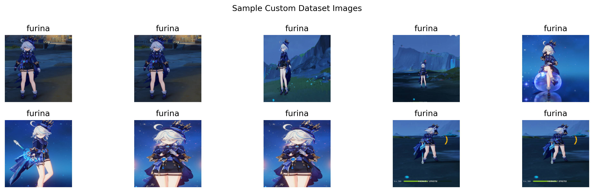

The sample images show the two custom classes used for transfer learning. The dataset contains visual variety, including front views, side views, full-body images, and different backgrounds.

This variation is useful because it helps the model learn character-specific features instead of only memorizing one pose or background.

## Input Image for Pretrained Prediction

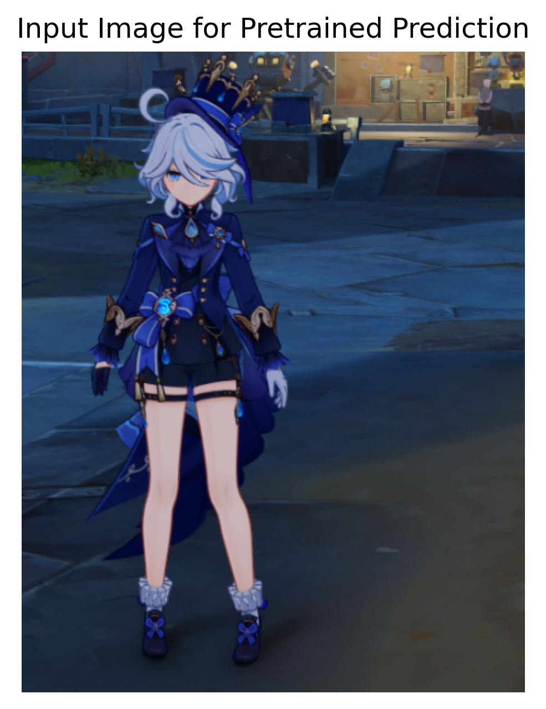

A sample image from the custom dataset was selected and tested using pretrained ImageNet models.

This was done before transfer learning to observe how pretrained models classify a custom character image without knowing the custom class names.

## Pretrained Top-5 Predictions

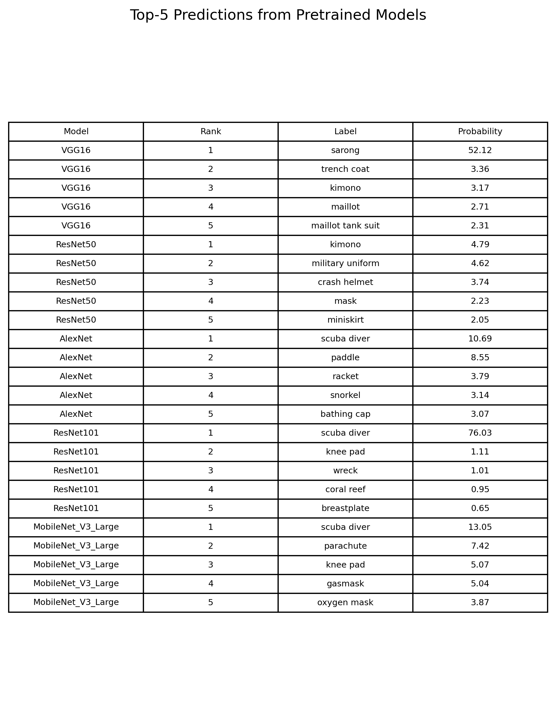

The pretrained models gave ImageNet-based predictions.

For example:

- VGG16 predicted `sarong` with 52.12% probability.
- ResNet50 predicted labels such as `kimono`, `military uniform`, and `crash helmet`.
- AlexNet predicted labels such as `scuba diver`, `paddle`, and `racket`.
- ResNet101 predicted `scuba diver` with high confidence.
- MobileNet predicted labels such as `scuba diver`, `parachute`, and `knee pad`.

These predictions were not Furina or Ororon because the pretrained models were trained on ImageNet, which does not contain these custom game-character classes.

This shows an important limitation of using pretrained models directly: they can only predict labels from their original training dataset.

## Transfer Learning Concept

Before transfer learning, the pretrained models had final output layers designed for 1000 ImageNet classes.

For this custom dataset, the final classification layer was replaced with a new layer for two classes:

```text
furina
ororon
```

The pretrained feature extractor was frozen, and only the final classification layer was trained.

This allowed the model to reuse useful visual features learned from ImageNet while adapting the final classifier to the custom character dataset.

## VGG16 Transfer Learning

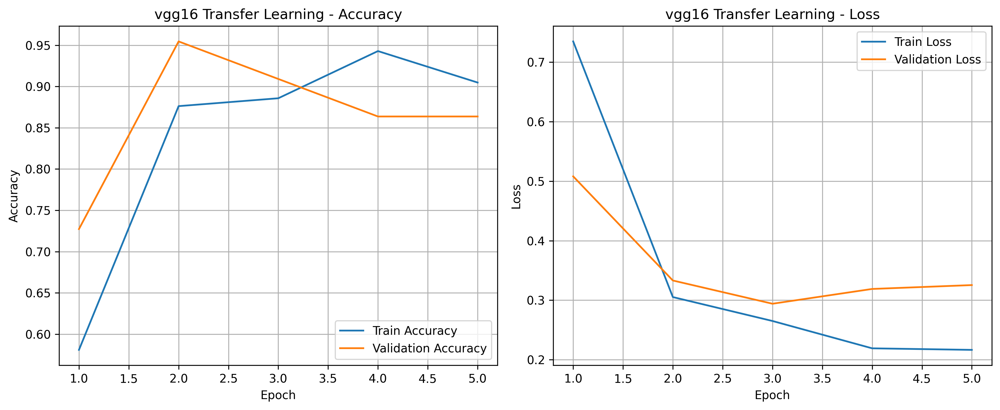

The VGG16 model was trained as a feature extractor with a new final classifier layer.

VGG16 achieved:

- Final training accuracy: 0.9048
- Final validation accuracy: 0.8636
- Test accuracy: 0.8261

VGG16 learned the custom dataset, but its test accuracy was lower than the other stronger models.

## ResNet50 Transfer Learning

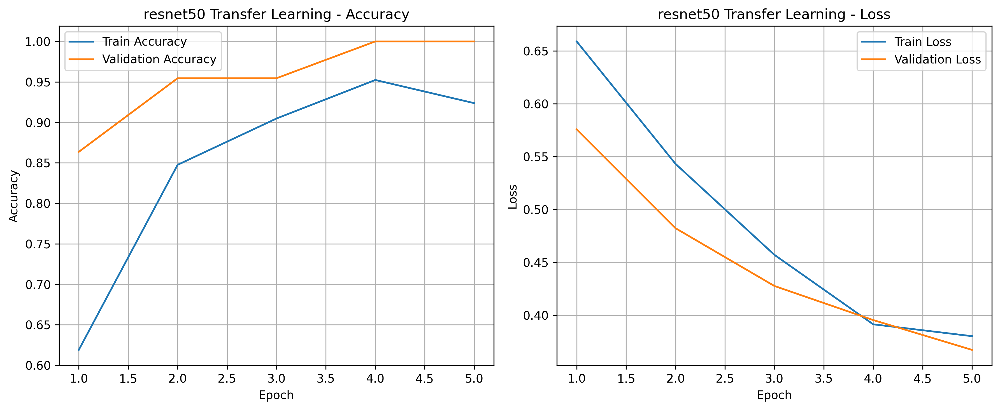

ResNet50 performed well on the custom dataset.

It achieved:

- Final training accuracy: 0.9238
- Final validation accuracy: 1.0000
- Test accuracy: 0.9565

The model generalized well and classified most test images correctly.

## AlexNet Transfer Learning

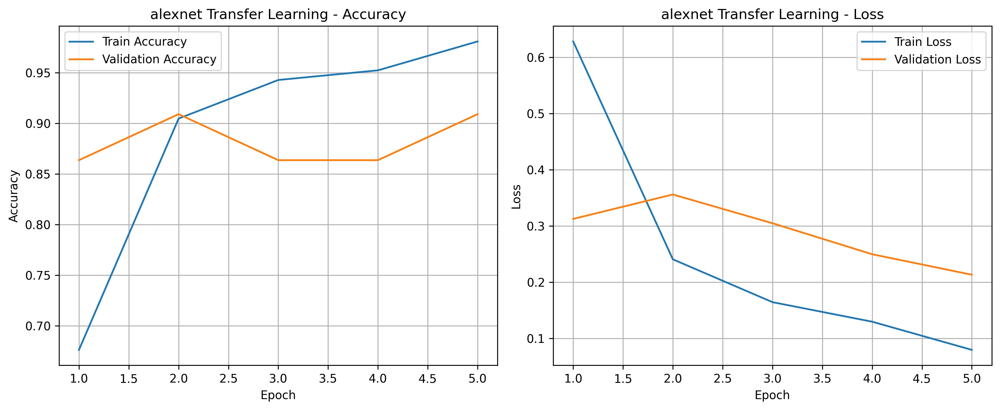

AlexNet was also tested as a transfer learning model.

It achieved:

- Final training accuracy: 0.9810
- Final validation accuracy: 0.9091
- Test accuracy: 0.9130

AlexNet performed better than VGG16 in this experiment, but it was still behind ResNet50, ResNet101, and MobileNet.

## ResNet101 Transfer Learning

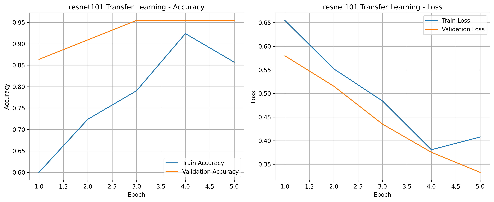

ResNet101 also performed strongly.

It achieved:

- Final training accuracy: 0.8571
- Final validation accuracy: 0.9545
- Test accuracy: 0.9565

Even though the training accuracy was lower than some other models, the validation and test accuracy were high. This shows good generalization on the test set.

## MobileNet Transfer Learning

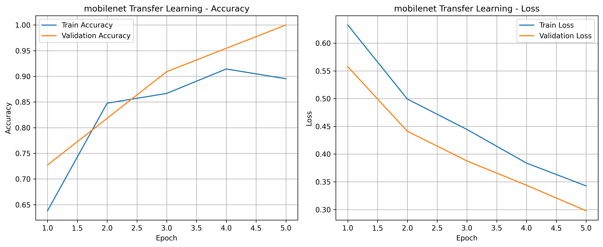

MobileNet gave the best result in this experiment.

It achieved:

- Final training accuracy: 0.8952
- Final validation accuracy: 1.0000
- Test accuracy: 1.0000

MobileNet also had the fewest trainable parameters, with only 2,562 trainable parameters. This makes it efficient and suitable for small custom datasets.

## Transfer Learning Model Comparison

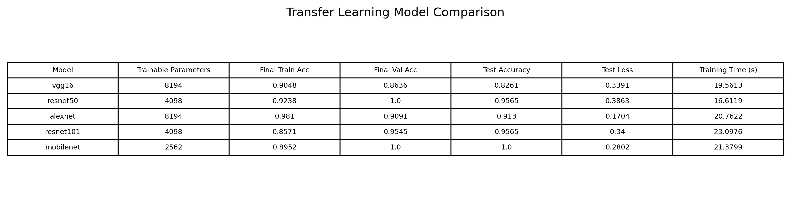

The comparison table shows the performance of all tested transfer learning models.

The results were:

- VGG16 test accuracy: 0.8261
- ResNet50 test accuracy: 0.9565
- AlexNet test accuracy: 0.9130
- ResNet101 test accuracy: 0.9565
- MobileNet test accuracy: 1.0000

MobileNet achieved the highest test accuracy and used the fewest trainable parameters.

## Test Accuracy Comparison

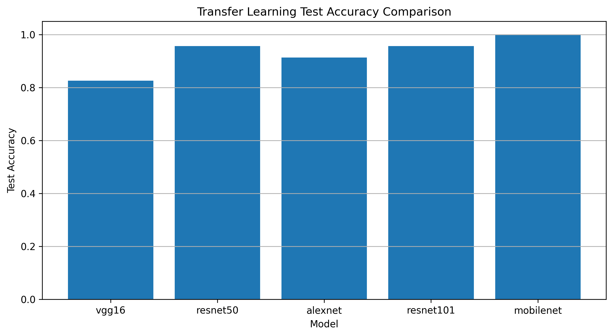

The test accuracy comparison clearly shows that all transfer learning models performed much better than the original pretrained ImageNet predictions.

Before transfer learning, the models could only predict ImageNet labels such as `sarong`, `kimono`, or `scuba diver`.

After transfer learning, the models were able to classify the images as either Furina or Ororon.

This demonstrates the main benefit of transfer learning.

## Best Model

The best model was:

```text
MobileNet
```

MobileNet achieved:

- Test accuracy: 1.0000
- Validation accuracy: 1.0000
- Trainable parameters: 2,562
- Test loss: 0.2802

MobileNet was the best model because it achieved perfect test accuracy while using the smallest number of trainable parameters.

## Confusion Matrix

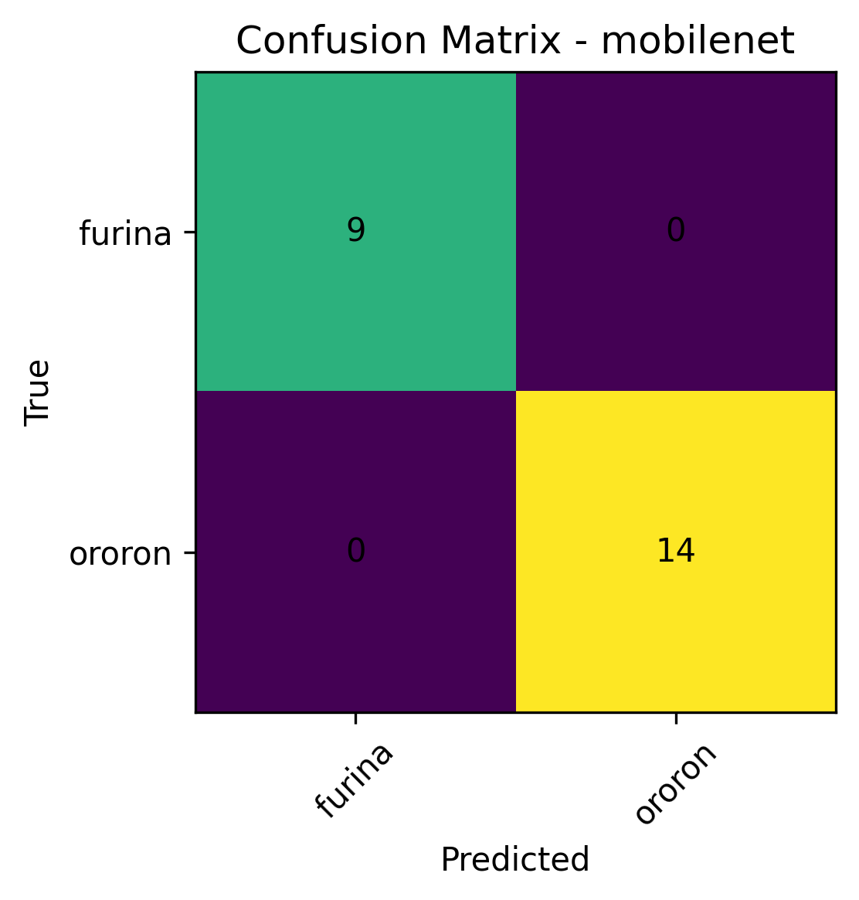

The confusion matrix for MobileNet shows:

- 9 Furina images correctly classified as Furina
- 14 Ororon images correctly classified as Ororon
- 0 Furina images misclassified
- 0 Ororon images misclassified

This confirms that MobileNet correctly classified all test images in this experiment.

## Best Model Prediction Examples

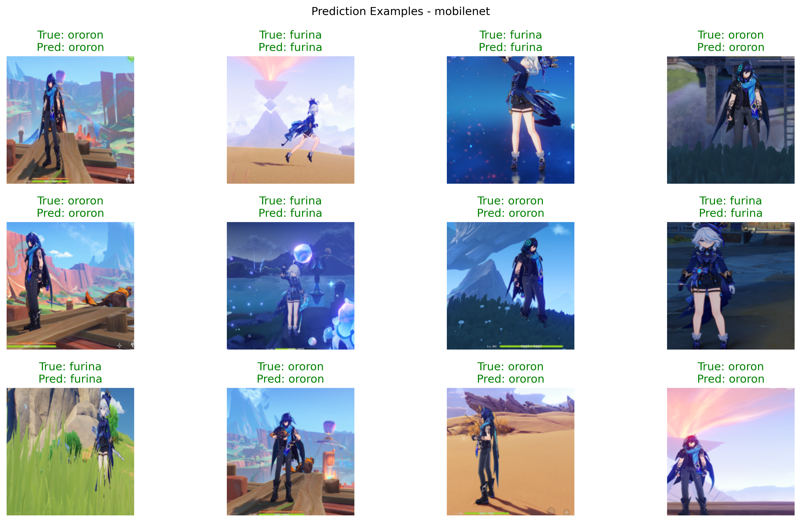

The prediction examples show that MobileNet correctly classified different Furina and Ororon test images.

The model correctly predicted images with different backgrounds, poses, and zoom levels. This shows that the transfer learning model learned useful character-specific visual features.

## Key Observations

- Pretrained ImageNet models could not directly identify Furina or Ororon.
- Before transfer learning, the predictions were limited to ImageNet classes.
- The top-5 predictions included labels such as `sarong`, `kimono`, `military uniform`, and `scuba diver`.
- After transfer learning, the models were able to classify the custom characters correctly.
- MobileNet gave the best result with 1.0000 test accuracy.
- ResNet50 and ResNet101 also performed very well with 0.9565 test accuracy.
- VGG16 had the lowest test accuracy among the tested transfer learning models.
- Transfer learning worked well because the pretrained models already had useful visual feature extraction ability.
- Only the final classification layer needed to be trained for the custom two-class dataset.

## Main Learning

The main learning from this tutorial is that pretrained models are useful, but their original predictions are limited to the dataset they were trained on.

A pretrained ImageNet model cannot directly predict custom classes such as Furina and Ororon. However, by replacing the final classification layer and training it on a custom dataset, the same pretrained model can be adapted to a new classification problem.

This is the main idea of transfer learning.

## Conclusion

This tutorial demonstrated how pretrained models can be used for both prediction and transfer learning.

In the first part, pretrained models produced top-5 ImageNet labels, but they were not able to identify the custom character classes directly.

In the second part, transfer learning was applied by replacing the final classification layer and training on the Furina/Ororon dataset. After transfer learning, the models were able to classify the two custom classes successfully.

MobileNet achieved the best result with 100% test accuracy and the fewest trainable parameters. Overall, the experiment showed that transfer learning is effective for small custom image classification datasets.
