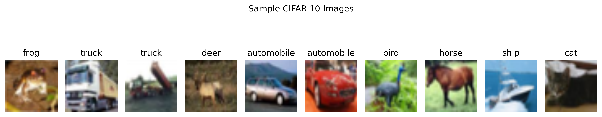
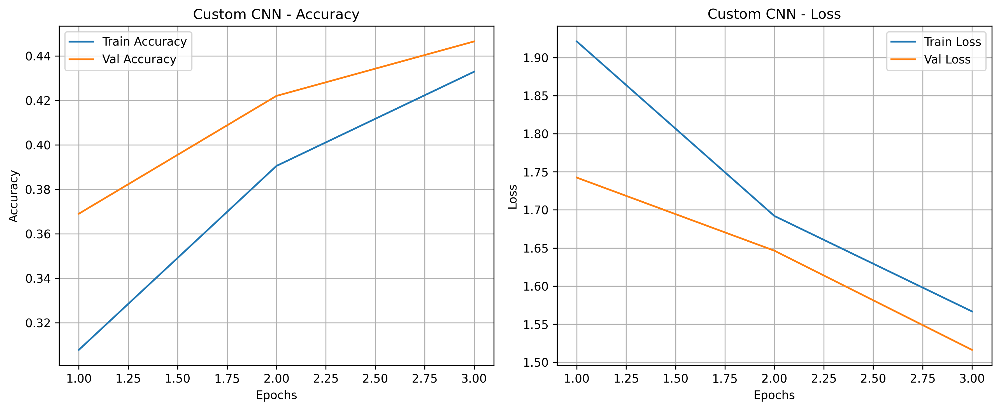
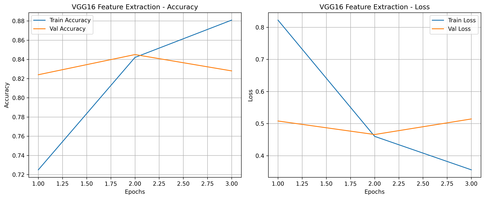
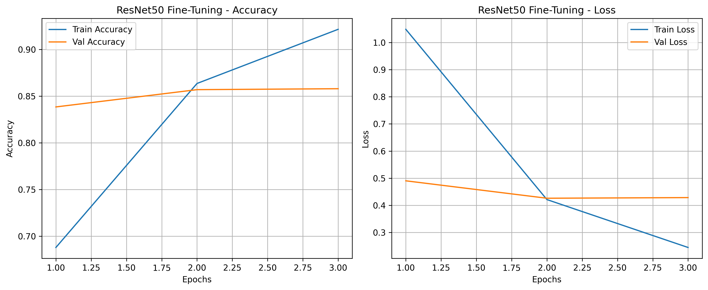
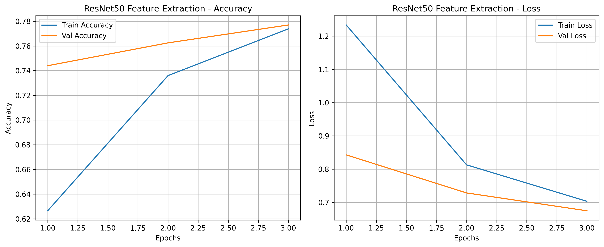
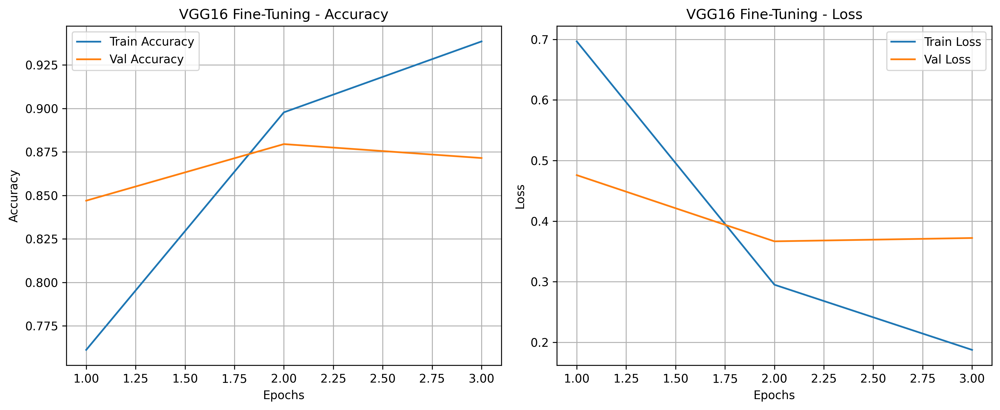
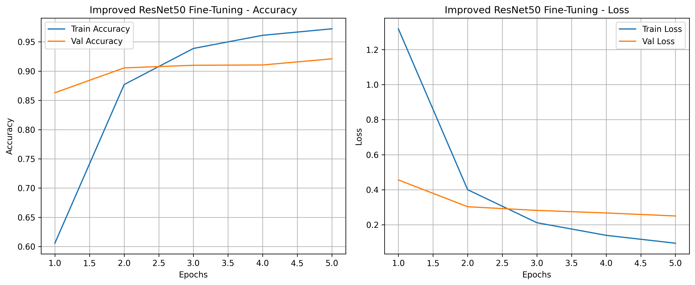
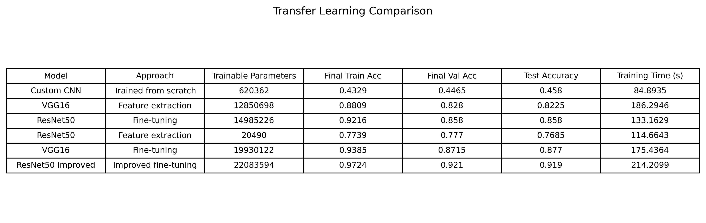
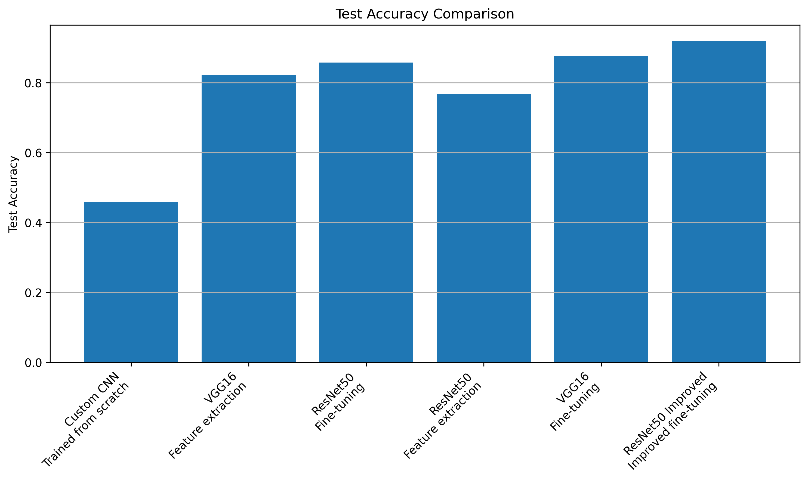
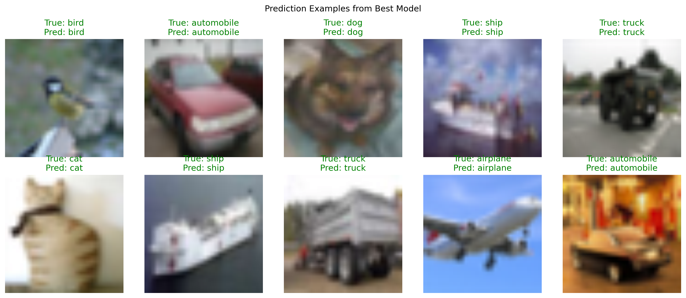

# Tutorial 07 — Transfer Learning: Feature Extraction vs Fine-Tuning

## Overview

This tutorial focuses on comparing feature extraction and fine-tuning using pretrained deep learning models. The original tutorial used TensorFlow/Keras, but this implementation was completed in PyTorch.

The main purpose was to understand how pretrained models can be reused for a new dataset, and how feature extraction and fine-tuning differ in terms of trainable parameters, accuracy, training time, and generalization.

## Objectives

The main objectives of this tutorial were:

- Understand transfer learning concepts
- Explore feature extraction
- Explore fine-tuning
- Work with pretrained models
- Evaluate and compare model performance
- Compare custom CNN, VGG16, and ResNet50 models
- Improve fine-tuning performance

## Dataset

The CIFAR-10 dataset was used for this tutorial.

CIFAR-10 contains 10 image classes:

- Airplane
- Automobile
- Bird
- Cat
- Deer
- Dog
- Frog
- Horse
- Ship
- Truck

The CIFAR-10 images were resized to 224 × 224 because pretrained ImageNet models such as VGG16 and ResNet50 expect larger input images. ImageNet normalization was also applied because the pretrained models were originally trained using ImageNet-style preprocessing.

## CIFAR-10 Sample Images

The sample images show different CIFAR-10 classes. These images are more complex than MNIST because they are colored natural images with different backgrounds, object shapes, and visual variations.

## Transfer Learning Concept

Transfer learning uses a model that was already trained on a large dataset, such as ImageNet, and adapts it to a new task.

In this tutorial, pretrained VGG16 and ResNet50 models were used for CIFAR-10 classification.

The original pretrained models classify 1000 ImageNet classes, so their final classification layers were replaced with new layers for the 10 CIFAR-10 classes.

## Feature Extraction

In feature extraction, the pretrained convolutional layers are frozen. Only the new classification layer is trained.

This means the model uses the features learned from ImageNet, but does not update the pretrained feature extractor.

Advantages of feature extraction:

- Faster training
- Fewer trainable parameters
- Lower risk of overfitting
- Useful when the dataset is small

Disadvantages:

- The model may not adapt fully to the new dataset
- Accuracy may be lower than fine-tuning

## Fine-Tuning

In fine-tuning, some of the pretrained layers are unfrozen and trained along with the new classification layer.

This allows the model to adjust pretrained features for the new dataset.

Advantages of fine-tuning:

- Better adaptation to the new task
- Can improve accuracy
- Useful when the new dataset is different from ImageNet

Disadvantages:

- More trainable parameters
- Slower training
- Higher risk of overfitting if not controlled

## Custom CNN Baseline

A custom CNN was trained from scratch to create a baseline for comparison.

The custom CNN had much lower accuracy compared to the pretrained models. This is expected because the custom model started with random weights, while pretrained models already had useful visual features learned from ImageNet.

The custom CNN achieved a test accuracy of 0.458.

## VGG16 Feature Extraction

VGG16 was first used as a feature extractor. The pretrained convolutional base was frozen, and only the new classifier layers were trained.

VGG16 feature extraction performed much better than the custom CNN. It achieved a test accuracy of 0.8225.

This shows the benefit of using pretrained features. Even without fine-tuning the convolutional layers, the model was able to classify CIFAR-10 images reasonably well.

## ResNet50 Fine-Tuning

ResNet50 was used for fine-tuning by unfreezing the last block and training it along with the new classifier.

ResNet50 fine-tuning achieved a test accuracy of 0.858.

This was better than ResNet50 feature extraction and VGG16 feature extraction. Fine-tuning allowed the model to adjust some pretrained features for the CIFAR-10 dataset.

## ResNet50 Feature Extraction

ResNet50 was also tested using feature extraction only.

ResNet50 feature extraction achieved a test accuracy of 0.7685.

This was lower than VGG16 feature extraction in this experiment. One possible reason is that only the final classifier was trained, while the frozen ResNet50 features may not have adapted enough to the CIFAR-10 resized images.

## VGG16 Fine-Tuning

VGG16 was also fine-tuned by unfreezing the last convolution block.

VGG16 fine-tuning achieved a test accuracy of 0.877.

This was better than VGG16 feature extraction and ResNet50 fine-tuning in the initial experiments. Fine-tuning improved performance because the model was able to update deeper features for CIFAR-10 classification.

## Improved ResNet50 Fine-Tuning

The improved fine-tuning experiment used ResNet50 with more layers unfrozen and better training settings.

The improvements included:

- Lower learning rate
- Weight decay
- Early stopping
- More epochs
- Unfreezing more layers
- Dropout in the classifier

The improved ResNet50 fine-tuning model achieved the best result, with a test accuracy of 0.919.

This shows that fine-tuning can perform very well when the learning rate, trainable layers, and regularization settings are chosen carefully.

## Model Comparison Table

The comparison table shows the performance of all models.

The results were:

- Custom CNN: 0.458 test accuracy
- VGG16 feature extraction: 0.8225 test accuracy
- ResNet50 fine-tuning: 0.858 test accuracy
- ResNet50 feature extraction: 0.7685 test accuracy
- VGG16 fine-tuning: 0.877 test accuracy
- Improved ResNet50 fine-tuning: 0.919 test accuracy

The improved ResNet50 fine-tuning model gave the highest test accuracy. The custom CNN had the lowest accuracy because it was trained from scratch and did not benefit from pretrained ImageNet features.

## Test Accuracy Comparison

The bar chart clearly shows that pretrained models performed much better than the custom CNN.

Fine-tuned models generally performed better than feature extraction models. The improved ResNet50 fine-tuning model gave the best overall performance.

## Prediction Examples

The prediction examples show test images with their true and predicted labels. This helps visually check how well the best model performs on unseen CIFAR-10 images.

Correct predictions are shown in green and incorrect predictions are shown in red.

## Feature Extraction vs Fine-Tuning Comparison

Feature extraction was faster and required fewer trainable parameters because most pretrained layers were frozen.

Fine-tuning required more computation and more trainable parameters, but it produced better performance in most cases.

In this experiment, fine-tuning was better than feature extraction because the model could adapt its deeper features to CIFAR-10.

## Improving Fine-Tuning Results

Fine-tuning results were improved by:

- Using a lower learning rate
- Using weight decay to reduce overfitting
- Using early stopping
- Unfreezing more layers
- Training for more epochs
- Adding dropout to the classifier
- Using ImageNet-style preprocessing

These changes improved the ResNet50 model from 0.858 test accuracy to 0.919 test accuracy.

## Best Model

The best model was the improved ResNet50 fine-tuning model.

It achieved:

- Final training accuracy: 0.9724
- Final validation accuracy: 0.921
- Test accuracy: 0.919

This was the highest test accuracy among all tested models.

## Key Observations

- Transfer learning gave much better performance than training a CNN from scratch.
- Feature extraction was faster and simpler, but generally less accurate than fine-tuning.
- Fine-tuning improved performance because the pretrained model could adapt to CIFAR-10.
- VGG16 fine-tuning performed better than VGG16 feature extraction.
- ResNet50 improved fine-tuning gave the best overall result.
- Lower learning rate helped make fine-tuning more stable.
- Weight decay, dropout, and early stopping helped reduce overfitting.
- ImageNet preprocessing was important because pretrained models expect ImageNet-style input formatting.

## Conclusion

This tutorial helped in understanding the difference between feature extraction and fine-tuning in transfer learning.

The custom CNN trained from scratch performed the worst, while pretrained models performed much better. Feature extraction provided good results with fewer trainable parameters, but fine-tuning gave better accuracy because the model could adapt to the CIFAR-10 dataset.

The improved ResNet50 fine-tuning model achieved the best result, showing that careful tuning of learning rate, trainable layers, epochs, and regularization can significantly improve transfer learning performance.
