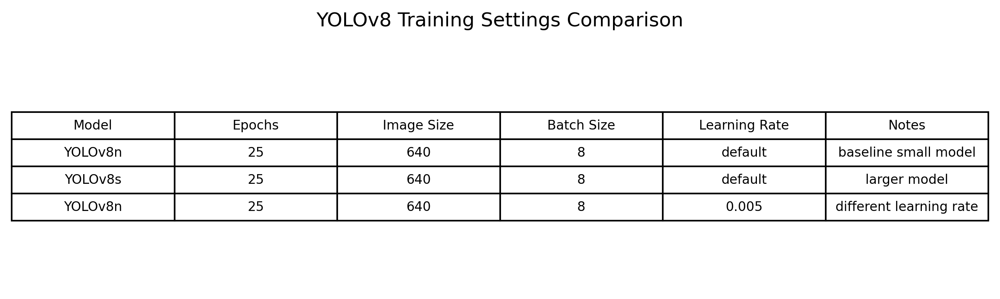
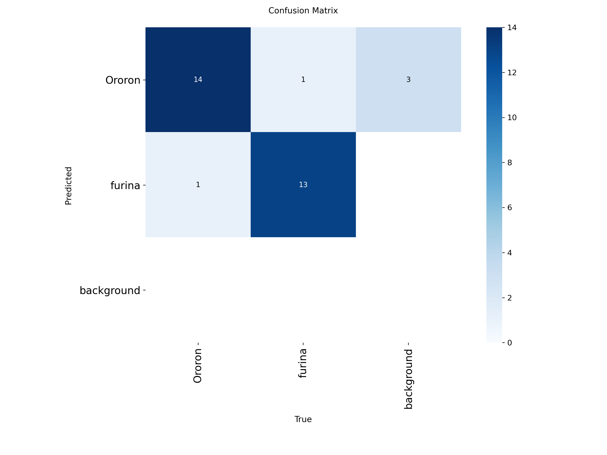
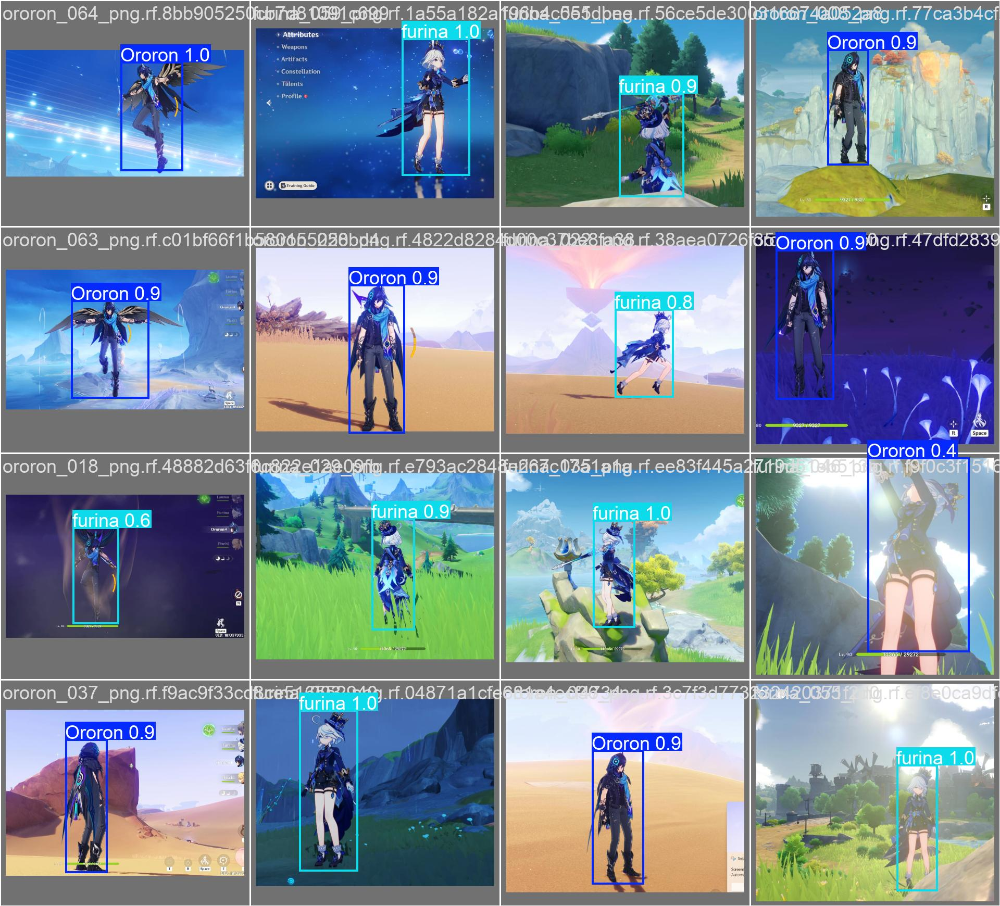
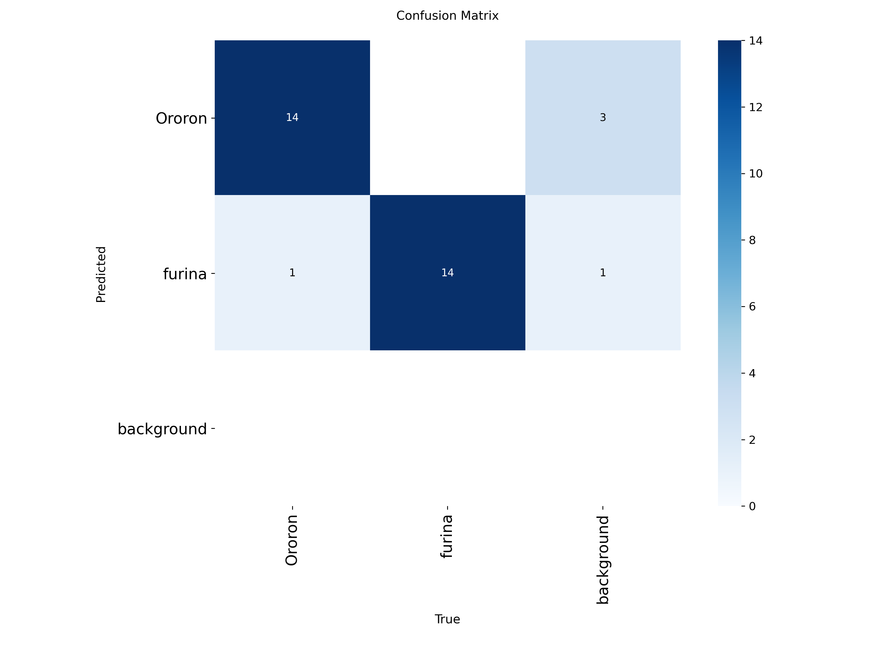
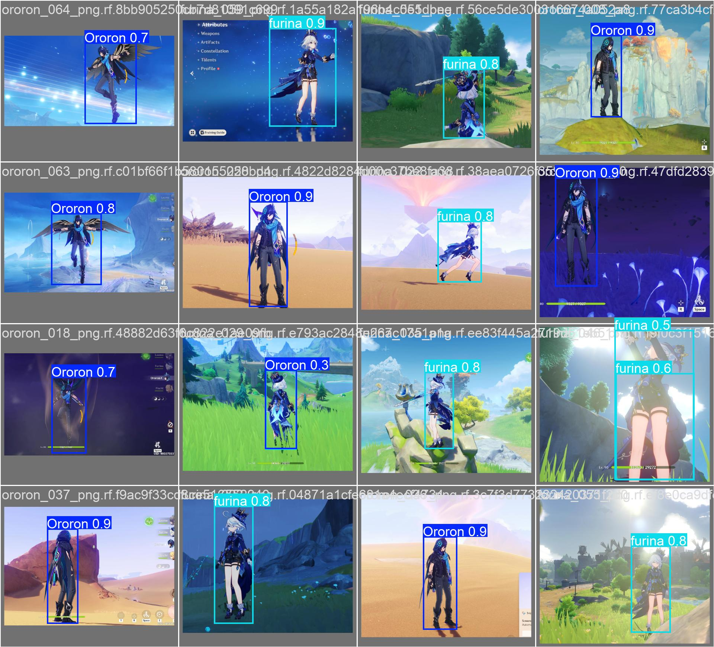
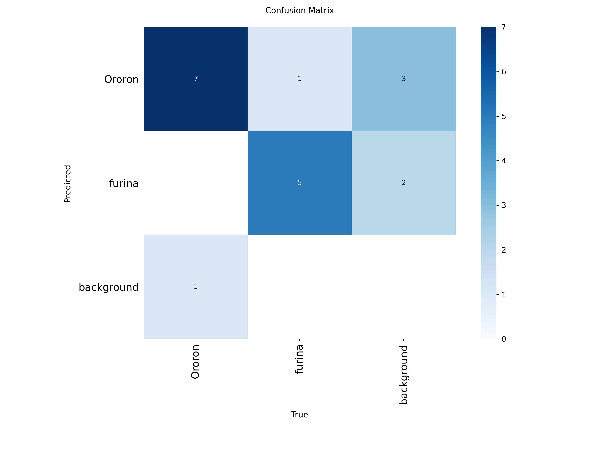
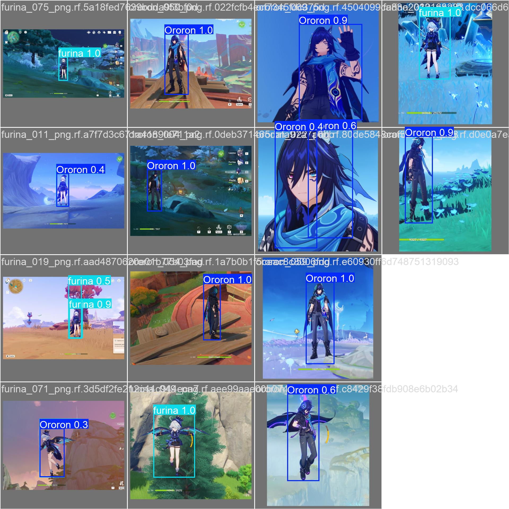
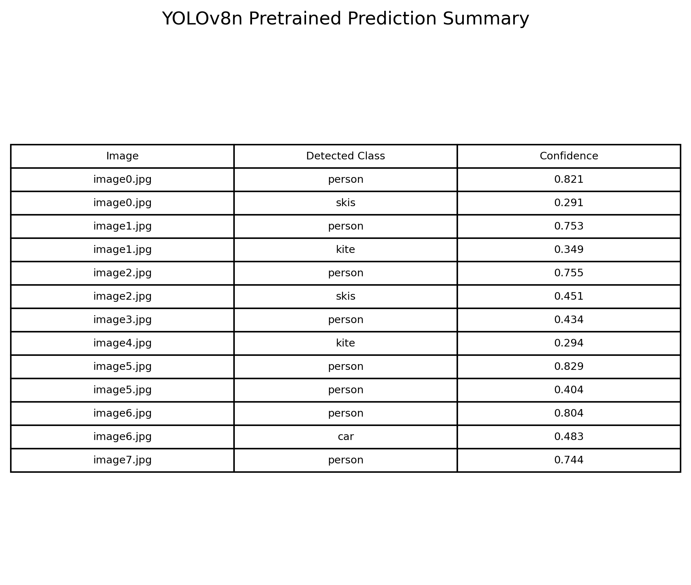
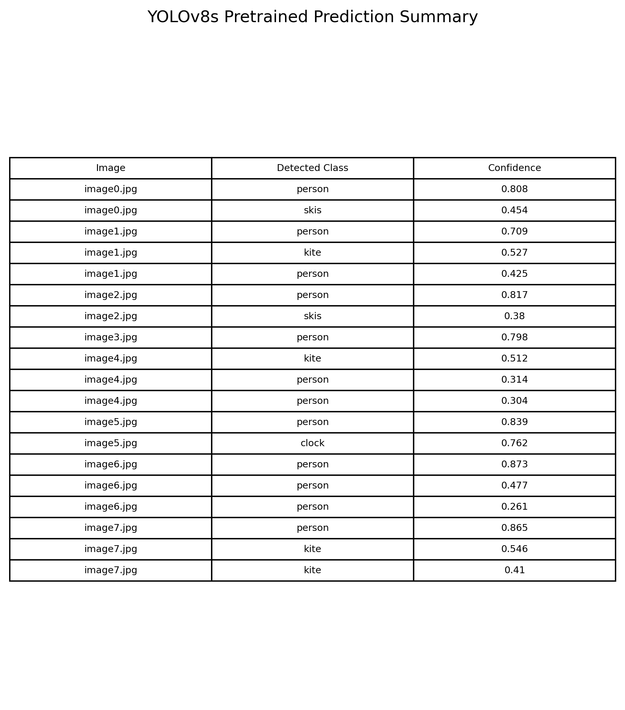
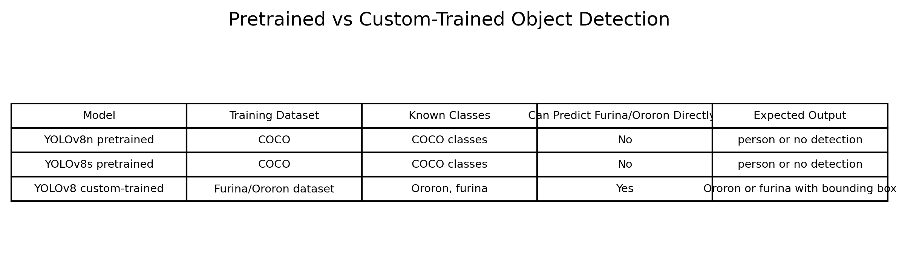

# Tutorial 08 — Object Detection using YOLO

## Overview

This tutorial focuses on object detection. The implementation was completed using YOLOv8 through the Ultralytics/PyTorch workflow.

The tutorial was divided into two parts:

- **Tutorial 08A:** Custom object detection using a manually labeled dataset
- **Tutorial 08B:** Testing pretrained object detection models without custom training

The custom dataset used two Genshin Impact characters:

- Ororon
- furina

The main purpose was to understand the difference between a pretrained object detector and a custom-trained object detector.

## Objectives

The main objectives of this tutorial were:

- Understand object detection using bounding boxes
- Prepare a custom labeled object detection dataset
- Train YOLOv8 on the custom dataset
- Test the model on unseen images
- Compare different YOLOv8 training settings
- Compare pretrained object detection with custom-trained detection
- Understand why custom training is required for new object classes

## Dataset

A custom dataset was created from game screenshots. The dataset contained two object classes:

```text
Ororon
furina
```

Unlike image classification, object detection requires not only the class label but also the object location. Therefore, each image was manually labeled using bounding boxes.

The dataset was exported in YOLO format with this structure:

```text
dataset/
├── train/
│   ├── images/
│   └── labels/
├── valid/
│   ├── images/
│   └── labels/
├── test/
│   ├── images/
│   └── labels/
└── data.yaml
```

Each YOLO label file contained:

```text
class_id x_center y_center width height
```

The coordinates were normalized between 0 and 1.

## Tutorial 08A — Custom Object Detection

Tutorial 08A used the manually labeled Furina/Ororon dataset to train YOLOv8 for custom object detection.

The goal was to make the model detect the actual custom classes instead of general pretrained labels.

## Labeled Dataset Samples


The labeled samples show the custom bounding-box annotations. The boxes are drawn around the visible character region.

This confirms that the dataset was prepared for object detection, not only classification. The model learns both:

- the class of the character
- the location of the character in the image

## YOLOv8 Training Settings



Three YOLOv8 training settings were tested:

- YOLOv8n baseline
- YOLOv8s custom model
- YOLOv8n with learning rate 0.005

All models were trained using:

- 25 epochs
- image size 640
- batch size 8

YOLOv8n is the smaller model, while YOLOv8s is a larger model with more capacity.

## YOLOv8n Custom Model

The first custom model was trained using YOLOv8n.

YOLOv8n is lightweight and suitable for small datasets. It trained quickly and was able to detect both custom classes.

## YOLOv8n Confusion Matrix



The confusion matrix shows that the YOLOv8n model was able to classify the detected objects into the correct custom classes.

This indicates that the model learned the difference between Ororon and furina after custom training.

## YOLOv8n Validation Predictions



The prediction image shows detected characters with bounding boxes and class labels.

The model was able to place bounding boxes around the visible characters and assign the correct class names.

## YOLOv8n Test Predictions


The YOLOv8n test prediction results show that the trained detector successfully detected both furina and Ororon in unseen test images.

The model predicted bounding boxes with high confidence values. This shows that the custom training was successful.

## YOLOv8s Custom Model

A larger YOLOv8s model was also trained and tested.

YOLOv8s has more capacity than YOLOv8n, so it can sometimes learn stronger features, but it also requires more computation.

## YOLOv8s Confusion Matrix



The YOLOv8s confusion matrix shows strong detection and classification performance on the test data.

From the metric output, YOLOv8s achieved strong results. For Ororon, the model reached high precision and full recall. For furina, the model also achieved full recall and high precision.

The visible YOLOv8s metric output showed:

- Ororon precision: 0.990
- Ororon recall: 1.000
- Ororon mAP50: 0.995
- Ororon mAP50-95: 0.622
- furina precision: 0.918
- furina recall: 1.000
- furina mAP50: 0.995
- furina mAP50-95: 0.697

This shows that the larger YOLOv8s model performed very well on the custom test set.

## YOLOv8s Validation Predictions



The YOLOv8s prediction image shows that the model successfully detected the characters and placed bounding boxes around them.

The predictions confirm that the larger model learned the custom object classes after training.

## YOLOv8n with Learning Rate 0.005

A second YOLOv8n model was trained using a different learning rate.

The purpose of this experiment was to observe how changing the learning rate affects object detection training.

## YOLOv8n Learning Rate 0.005 Confusion Matrix



The confusion matrix shows the performance of the YOLOv8n model trained with the modified learning rate.

Changing the learning rate can affect how quickly the model learns and how stable the training process is.

## YOLOv8n Learning Rate 0.005 Validation Predictions



The prediction image shows that the model trained with the modified learning rate was still able to detect the custom characters.

This shows that YOLOv8 remained effective on the dataset even when the learning rate was changed.

## Tutorial 08B — Pretrained Object Detection

Tutorial 08B tested pretrained YOLOv8 object detection models directly on the same type of test images.

The pretrained models were not trained on the Furina/Ororon dataset. They were trained on the COCO dataset.

COCO contains general object classes such as:

- person
- car
- dog
- cat
- kite

It does not contain custom game-character classes such as Ororon or furina.

## Input Test Images


The same style of character images was used for pretrained detection.

These images were used to check what a COCO-pretrained detector can identify without custom training.

## YOLOv8n Pretrained Predictions


The YOLOv8n pretrained model did not predict the custom class names.

Instead, it mostly detected the characters as the general COCO class:

```text
person
```

In some images where the character was gliding, the model also detected the glider as:

```text
kite
```

This is reasonable because the glider wing shape visually resembles the COCO kite class.

## YOLOv8n Pretrained Prediction Table



The prediction table confirms that YOLOv8n predicted general COCO classes instead of the custom character names.

This shows the limitation of using a pretrained detector directly on new classes.

## YOLOv8s Pretrained Predictions


The larger YOLOv8s pretrained model behaved similarly.

It detected the character as a general object such as `person`, and in gliding images it detected the wing/glider as `kite`.

Although YOLOv8s is larger than YOLOv8n, it still cannot predict custom classes that were not in its training dataset.

## YOLOv8s Pretrained Prediction Table



The YOLOv8s prediction table also shows COCO-based detections.

This confirms that model size alone is not enough to detect new custom classes. The model must be trained or fine-tuned on labeled examples of those classes.

## Pretrained vs Custom-Trained Object Detection



The comparison table summarizes the difference between pretrained and custom-trained object detection.

The pretrained YOLOv8 models were trained on COCO, so they predicted general labels such as `person` and `kite`.

The custom-trained YOLOv8 model was trained on the Furina/Ororon dataset, so it was able to predict the actual custom classes:

```text
Ororon
furina
```

This is the main lesson from the tutorial.

## Key Observations

- Object detection requires both class labels and bounding-box annotations.
- The custom dataset was labeled manually using bounding boxes.
- YOLOv8n successfully learned to detect the custom characters.
- YOLOv8s also performed very strongly on the test set.
- The learning-rate experiment still produced successful detections.
- The custom-trained YOLO models predicted `Ororon` and `furina` directly.
- Pretrained YOLO models did not know the custom classes.
- Pretrained YOLO mostly detected the characters as `person`.
- In gliding images, pretrained YOLO also detected the glider wings as `kite`.
- This happened because `person` and `kite` are COCO classes, while `Ororon` and `furina` are not.
- Custom training is necessary when the target object classes are not included in the pretrained dataset.

## Main Learning

The main learning from this tutorial is that pretrained object detection models are useful for general object categories, but they cannot directly detect new custom classes.

Before custom training, YOLO could only detect general COCO classes such as `person` and `kite`.

After custom training on the labeled dataset, YOLO was able to detect the actual target classes, Ororon and furina.

This demonstrates the importance of dataset labeling and transfer learning/custom training in object detection.

## Conclusion

This tutorial demonstrated object detection using YOLOv8.

In Tutorial 08A, a custom object detection dataset was created using manually labeled bounding boxes. YOLOv8 was trained on this dataset and successfully detected the two custom classes, Ororon and furina.

In Tutorial 08B, pretrained YOLOv8 models were tested directly on the same type of images. These models did not detect Ororon or furina because those classes were not part of the COCO dataset. Instead, the models detected general classes such as `person`, and sometimes `kite` when the character was gliding.

Overall, the results show that pretrained object detectors are useful as starting points, but custom labeled data and training are required for detecting new object classes.
