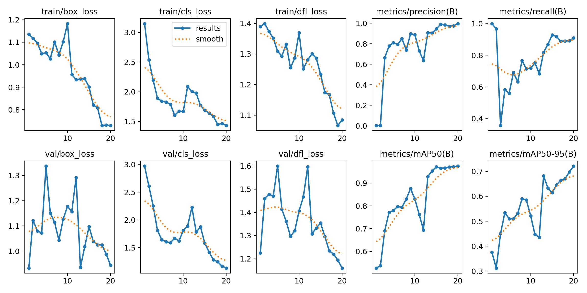
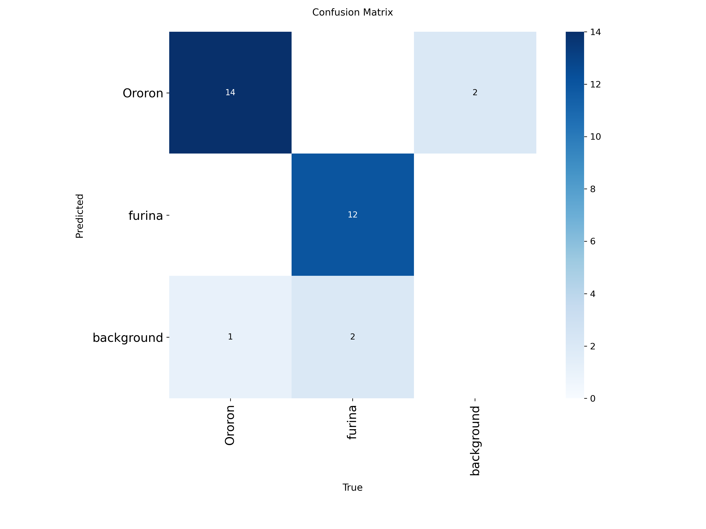
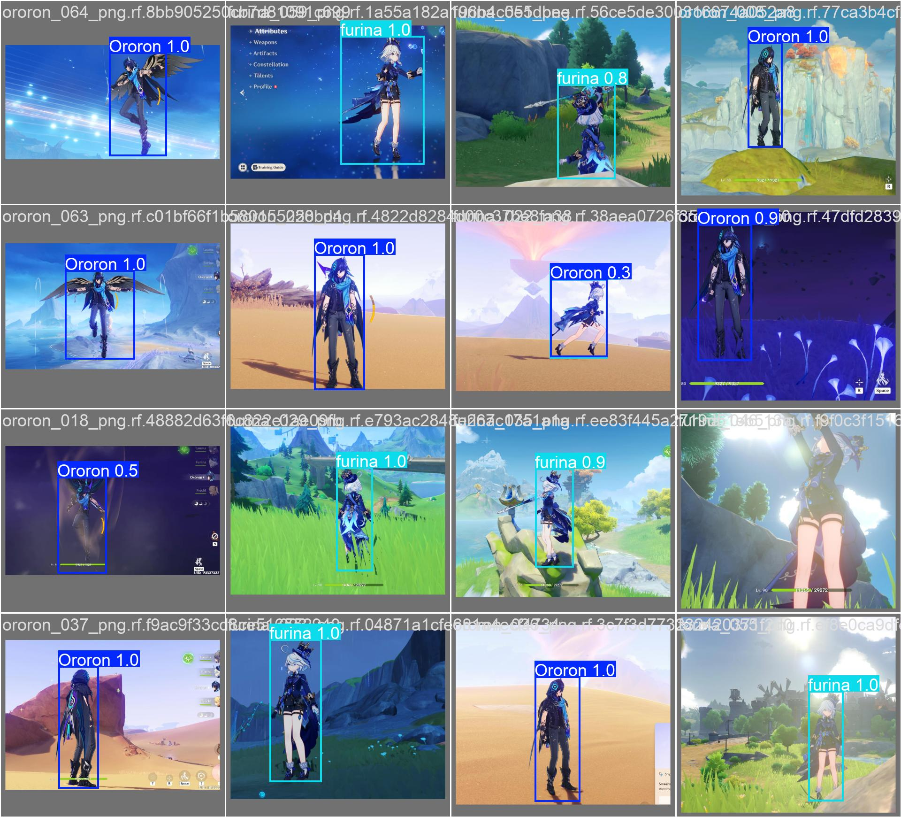
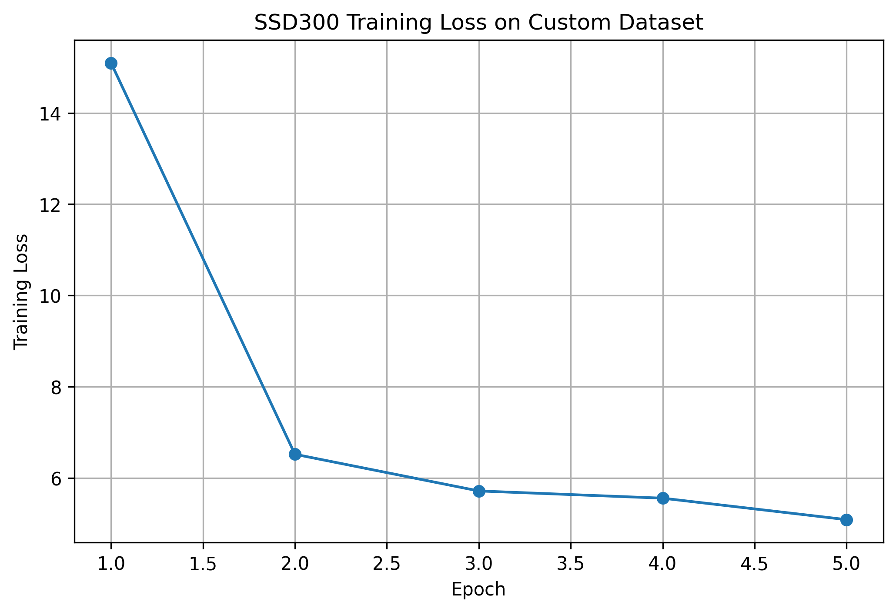
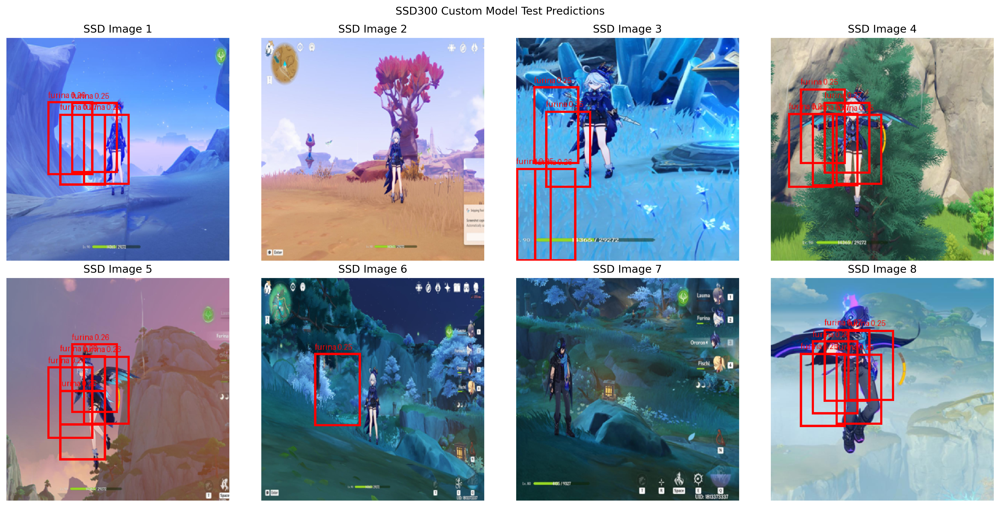
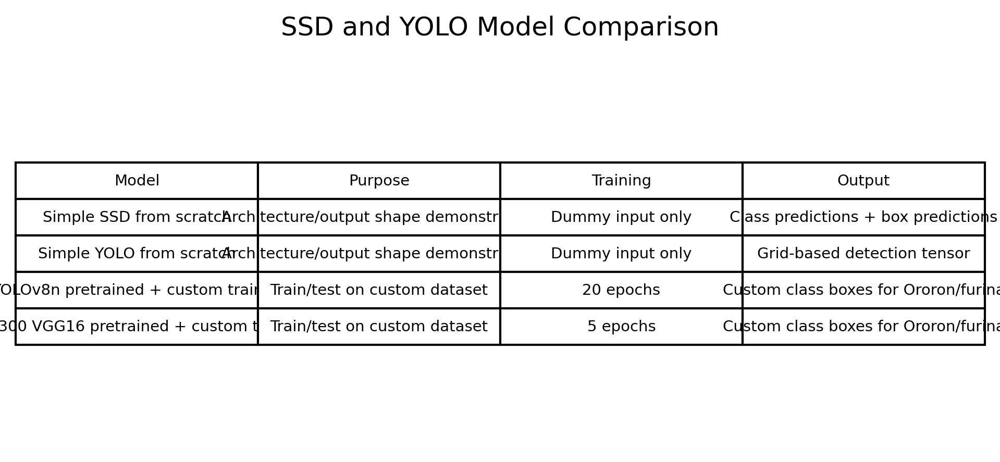

# Tutorial 09 — Object Detection using SSD and YOLO

## Overview

This tutorial focuses on object detection using SSD and YOLO. The implementation was completed in PyTorch using a combination of custom model structures and pretrained object detection models.

The tutorial had two main purposes:

- Understand how SSD and YOLO object detection models are structured
- Train and test pretrained SSD and YOLO models using the custom object detection dataset from Tutorial 08

The custom dataset contained two classes:

- Ororon
- furina

## Objectives

The main objectives of this tutorial were:

- Understand the backbone network used in SSD and YOLO
- Understand detection heads and prediction layers
- Implement simplified SSD and YOLO-style models from scratch
- Test model output shapes using dummy input data
- Reuse the custom object detection dataset from Tutorial 08
- Train and test a pretrained YOLO model on the custom dataset
- Train and test a pretrained SSD model on the custom dataset
- Compare SSD and YOLO results

## Dataset

The dataset used in this tutorial was the same object detection dataset developed in Tutorial 08.

The dataset was created from game screenshots and manually labeled using bounding boxes.

The classes were:

```text
Ororon
furina
```

The dataset was arranged in YOLO format:

```text
dataset/
├── train/
│   ├── images/
│   └── labels/
├── valid/
│   ├── images/
│   └── labels/
├── test/
│   ├── images/
│   └── labels/
└── data.yaml
```

Each label file contained bounding-box information in this format:

```text
class_id x_center y_center width height
```

The bounding-box values were normalized between 0 and 1.

## Part A — SSD Model from Scratch

The first part of the notebook implemented a simplified SSD-style model.

SSD stands for Single Shot MultiBox Detector. It uses a convolutional backbone to extract features from the input image. Prediction heads are then applied to feature maps to produce:

- class predictions
- bounding-box coordinate predictions

SSD predicts objects at multiple scales by using feature maps from different depths of the network.

## SSD Architecture Concept

The simplified SSD model contained:

- a small CNN backbone
- multiple feature maps
- classification heads
- bounding-box regression heads

The classification head predicted the object class for each anchor box. The bounding-box head predicted box coordinates.

For dummy input testing, the SSD model produced two outputs:

```text
SSD class prediction shape
SSD box prediction shape
```

The class prediction output represents the class scores for all anchor boxes. The box prediction output represents the bounding-box coordinates for those anchor boxes.

## Part B — YOLO Model from Scratch

The second part of the notebook implemented a simplified YOLO-style model.

YOLO stands for You Only Look Once. It divides the image into a grid and predicts bounding boxes and class probabilities from each grid cell.

Each YOLO prediction contains:

- x coordinate
- y coordinate
- width
- height
- object confidence score
- class probabilities

The simplified YOLO model used a CNN backbone and a detection head.

## YOLO Architecture Concept

The simplified YOLO model produced an output tensor in this form:

```text
batch_size × grid_height × grid_width × prediction_channels
```

The prediction channels depend on:

- number of bounding boxes per grid cell
- number of object classes

This helped confirm how YOLO organizes object detection predictions.

## Part C — Pretrained YOLOv8n on Custom Dataset

A pretrained YOLOv8n model was trained on the custom Ororon/furina dataset.

The training settings were:

```text
Model: YOLOv8n
Epochs: 20
Image size: 640
Batch size: 8
Dataset: Ororon/furina custom object detection dataset
```

YOLOv8n was selected because it is lightweight and suitable for a small custom dataset.

## YOLOv8n Training Results



The YOLOv8n results plot shows the training and validation behavior over the epochs.

The model learned to detect the custom classes successfully. The final YOLOv8n results were:

```text
Precision: 0.997
Recall: 0.910
mAP50: 0.975
mAP50-95: 0.721
```

The high precision shows that most predicted detections were correct. The high mAP50 value shows that the model performed well at detecting the custom objects.

## YOLOv8n Confusion Matrix



The confusion matrix shows how well the YOLOv8n model classified the detected objects.

The model was able to distinguish between the two custom classes:

```text
Ororon
furina
```

The confusion matrix confirms that the model learned the custom classes after training.

## YOLOv8n Validation Predictions



The validation prediction image shows YOLOv8n detecting the custom characters and drawing bounding boxes around them.

This confirms that the model was not only predicting class labels, but also correctly localizing the objects in the images.

## YOLOv8n Test Predictions


The YOLOv8n test predictions show the model detecting Ororon and furina on unseen test images.

The bounding boxes were placed around the visible character regions, and the model predicted the custom class names with high confidence.

This shows that the pretrained YOLOv8n model was successfully adapted to the custom dataset.

## Part D — Pretrained SSD300 VGG16 on Custom Dataset

A pretrained SSD300 VGG16 model was also used.

The SSD model was modified for the custom dataset by replacing the classification head. SSD detection models include a background class, so the output classes became:

```text
background
Ororon
furina
```

The SSD model was then trained on the same custom dataset.

## SSD Training Loss



The SSD training loss plot shows how the loss changed during training.

The loss decreased during training, which indicates that the SSD model was learning from the custom dataset.

However, the SSD experiment was trained for fewer epochs and used a simpler training setup compared to the YOLOv8n experiment.

## SSD Test Predictions



The SSD test prediction image shows the SSD model predictions on custom test images.

The SSD model was able to generate bounding-box predictions after training. However, the SSD predictions were generally less stable compared to the YOLOv8n results.

This difference is expected because the YOLOv8n workflow is more optimized and easier to train for a small custom dataset.

## SSD and YOLO Comparison



The comparison table summarizes the models used in this tutorial.

The simplified SSD and YOLO models were used mainly to understand model architecture and output shapes. The pretrained YOLOv8n and SSD300 models were then trained and tested on the real custom dataset.

## SSD vs YOLO Discussion

SSD and YOLO are both single-stage object detection models, but they use different prediction strategies.

SSD uses multiple feature maps and anchor boxes to detect objects at different scales. This makes it useful for detecting objects of different sizes.

YOLO uses a grid-based prediction approach. It predicts bounding boxes, confidence scores, and class probabilities directly from the detection head.

In this tutorial, YOLOv8n performed better overall on the custom dataset. It produced clearer detections and strong numerical results.

## Key Observations

- The simplified SSD model successfully produced class and bounding-box outputs.
- The simplified YOLO model successfully produced a grid-based detection tensor.
- Dummy input testing was useful for checking output shapes.
- The custom object detection dataset from Tutorial 08 was reused successfully.
- YOLOv8n trained well on the Ororon/furina dataset.
- YOLOv8n achieved high precision, recall, and mAP values.
- SSD300 was successfully adapted for the custom classes by replacing its classification head.
- SSD training loss decreased, showing that the model learned from the dataset.
- YOLOv8n produced more reliable predictions than the SSD experiment.
- Both SSD and YOLO require bounding-box labeled data for custom object detection.

## Main Learning

The main learning from this tutorial is that object detection models have two important parts:

- backbone feature extractor
- detection or prediction head

SSD and YOLO both detect objects, but their output structures are different.

SSD predicts detections from multiple feature maps and uses anchor boxes. YOLO predicts detections using a grid-based output.

For custom object detection, pretrained models must be adapted to the new dataset by changing the final detection/classification head and training on labeled bounding-box data.

## Conclusion

This tutorial demonstrated object detection using SSD and YOLO.

First, simplified SSD and YOLO-style models were implemented to understand how their architectures and output shapes work. Dummy data was used to verify that the models produced the expected prediction outputs.

Then, the custom Ororon/furina object detection dataset from Tutorial 08 was reused. A pretrained YOLOv8n model was trained and tested on this dataset and achieved strong results, including high precision and mAP50.

A pretrained SSD300 VGG16 model was also adapted and trained on the same custom dataset. The SSD model was able to learn from the data, as shown by the decreasing training loss and prediction outputs.

Overall, YOLOv8n gave stronger and clearer detection results in this experiment, while SSD was useful for understanding multi-scale anchor-based object detection.
