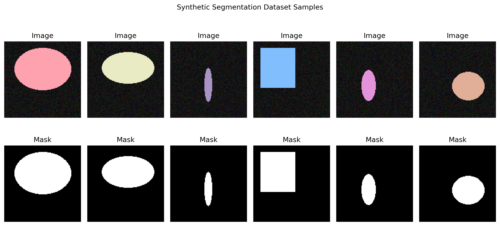
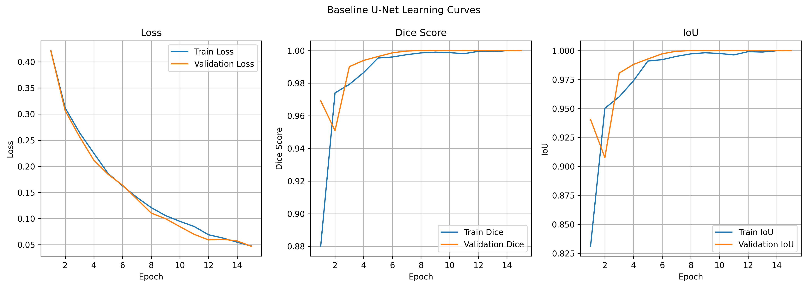
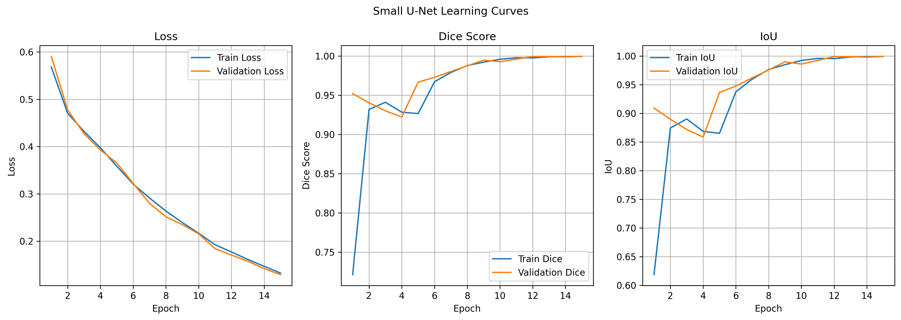
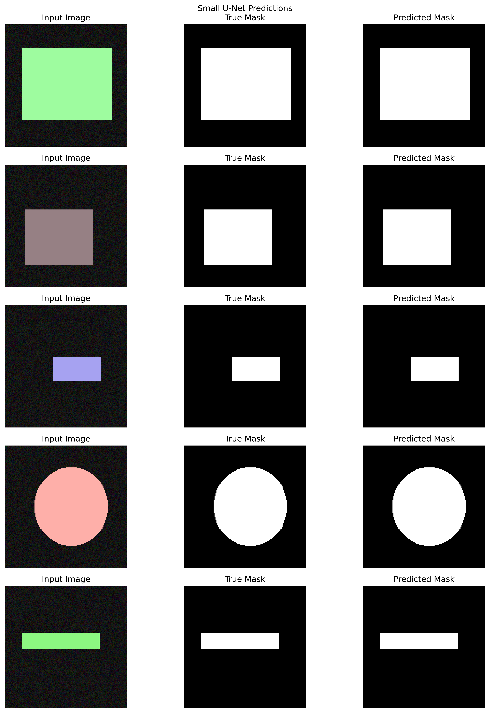
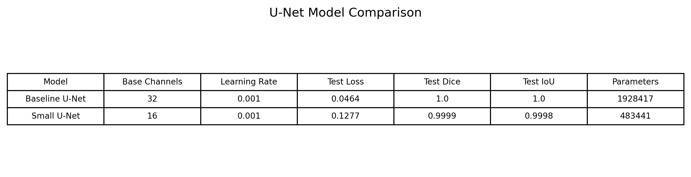
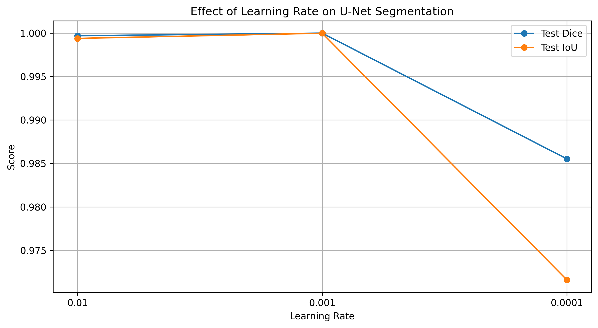
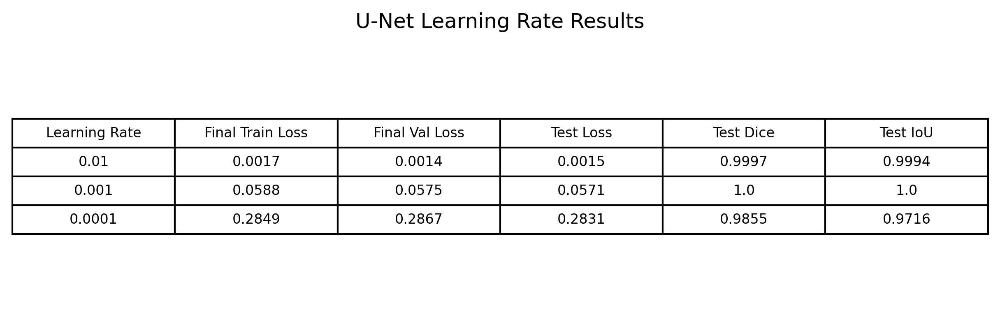

# Tutorial 10 — Image Segmentation using U-Net

## Overview

This tutorial focuses on image segmentation using a U-Net model. The original tutorial explains the U-Net architecture, dataset preparation, model training, evaluation, and visualization of segmentation results.

In this implementation, the tutorial was completed using PyTorch.

A synthetic segmentation dataset was used for this version. Each sample contained:

- an input image with a simple random shape
- a binary mask showing the object region

The task was binary segmentation:

```text
0 = background
1 = object
```

## Objectives

The main objectives of this tutorial were:

- Understand the architecture of U-Net
- Implement U-Net from scratch
- Create image-mask pairs for segmentation
- Train the segmentation model
- Evaluate segmentation performance
- Visualize predicted masks
- Change model layers
- Test different learning rates
- Compare segmentation results

## Dataset

A synthetic dataset was generated for this tutorial.

Each image contained a simple object shape such as:

- circle
- ellipse
- rectangle

Each image also had a corresponding binary mask. The mask identifies the object region in white and the background in black.

This dataset is simpler than real segmentation data, but it is useful for understanding the complete U-Net workflow.

## Synthetic Dataset Samples



The dataset samples show input images and their corresponding binary masks.

The mask represents the target segmentation output. The model learns to predict this mask from the input image.

## U-Net Architecture

U-Net is an encoder-decoder segmentation model.

The encoder extracts image features while reducing the spatial size. The decoder upsamples the feature maps to reconstruct the final segmentation mask.

A key feature of U-Net is the use of skip connections. These skip connections pass high-resolution features from the encoder to the decoder. This helps the decoder recover object boundaries and spatial details.

The model used in this tutorial included:

- convolution blocks
- max-pooling layers
- bottleneck layer
- transposed convolution upsampling
- skip connections
- final 1-channel output mask

The output was passed through a sigmoid function during evaluation to obtain a binary mask.

## Baseline U-Net

The baseline U-Net used:

```text
base_channels = 32
learning_rate = 0.001
```

This model was trained on the synthetic image-mask dataset.

## Baseline U-Net Learning Curves



The baseline U-Net learning curves show the training and validation behavior.

The loss decreased during training, while Dice score and IoU increased. This shows that the model learned to segment the synthetic objects from the background.

## Baseline U-Net Predictions


The prediction visualization compares:

- input image
- true mask
- predicted mask

The baseline U-Net was able to predict masks that closely matched the true masks. Since the dataset used simple synthetic shapes, the model could learn the segmentation task effectively.

## Changed-Layer U-Net

The task also required changing the model layers.

A smaller U-Net was tested by reducing the number of base channels:

```text
base_channels = 16
```

This reduced the number of trainable parameters and made the model lighter.

## Small U-Net Learning Curves



The small U-Net learning curves show that the reduced model also learned the segmentation task.

Because the dataset was simple, even the smaller model was able to perform well.

## Small U-Net Predictions



The small U-Net predictions show that the smaller model was still able to generate clean binary masks.

This means that for a simple synthetic dataset, a smaller model can be sufficient.

## Model Comparison



The model comparison table compares the baseline U-Net and the smaller U-Net.

The baseline model has more parameters because it uses more channels. The small U-Net has fewer parameters and is computationally lighter.

For this synthetic dataset, both models were able to perform well.

## Learning Rate Experiment

The tutorial also required using different learning rates and visualizing the results.

The tested learning rates were:

```text
0.01
0.001
0.0001
```

The same U-Net structure was trained with each learning rate.

## Learning Rate Comparison



The learning-rate comparison shows how the learning rate affected segmentation performance.

A very high learning rate can make training less stable, while a very low learning rate can make training slower. The middle learning rate generally provides a good balance.

## Learning Rate Results Table



The results table summarizes the final training, validation, and test results for different learning rates.

The comparison helps show how training behavior changes when the learning rate is modified.

## Key Observations

- U-Net was successfully implemented from scratch.
- Synthetic image-mask pairs were generated for segmentation training.
- The baseline U-Net learned to segment the object region from the background.
- The predicted masks were close to the true masks.
- Reducing the base channels created a smaller U-Net with fewer parameters.
- The smaller model still performed well because the dataset was simple.
- Different learning rates affected training and segmentation performance.
- Dice score and IoU were useful metrics for evaluating segmentation quality.
- Segmentation is different from classification and object detection because the model predicts a label for every pixel.

## Limitations

The dataset used in this tutorial was synthetic and simple.

The images contained basic geometric shapes, so the segmentation task was easier than real-world segmentation. Real image segmentation would be more difficult because of:

- complex object boundaries
- textured backgrounds
- lighting changes
- occlusion
- multiple objects
- fine details such as hair, clothing, and accessories

For a stronger version of this tutorial, the same U-Net workflow could be applied to a custom segmentation dataset created from the Furina/Ororon images. That would require manually creating pixel-level masks instead of only bounding boxes.

## Main Learning

The main learning from this tutorial is that U-Net is designed for pixel-level segmentation.

Unlike image classification, where the model predicts one label for the entire image, segmentation predicts a class label for each pixel.

Unlike object detection, where the model predicts bounding boxes, segmentation predicts the exact object region.

U-Net performs this task using an encoder-decoder structure with skip connections. The encoder extracts features, while the decoder reconstructs the final segmentation mask.

## Conclusion

This tutorial demonstrated image segmentation using U-Net.

A synthetic dataset was generated with image-mask pairs. A baseline U-Net was trained and tested on this dataset. The model successfully learned to predict binary masks for the synthetic objects.

A smaller U-Net was also tested by changing the number of base channels. The smaller model still performed well because the dataset was simple.

Different learning rates were tested and compared using loss, Dice score, and IoU.

Overall, the tutorial showed how U-Net performs segmentation and how model size and learning rate affect training results. The current synthetic dataset is useful for learning the workflow, but applying the same method to real custom character images would require creating proper segmentation masks.
