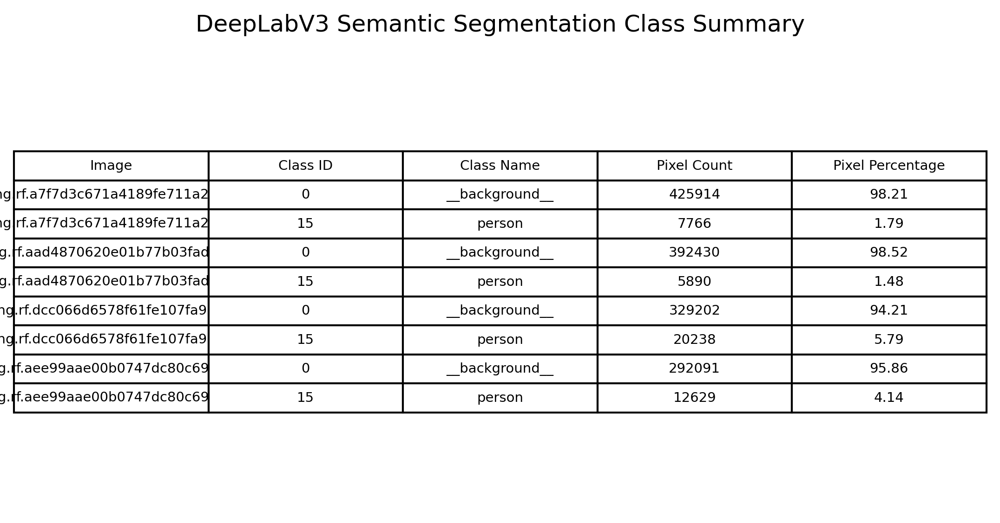
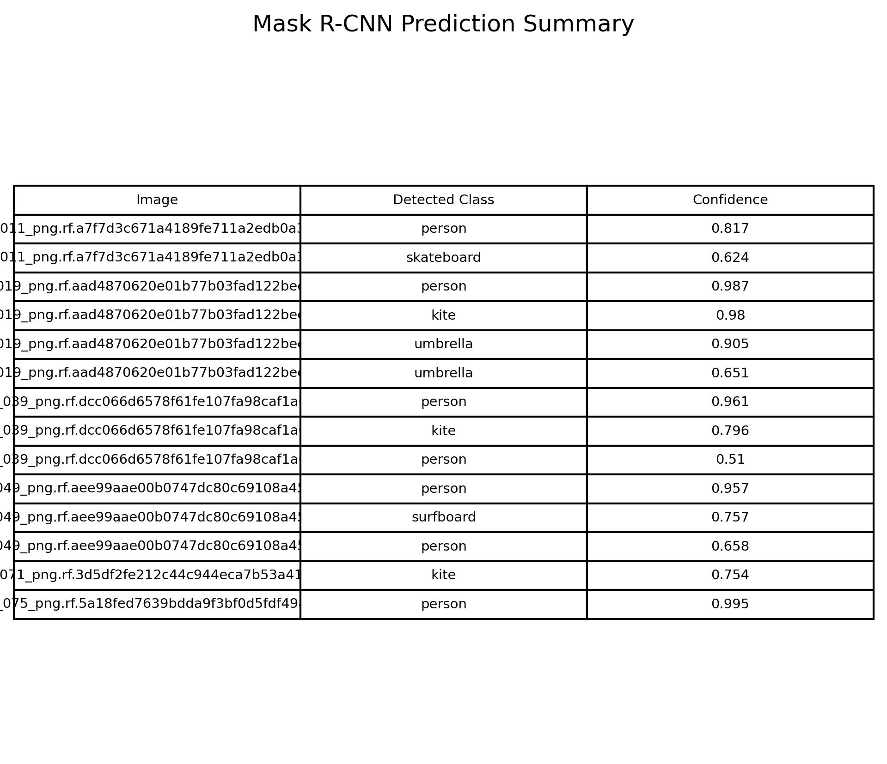
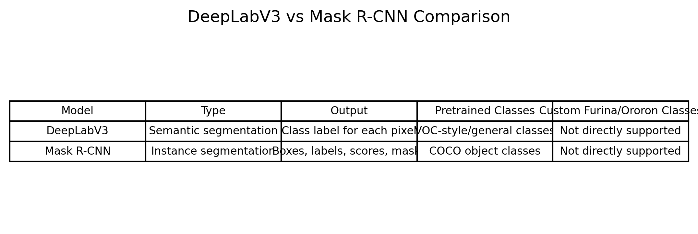

# Tutorial 11 — Semantic Segmentation using Pretrained DeepLabV3 and Mask R-CNN

## Overview

This tutorial focuses on semantic segmentation using a pretrained DeepLabV3 model. The implementation was completed in PyTorch using Torchvision.

The tutorial also included Mask R-CNN, which is an instance segmentation model.

The main purpose was to test pretrained segmentation models on the developed image dataset and visualize the results.

The dataset images were taken from the Furina/Ororon custom dataset used in previous tutorials.

## Objectives

The main objectives of this tutorial were:

- Understand semantic segmentation
- Load and use a pretrained DeepLabV3 model
- Test the pretrained segmentation model on the developed dataset
- Visualize semantic segmentation results
- Implement and test Mask R-CNN
- Compare DeepLabV3 and Mask R-CNN outputs

## Dataset

The dataset used in this tutorial was the same developed image dataset from earlier tutorials.

Only the image files were needed for this tutorial. The object detection labels were not required because the models were pretrained and used for inference only.

The expected image path was:

```text
dataset/test/images
```

The images contained the custom game characters:

```text
Furina
Ororon
```

However, the pretrained segmentation models were not trained on these custom classes.

## Input Images


The input images show the test images used for pretrained segmentation.

These images contain game characters with different backgrounds and poses. The models were tested directly on these images without custom fine-tuning.

## Part A — DeepLabV3 Semantic Segmentation

DeepLabV3 is a semantic segmentation model.

Semantic segmentation means that the model predicts a class label for every pixel in the image.

The pretrained DeepLabV3 model used in this tutorial was loaded from Torchvision with a ResNet backbone.

Because the model is pretrained on general segmentation classes, it does not directly know the custom classes Furina and Ororon.

## DeepLabV3 Segmentation Results


The DeepLabV3 result image shows:

- original image
- segmentation map
- segmentation overlay

The model produced semantic segmentation maps, but the output classes were based on the pretrained model's original class set.

Since Furina and Ororon are not part of the pretrained class list, the model could not segment them as custom character classes.

In some regions, the model segmented the image as general classes or background. This is expected because the model was not trained on this type of custom character data.

## DeepLabV3 Class Summary



The class summary table shows the main segmentation classes predicted by DeepLabV3 for the selected images.

This table helps identify which pretrained classes were assigned to the image pixels.

The output confirms that DeepLabV3 works as a semantic segmentation model, but its predictions are limited to the classes it already knows.

## Part B — Mask R-CNN Instance Segmentation

Mask R-CNN is different from DeepLabV3.

DeepLabV3 performs semantic segmentation, while Mask R-CNN performs instance segmentation.

Mask R-CNN predicts:

- bounding boxes
- class labels
- confidence scores
- object masks

This means Mask R-CNN can separate individual detected objects and generate a mask for each object instance.

## Mask R-CNN Segmentation Results


The Mask R-CNN results show instance-level predictions on the same dataset images.

The model produced detections and masks based on its pretrained object classes.

Similar to DeepLabV3, Mask R-CNN does not directly know Furina or Ororon. Therefore, it can only predict general pretrained classes if it detects anything in the image.

## Mask R-CNN Prediction Summary



The Mask R-CNN prediction summary table lists the detected classes and confidence values.

This table helps show what the pretrained Mask R-CNN model detected in the custom images.

If the model detected a character-like object, it may classify it as a general class such as `person`. If the character style is too different from the model's training data, detection may be weak or missing.

## DeepLabV3 vs Mask R-CNN



The comparison table summarizes the difference between the two segmentation models.

DeepLabV3 performs semantic segmentation. It assigns a class label to every pixel.

Mask R-CNN performs instance segmentation. It detects separate objects and predicts a mask for each detected object.

Both models are useful, but they solve different segmentation problems.

## Semantic Segmentation vs Instance Segmentation

Semantic segmentation answers:

```text
Which class does each pixel belong to?
```

Instance segmentation answers:

```text
Where is each object instance, and what is its mask?
```

For example, semantic segmentation would label all pixels of the same class together, while instance segmentation can separate two different objects of the same class.

## Key Observations

- DeepLabV3 was successfully loaded and tested on the developed dataset images.
- DeepLabV3 produced semantic segmentation maps.
- The segmentation output was limited to pretrained classes.
- The model did not directly identify Furina or Ororon because they were not part of the pretrained class set.
- Mask R-CNN was successfully implemented and tested.
- Mask R-CNN produced instance-level predictions with boxes, labels, scores, and masks.
- Mask R-CNN also did not directly know Furina or Ororon.
- The results show the difference between semantic segmentation and instance segmentation.
- Pretrained segmentation models are useful for general classes, but custom segmentation requires custom labeled masks.

## Limitations

The main limitation is that the pretrained models were not trained on the custom Furina/Ororon dataset.

The models were used only for inference. Therefore, they could not segment the custom classes directly.

For better custom results, a segmentation dataset would need to be created with pixel-level masks for each character.

This would require masks like:

```text
character region = foreground
background = background
```

After preparing those masks, a model such as U-Net, DeepLabV3, or Mask R-CNN could be fine-tuned for the custom classes.

## Main Learning

The main learning from this tutorial is that pretrained segmentation models can be used directly for general segmentation tasks, but their output is limited to the classes they were trained on.

DeepLabV3 performs semantic segmentation by assigning class labels to pixels.

Mask R-CNN performs instance segmentation by detecting objects and predicting masks for each detected object.

For custom classes such as Furina and Ororon, pretrained models need custom mask-labeled data and fine-tuning.

## Conclusion

This tutorial demonstrated semantic segmentation using a pretrained DeepLabV3 model and instance segmentation using Mask R-CNN.

DeepLabV3 produced semantic segmentation maps from the input images, while Mask R-CNN produced instance-level outputs with masks and bounding boxes.

Both models were tested on the developed dataset images. However, because the models were pretrained on general classes, they did not directly segment Furina or Ororon as custom classes.

Overall, the tutorial showed the difference between semantic and instance segmentation and demonstrated how pretrained segmentation models can be applied to custom images for inference.
