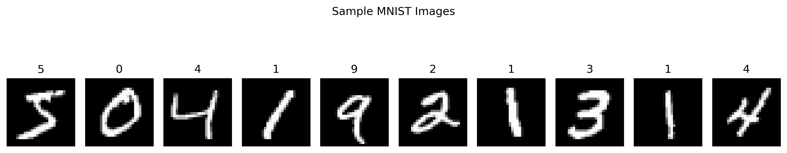
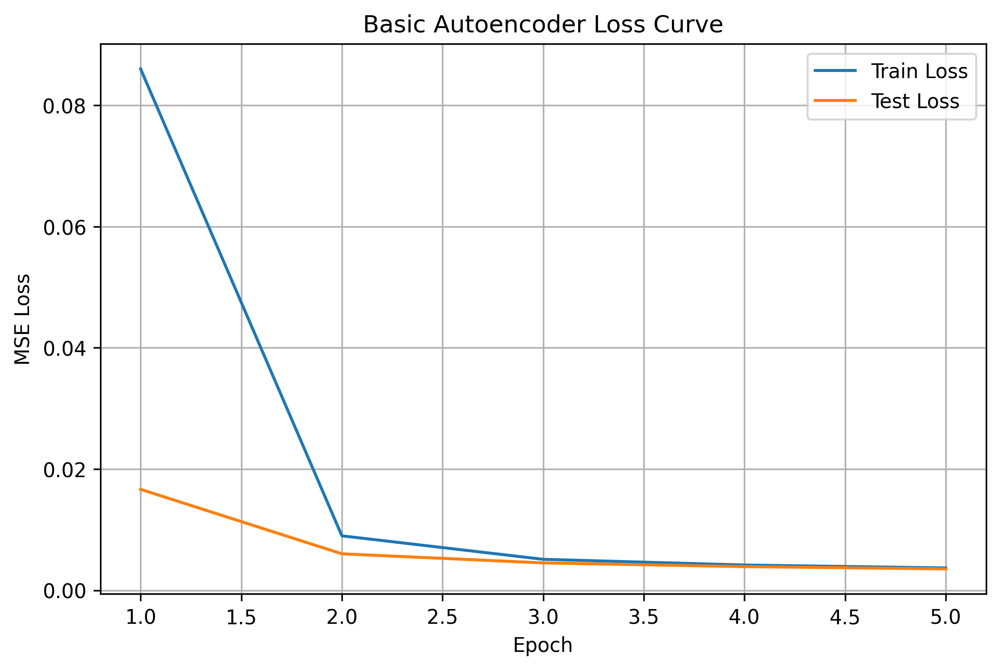
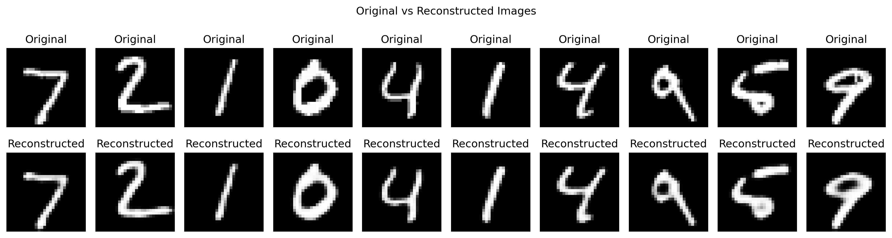
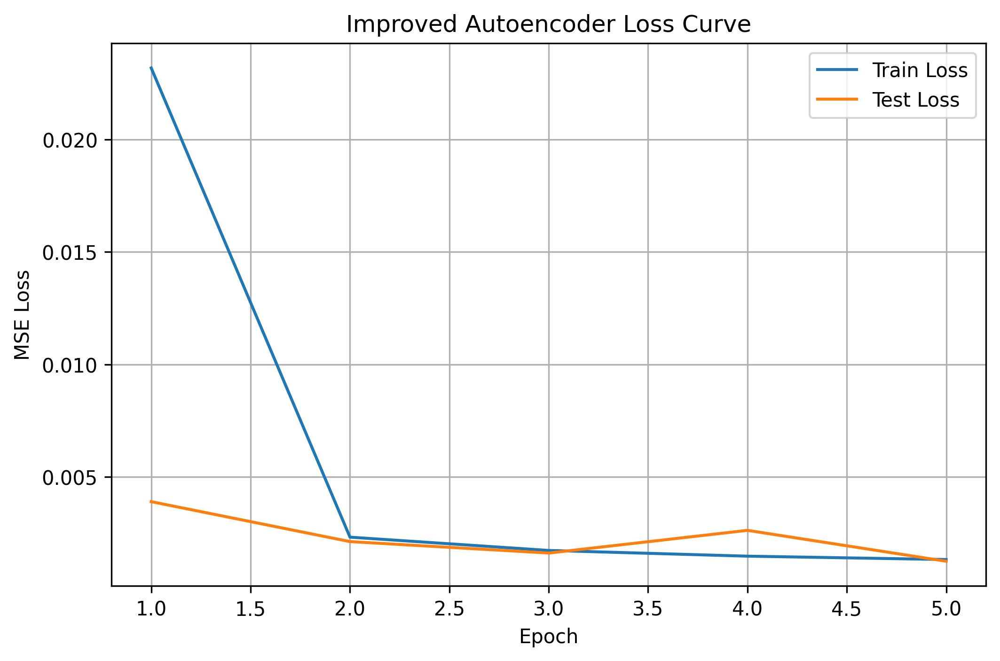
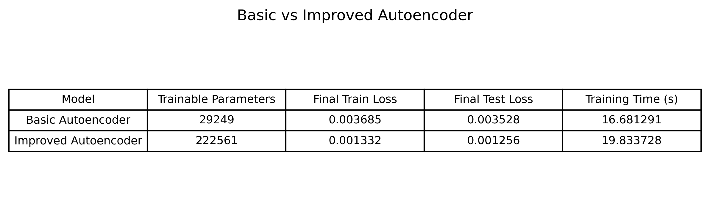
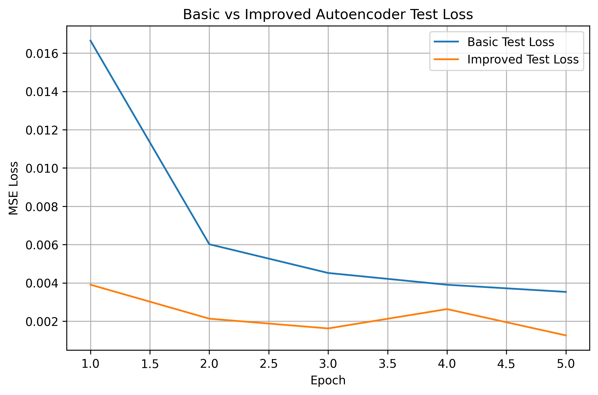

# Tutorial 12 — Basic Autoencoder

## Overview

This tutorial focuses on implementing a basic autoencoder using the MNIST dataset. The original tutorial used TensorFlow/Keras, but the implementation was completed in PyTorch.

The main purpose of this tutorial was to understand how an autoencoder compresses an input image into a smaller representation and then reconstructs the original image from that compressed representation.

## Objectives

The main objectives of this tutorial were:

- Understand the architecture of a basic autoencoder
- Load and preprocess the MNIST dataset
- Build a convolutional autoencoder
- Train the autoencoder to reconstruct input images
- Visualize original and reconstructed images
- Improve the model by changing the architecture

## Dataset

The MNIST dataset was used for this tutorial. It contains grayscale handwritten digit images.

Each image has a size of 28 × 28 pixels.

The pixel values were normalized to the range 0 to 1 using `transforms.ToTensor()`.

## MNIST Sample Images

The sample images show handwritten digits from the MNIST dataset. These images were used as both the input and the target output for the autoencoder.

## Autoencoder Concept

An autoencoder has two main parts:

### Encoder

The encoder compresses the input image into a smaller latent representation.

### Decoder

The decoder reconstructs the original image from the compressed representation.

The model is trained by comparing the reconstructed image with the original input image. The goal is to reduce reconstruction error.

## Basic Autoencoder Model

The basic autoencoder used convolutional layers in the encoder and transposed convolutional layers in the decoder.

The encoder compressed the MNIST image, while the decoder reconstructed it back to the original 28 × 28 shape.

Mean Squared Error loss was used because the model was trying to reconstruct pixel values.

## Basic Autoencoder Loss Curve

The basic autoencoder loss decreased strongly during training.

The training loss dropped quickly after the first epoch, showing that the model learned the basic structure of MNIST digits. The test loss also decreased smoothly, which shows that the model was able to generalize reasonably well to unseen test images.

By the final epoch, the basic autoencoder reached a final test loss of 0.003528.

## Basic Autoencoder Reconstructions

The reconstructed images from the basic autoencoder were similar to the original MNIST digits.

However, some reconstructed digits may appear slightly blurred. This is expected because the encoder compresses the image into a smaller representation, and some fine details can be lost during reconstruction.

## Improved Autoencoder Model

The improved autoencoder was created to increase reconstruction quality.

The improved architecture used:

- More convolutional layers
- More feature channels
- Batch normalization
- A deeper encoder
- A deeper decoder

This increased the model capacity and allowed the autoencoder to learn better image representations.

## Improved Autoencoder Loss Curve

The improved autoencoder also showed a strong reduction in loss.

The test loss became much lower than the basic model. There was a small fluctuation around epoch 4, but the final test loss still decreased to 0.001256.

This shows that the improved model reconstructed the MNIST images more accurately than the basic autoencoder.

## Improved Autoencoder Reconstructions

The improved model produced clearer reconstructed images compared to the basic model.

The digit shapes were better preserved, and the reconstructed images were closer to the original inputs. This shows that the deeper architecture helped improve reconstruction quality.

## Basic vs Improved Autoencoder Comparison

The comparison table shows the difference between the basic and improved autoencoders.

The basic autoencoder had 29,249 trainable parameters, while the improved autoencoder had 222,561 trainable parameters.

The final results were:

- Basic Autoencoder final test loss: 0.003528
- Improved Autoencoder final test loss: 0.001256

The improved autoencoder achieved a much lower reconstruction loss, but it also required more trainable parameters and slightly more training time.

## Basic vs Improved Test Loss

The test loss comparison shows that the improved autoencoder performed better across the training process.

The improved model had lower test loss from the first epoch and finished with a much smaller error. This confirms that the deeper architecture improved reconstruction quality.

## Key Observations

- The basic autoencoder successfully learned to reconstruct MNIST digits.
- The loss decreased smoothly during training.
- The reconstructed images from the basic model were understandable but slightly blurred.
- The improved autoencoder achieved lower training and test loss.
- Adding more convolutional layers and batch normalization improved reconstruction quality.
- The improved model had more trainable parameters, so it required more computation.
- The final test loss improved from 0.003528 to 0.001256.
- The improved model gave better reconstruction results than the basic model.

## Conclusion

This tutorial helped in understanding how autoencoders work for image reconstruction.

The basic autoencoder was able to compress and reconstruct MNIST digits, but the improved autoencoder performed better. By adding more layers, more channels, and batch normalization, the model achieved lower reconstruction loss and produced clearer reconstructed images.

Overall, the improved autoencoder showed that increasing model capacity can improve reconstruction quality, but it also increases the number of trainable parameters and training time.
