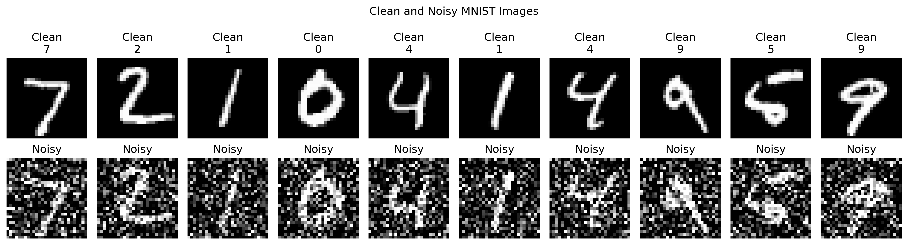
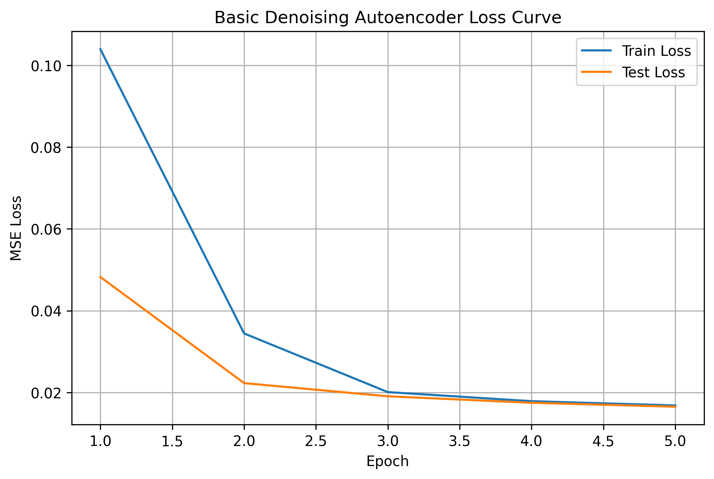
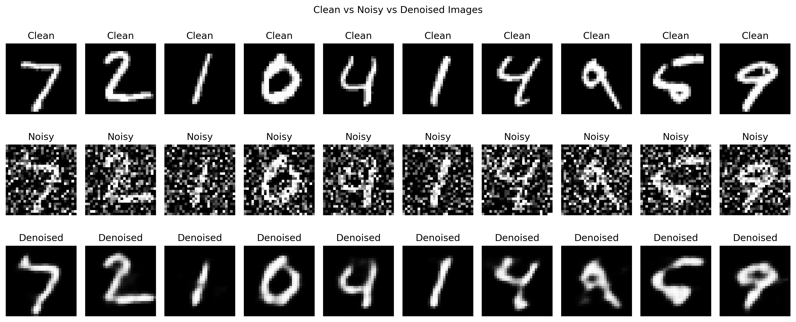
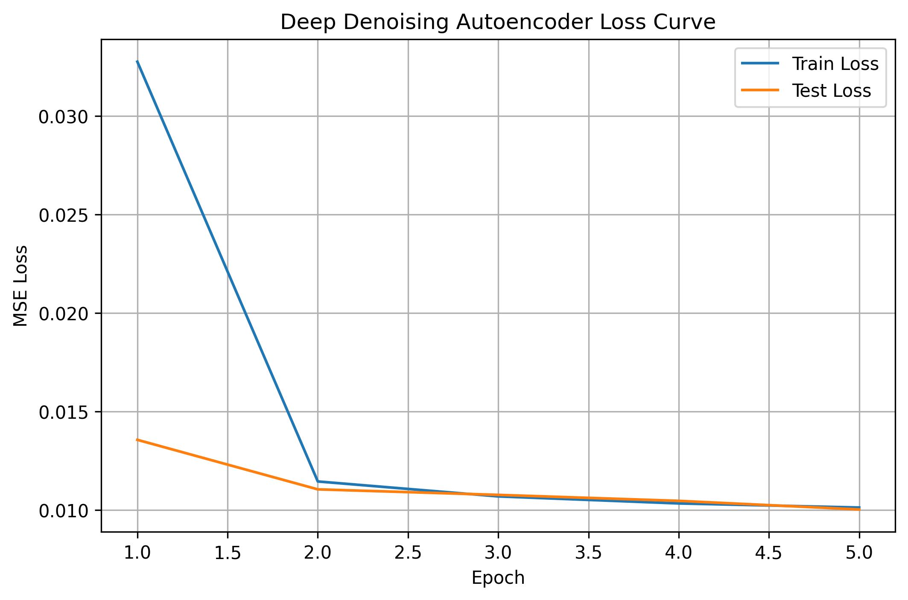
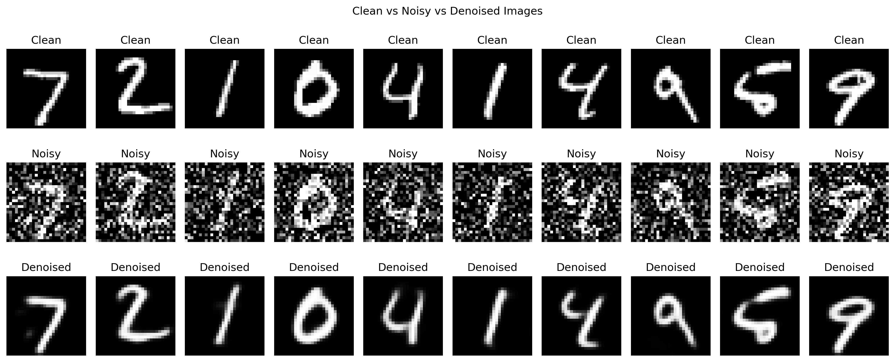
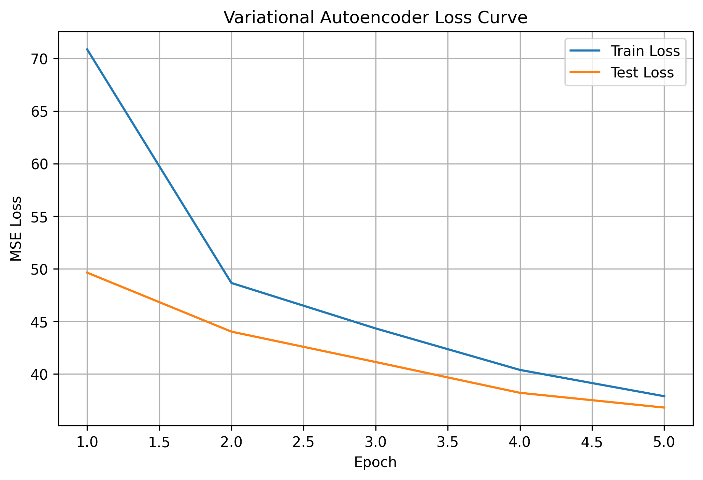
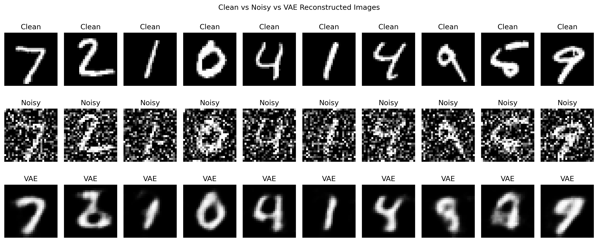
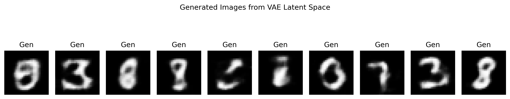
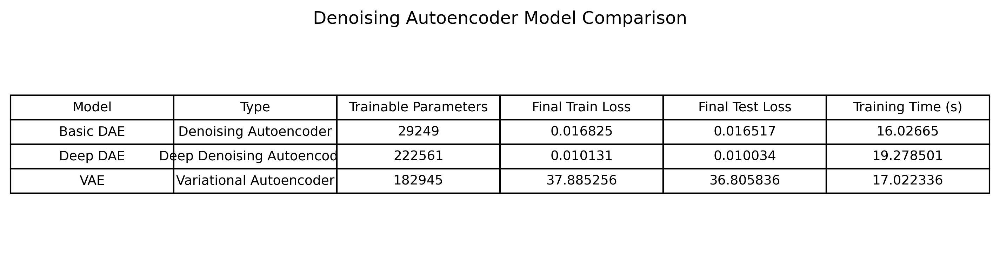
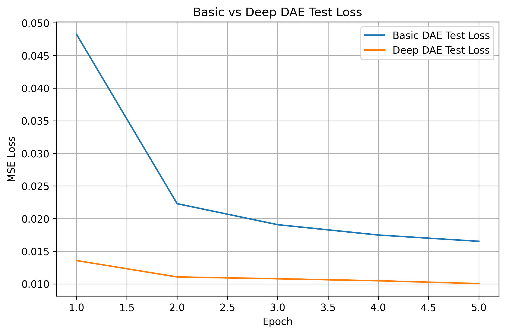

# Tutorial 13 — Denoising Autoencoder

## Overview

This tutorial focuses on implementing denoising autoencoders using the MNIST dataset. The original tutorial used TensorFlow/Keras, but the implementation was completed in PyTorch.

The main purpose of this tutorial was to understand how an autoencoder can reconstruct clean images from noisy input images. Unlike a basic autoencoder, a denoising autoencoder receives corrupted input and learns to recover the original clean image.

## Objectives

The main objectives of this tutorial were:

- Understand the architecture of denoising autoencoders
- Load and preprocess the MNIST dataset
- Add random noise to clean images
- Train a model to reconstruct clean images from noisy inputs
- Visualize clean, noisy, and denoised images
- Implement a deep autoencoder
- Implement a variational autoencoder

## Dataset

The MNIST dataset was used for this tutorial. It contains grayscale handwritten digit images.

Each image has a size of 28 × 28 pixels.

The images were normalized to the range 0 to 1. Random Gaussian noise was then added to the clean images to create noisy input images.

## Clean and Noisy Images

The first row shows clean MNIST digits, while the second row shows the same digits after adding random noise.

The noise makes the digits harder to recognize, so the model has to learn the important digit structure while ignoring random pixel corruption.

## Denoising Autoencoder Concept

A denoising autoencoder has two main parts:

### Encoder

The encoder compresses the noisy input image into a smaller feature representation.

### Decoder

The decoder reconstructs the clean image from the compressed representation.

The model is trained using:

- Input: noisy image
- Target: clean image

This forces the model to learn useful features instead of simply copying the input.

## Basic Denoising Autoencoder

The basic denoising autoencoder used convolutional layers for encoding and transposed convolutional layers for decoding.

The model learned to remove noise and reconstruct the original MNIST digits.

## Basic Denoising Autoencoder Loss

The basic denoising autoencoder loss decreased during training. The training loss and test loss both reduced steadily, showing that the model learned to reconstruct clean images from noisy inputs.

The final test loss of the basic denoising autoencoder was 0.016517.

## Basic Denoising Results

The basic model removed a large amount of noise from the input images. The reconstructed digits are much cleaner than the noisy images.

However, the outputs are slightly blurred compared to the original clean digits. This is expected because the model compresses the image and loses some fine details during reconstruction.

## Deep Denoising Autoencoder

The task required implementing a deep autoencoder. For this, a deeper denoising autoencoder was created.

The deep model used:

- More convolutional layers
- More feature channels
- Batch normalization
- A deeper encoder
- A deeper decoder

This increased the model capacity and allowed it to learn better representations for denoising.

## Deep Denoising Autoencoder Loss

The deep denoising autoencoder achieved a lower loss than the basic model.

The loss decreased smoothly, and the final test loss reached 0.010034. This is better than the basic model's final test loss of 0.016517.

## Deep Denoising Results

The deep denoising autoencoder produced clearer reconstructed images compared to the basic denoising autoencoder.

The digit shapes are better preserved, and the noise is removed more effectively. Some blurring is still present, but the results are visually closer to the original clean images.

## Variational Autoencoder

The second task required implementing a variational autoencoder.

A VAE is different from a normal autoencoder because it learns a probabilistic latent space. Instead of encoding the image into one fixed representation, the encoder predicts:

- Mean vector
- Log variance vector

A latent vector is then sampled using the reparameterization trick.

## VAE Loss

The VAE loss also decreased during training. However, the VAE loss values are much larger than the normal autoencoder losses because the VAE loss includes both reconstruction loss and KL divergence.

Therefore, the VAE loss should not be directly compared with the MSE loss of the basic and deep denoising autoencoders.

## VAE Denoising Results

The VAE was able to reconstruct the general shape of the digits from noisy images.

However, the VAE reconstructions are more blurred compared to the deep denoising autoencoder. This happens because the VAE learns a smoother probabilistic latent space, which is useful for generation but can reduce sharp reconstruction detail.

## VAE Generated Samples

The VAE was also used to generate new digit-like images from random latent vectors.

The generated samples show that the VAE learned a meaningful latent representation of MNIST digits. Some generated images are not perfectly clear, but they resemble handwritten digit patterns.

## Model Comparison

The comparison table shows the results for the three models:

- Basic DAE
- Deep DAE
- VAE

The basic denoising autoencoder had 29,249 trainable parameters and achieved a final test loss of 0.016517.

The deep denoising autoencoder had 222,561 trainable parameters and achieved a final test loss of 0.010034.

The VAE had 182,945 trainable parameters and achieved a final test loss of 36.805836. This value is larger because the VAE loss includes KL divergence and uses a different loss scale.

## Basic vs Deep DAE Loss

The loss comparison shows that the deep denoising autoencoder performed better than the basic denoising autoencoder.

The deep DAE had a lower test loss from the first epoch and continued to stay lower throughout training. This confirms that the deeper architecture improved denoising performance.

## Key Observations

- Adding random noise made the input images harder to recognize.
- The basic denoising autoencoder successfully removed much of the noise.
- The basic model reconstructed readable digits, but the outputs were slightly blurred.
- The deep denoising autoencoder achieved lower test loss than the basic model.
- The deep model produced clearer and more accurate denoised images.
- The VAE learned a probabilistic latent space.
- VAE outputs were more blurred, but the model could also generate new digit-like samples.
- The VAE loss scale is different from the DAE loss because it includes KL divergence.
- The best reconstruction performance came from the deep denoising autoencoder.

## Conclusion

This tutorial helped in understanding how denoising autoencoders reconstruct clean images from noisy inputs.

The basic denoising autoencoder worked successfully, but the deep denoising autoencoder gave better results with lower test loss and clearer reconstructions.

The variational autoencoder added a generative component by learning a probabilistic latent space. Although its reconstructions were blurrier, it was able to generate new digit-like images.

Overall, the deep denoising autoencoder gave the best denoising performance, while the VAE demonstrated how autoencoders can also be used for image generation.
