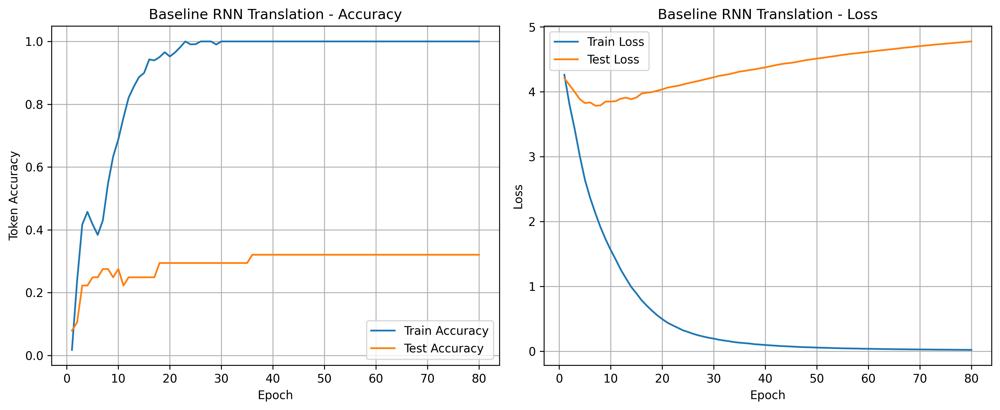
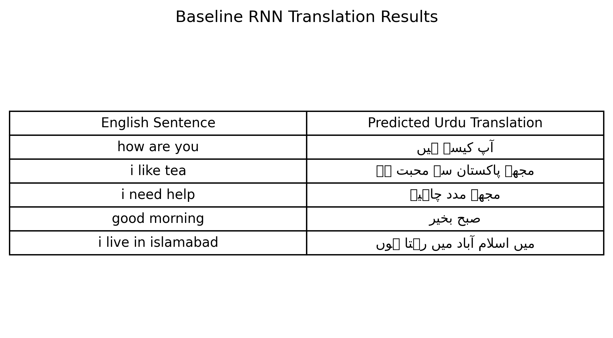
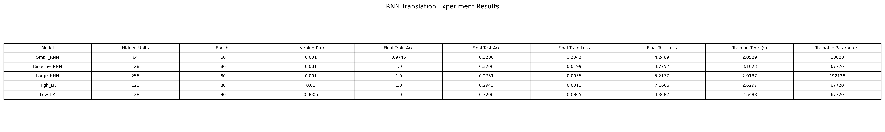
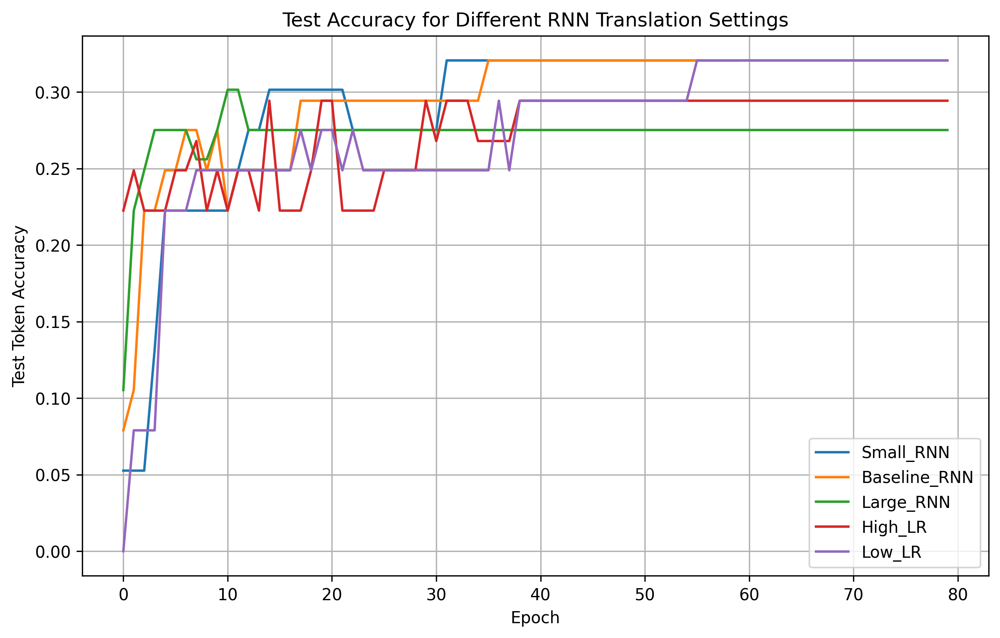
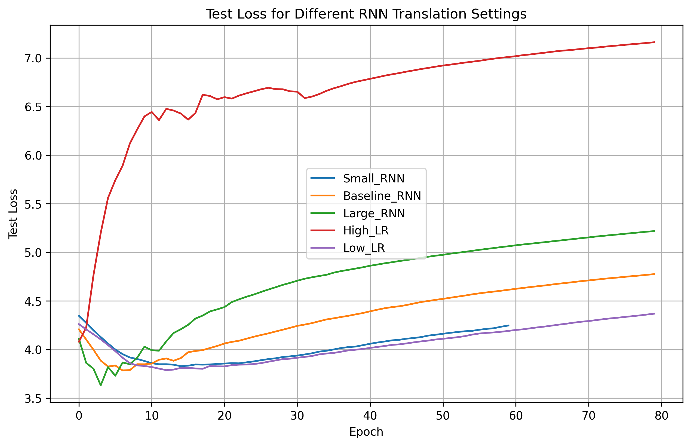
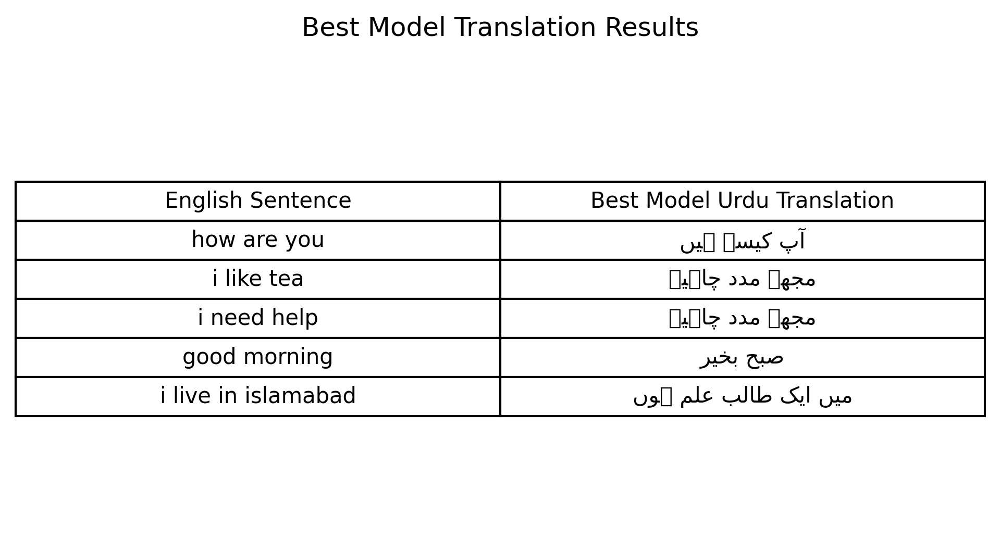
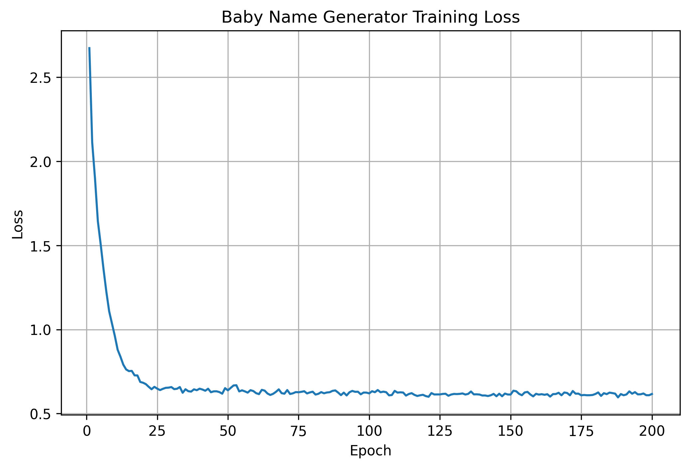
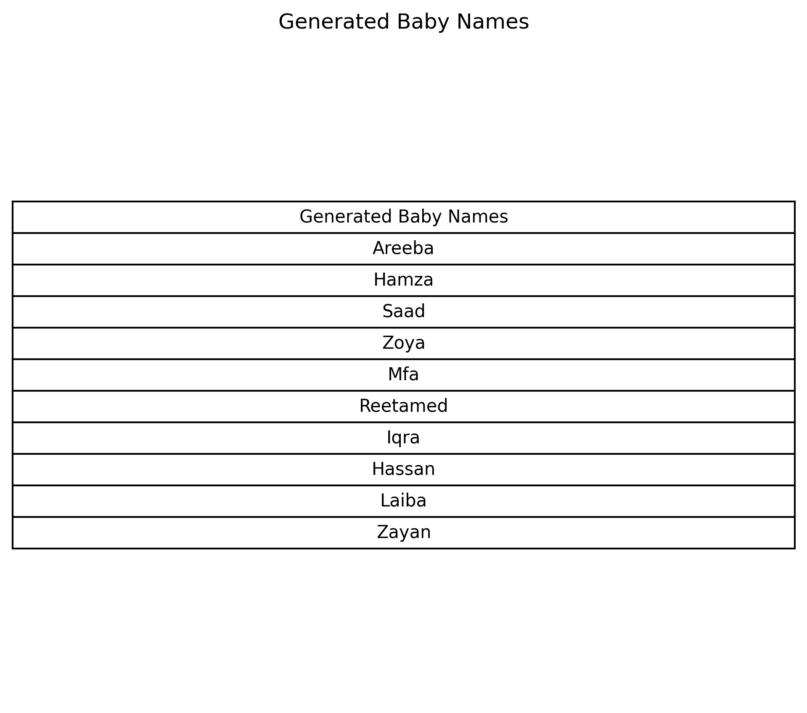

# Tutorial 14_B — English to Urdu Translation using RNN

## Overview

This tutorial focuses on building an RNN-based English to Urdu translation model. The original tutorial used TensorFlow/Keras, but the implementation was completed in PyTorch.

The purpose of this tutorial was to understand how an encoder-decoder RNN can be used for sequence-to-sequence translation. The tutorial also included experiments with hidden units, epochs, and learning rate, along with a one-to-many RNN model for baby name generation.

## Objectives

The main objectives of this tutorial were:

- Understand the architecture of RNN
- Prepare an English–Urdu sentence-pair dataset
- Tokenize English and Urdu sentences
- Build an encoder-decoder RNN model
- Train the model for translation
- Generate Urdu translations for English sentences
- Change hidden units, epochs, and learning rate
- Develop a one-to-many RNN model for baby name generation

## Dataset

A small custom English–Urdu dataset was created inside the notebook.

Each data sample contained:

- English sentence
- Corresponding Urdu sentence

Example:

English: how are you  
Urdu: آپ کیسے ہیں

The dataset was small, so the model was mainly used to demonstrate the translation workflow rather than produce production-level translation results.

## Data Preprocessing

The English sentences were tokenized by splitting words. Urdu sentences were also tokenized using spaces.

Special tokens were added:

- `<PAD>` for padding
- `<SOS>` for start of sentence
- `<EOS>` for end of sentence
- `<UNK>` for unknown words

Separate vocabularies were created for English and Urdu. The sentences were then converted into integer sequences and padded to the same length.

## Encoder-Decoder RNN Model

The translation model used an encoder-decoder architecture.

### Encoder

The encoder reads the English input sentence and converts it into a hidden representation.

### Decoder

The decoder uses the encoder hidden state and generates the Urdu translation one token at a time.

This structure is useful for sequence-to-sequence tasks because both the input and output are text sequences.

## Baseline RNN Training Curves

The baseline model quickly learned the training data.

The training accuracy reached 1.0 and the training loss became very low. However, the test accuracy stayed around 0.32, and the test loss increased during later epochs.

This shows clear overfitting. The model memorized the small training dataset but did not generalize well to unseen test sentences.

## Baseline Translation Results

The baseline model generated Urdu translations for test English sentences.

Some translations were partially correct. For example, `good morning` was translated correctly as:

صبح بخیر

However, other translations were inaccurate or mixed with words from other training examples. This happened because the dataset was very small, so the model did not have enough examples to learn proper translation patterns.

Some Urdu characters in the saved table image may still show small box symbols because of font/rendering limitations in matplotlib. The actual notebook text output keeps the Urdu strings correctly.

## Task — Changing Hidden Units, Epochs, and Learning Rate

The tutorial required changing the number of units, epochs, and learning rate.

The following configurations were tested:

- Small_RNN
- Baseline_RNN
- Large_RNN
- High_LR
- Low_LR

## Experiment Results

The results were:

- Small_RNN test accuracy: 0.3206
- Baseline_RNN test accuracy: 0.3206
- Large_RNN test accuracy: 0.2751
- High_LR test accuracy: 0.2943
- Low_LR test accuracy: 0.3206

The Small_RNN, Baseline_RNN, and Low_LR models achieved the highest test accuracy of 0.3206.

The Large_RNN had more trainable parameters but lower test accuracy. This shows that increasing model size did not improve generalization on this small dataset.

The High_LR model also performed slightly worse, which suggests that too high a learning rate can make training less stable.

## Experiment Accuracy Curves

The experiment accuracy curves show that most models reached a low test accuracy range of around 0.27 to 0.32.

The test accuracy improved slightly in the early epochs but then became almost flat. This means the model could only learn limited generalizable translation patterns from the small dataset.

## Experiment Loss Curves

The loss curves showed that training loss decreased strongly, while test loss remained high or increased.

This confirms overfitting. The model learned the training sentence pairs but struggled with unseen test sentences.

## Best Model Translation Results

The best model generated translations for the same test sentences.

The translation for `good morning` remained correct:

صبح بخیر

However, other translations were still not fully accurate. For example, some generated outputs reused words from unrelated training sentences.

This again shows that the model needed a much larger English–Urdu parallel corpus to learn reliable translation.

## One-to-Many RNN for Baby Name Generation

The tutorial also required developing a one-to-many RNN model.

A small baby-name dataset was created. The model was trained at character level, where the input was a starting character and the output was a generated name sequence.

## Baby Name Generator Loss

The baby name generator loss decreased quickly during the early epochs and then stabilized.

This shows that the model learned common character patterns from the baby-name dataset.

## Generated Baby Names

The model generated several baby names, such as:

- Areeba
- Hamza
- Saad
- Zoya
- Iqra
- Hassan
- Laiba
- Zayan

Some generated names were realistic because they were similar to names in the training set. A few outputs were less meaningful, which is expected because the dataset was small and the model was simple.

## Overfitting Analysis

The translation model showed clear overfitting.

The training accuracy became very high, but the test accuracy stayed low. This happened because the English–Urdu dataset contained only a small number of sentence pairs.

For real machine translation, a much larger parallel dataset is required. A Simple RNN also has limitations for translation because it struggles with longer sequences and context.

## Key Observations

- The encoder-decoder RNN model was successfully implemented in PyTorch.
- A custom English–Urdu dataset was created and used for training.
- The model learned the training sentence pairs very well.
- The test accuracy remained low because the dataset was very small.
- Increasing hidden units did not improve performance.
- A higher learning rate did not improve test accuracy.
- The best test accuracy was 0.3206.
- Some translations were partially correct, but many were inaccurate.
- The model clearly overfitted the training data.
- The baby name generator learned character patterns and produced realistic names.
- One-to-many RNN generation worked better than translation because the name-generation task was simpler.

## How to Improve the Translation Model

The translation model can be improved by:

- Using a much larger English–Urdu parallel corpus
- Using LSTM or GRU instead of Simple RNN
- Adding attention mechanism
- Training for more data diversity instead of only more epochs
- Using subword tokenization
- Using pretrained embeddings
- Using a Transformer-based model for real translation

## Conclusion

This tutorial helped in understanding how RNNs can be used for sequence-to-sequence translation and one-to-many generation.

The English–Urdu translation model successfully demonstrated the encoder-decoder workflow, but the small dataset caused overfitting and weak generalization. The model memorized training examples but could not reliably translate unseen sentences.

The baby name generator performed better as a demonstration of one-to-many RNN generation. It learned character-level patterns and generated several realistic baby names.

Overall, this tutorial showed that RNNs can handle sequence tasks, but real translation requires a much larger dataset and more advanced architectures such as LSTM, GRU, attention-based models, or Transformers.
