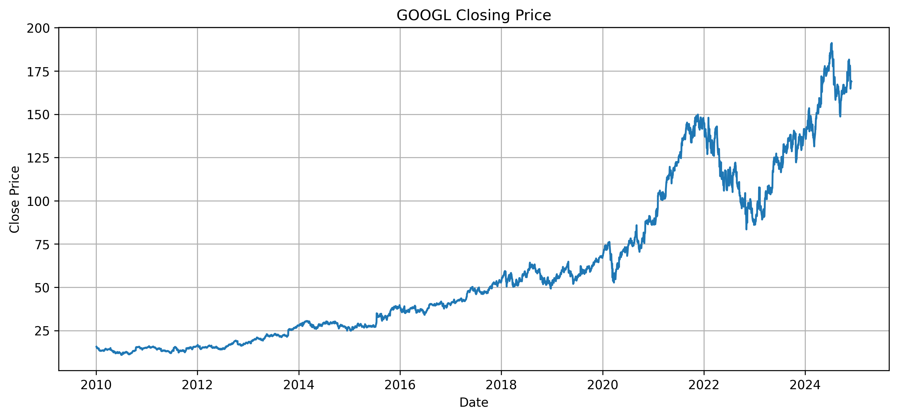
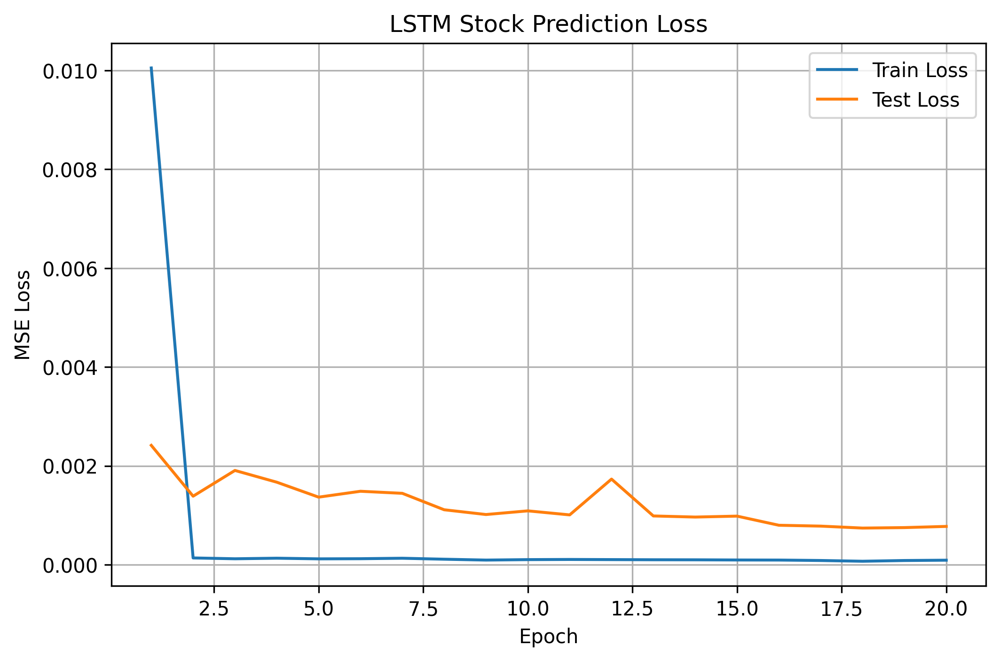
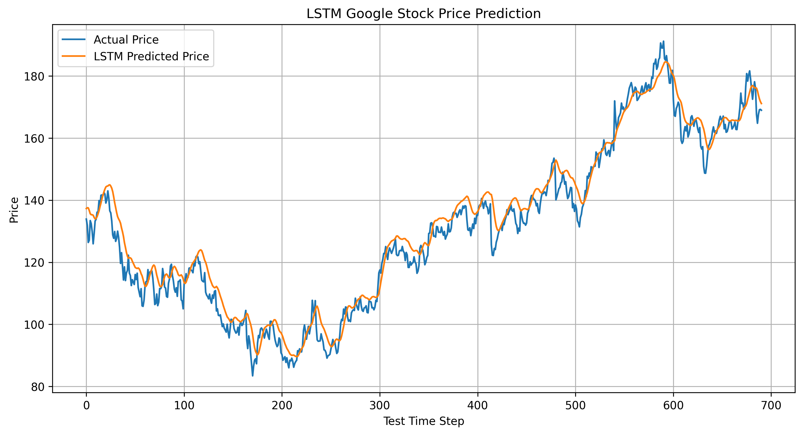
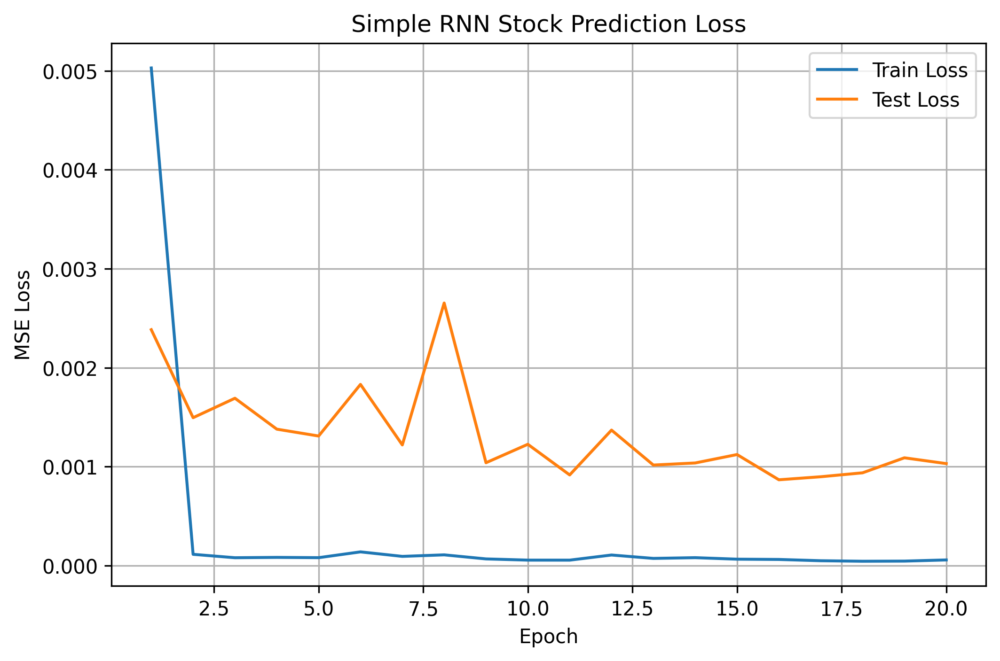
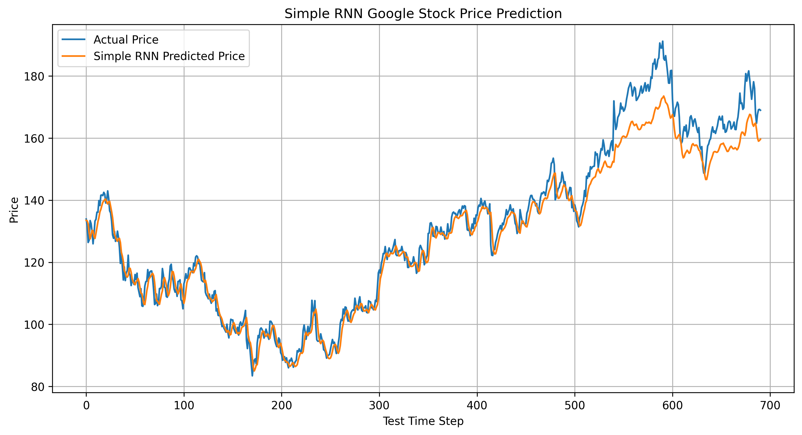
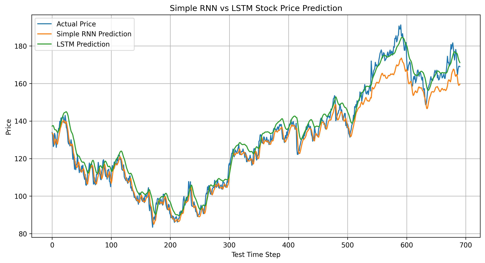
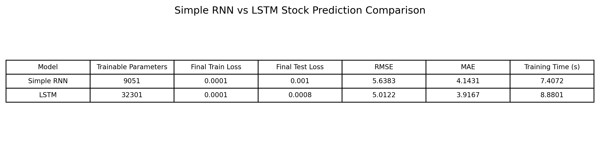
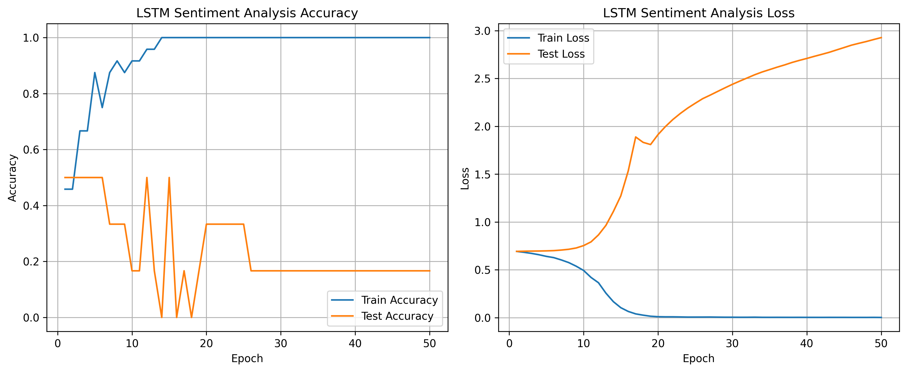
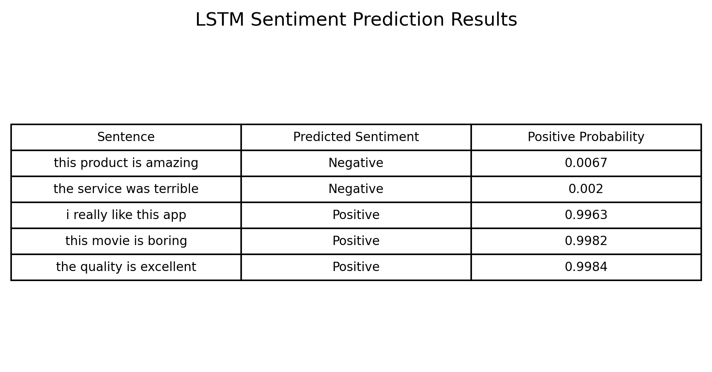

# Tutorial 15 — Long Short-Term Memory (LSTM)

## Overview

This tutorial focuses on implementing Long Short-Term Memory networks using PyTorch. The original tutorial used TensorFlow/Keras, but the implementation was completed in PyTorch.

The main purpose of this tutorial was to understand how LSTM models work with sequential data. The tutorial was divided into two main parts:

- Stock price prediction using LSTM
- Sentiment analysis using LSTM

The tutorial also required comparing LSTM with a Simple RNN.

## Objectives

The main objectives of this tutorial were:

- Understand the architecture of LSTM
- Fetch and preprocess Google stock price data
- Create time-series sequences
- Train an LSTM model for stock price prediction
- Visualize actual vs predicted prices
- Predict the next day's stock price
- Compare LSTM with Simple RNN
- Build an LSTM model for sentiment analysis

## Dataset for Stock Prediction

Google stock closing price data was used for the stock prediction task.

The closing price was selected as the target variable. The data was normalized using MinMaxScaler so that the values were scaled between 0 and 1.

A sequence length of 60 was used. This means the model used the previous 60 days of closing prices to predict the next day's closing price.

## Google Stock Price Data

The stock price plot shows the overall trend of Google stock closing prices over time.

The data contains both upward and downward movements, making it a suitable time-series prediction task.

## LSTM Model

The LSTM model was built for stock price prediction.

The model used:

- LSTM layers
- Fully connected layers
- Mean Squared Error loss
- Adam optimizer

LSTM is suitable for this task because it is designed to handle sequential data and can learn long-term dependencies better than a normal Simple RNN.

## LSTM Training Curves

The LSTM training loss decreased sharply after the first epoch and then remained low.

The test loss also generally decreased, although it showed some fluctuations. This is normal in stock prediction because stock prices are noisy and contain sudden changes.

The final test loss was lower than the initial test loss, showing that the LSTM model learned useful time-series patterns.

## LSTM Stock Price Prediction

The LSTM prediction plot compares the actual stock prices with the predicted stock prices.

The LSTM model followed the overall trend of the actual stock prices. It captured the general upward and downward movements, although the predictions were smoother than the actual price curve.

This smoothing effect is common in time-series prediction because the model learns general trends but may not capture sudden sharp changes perfectly.

## Simple RNN Model

A Simple RNN model was also trained on the same stock price dataset for comparison.

The Simple RNN used the same 60-day input sequence and predicted the next day's closing price.

## Simple RNN Training Curves

The Simple RNN training loss also decreased quickly.

However, the test loss showed more fluctuation compared to the LSTM model. This suggests that the Simple RNN learned the general pattern but was less stable on unseen test data.

## Simple RNN Stock Prediction

The Simple RNN prediction curve followed the general trend of the actual prices, but it was less accurate than the LSTM model.

The Simple RNN prediction was smoother and underestimated some higher price regions.

## Simple RNN vs LSTM Prediction Comparison

The comparison plot shows the actual price, Simple RNN prediction, and LSTM prediction together.

The LSTM prediction followed the actual stock price more closely than the Simple RNN prediction.

The Simple RNN generally stayed lower than the actual price during many higher-price regions, while the LSTM model tracked the price movement better.

## Model Comparison

The comparison table shows the quantitative results.

The Simple RNN results were:

- Trainable parameters: 9,051
- Final test loss: 0.0010
- RMSE: 5.6383
- MAE: 4.1431
- Training time: 7.4072 seconds

The LSTM results were:

- Trainable parameters: 32,301
- Final test loss: 0.0008
- RMSE: 5.0122
- MAE: 3.9167
- Training time: 8.8801 seconds

The LSTM achieved lower RMSE and MAE than the Simple RNN, which means it made better predictions. However, the LSTM had more trainable parameters and required slightly more training time.

## Stock Prediction Observation

The LSTM performed better than the Simple RNN for stock price prediction.

This is expected because LSTM networks are designed to remember longer-term patterns using gates. Simple RNNs have more difficulty learning long-term dependencies and can suffer from vanishing gradient problems.

## LSTM for Sentiment Analysis

The second task was to create an LSTM model for sentiment analysis.

A small custom dataset was created with positive and negative sentences.

The model classified each sentence into one of two classes:

- Positive
- Negative

## Sentiment Analysis Training Curves

The sentiment model quickly reached 100% training accuracy.

However, the test accuracy remained low and unstable. The test loss increased while the training loss decreased.

This indicates clear overfitting. The model memorized the small training dataset but did not generalize well to unseen sentences.

## Sentiment Prediction Results

The sentiment prediction table shows the model predictions on new sentences.

The model correctly predicted some sentences, such as:

- `the service was terrible` as Negative
- `i really like this app` as Positive
- `the quality is excellent` as Positive

However, it made some incorrect predictions:

- `this product is amazing` was predicted as Negative
- `this movie is boring` was predicted as Positive

These incorrect predictions show that the model did not generalize well because the sentiment dataset was very small.

## Overfitting in Sentiment Analysis

The sentiment analysis model overfitted strongly.

The training accuracy reached 1.0, but the test accuracy stayed low. This happened because the model had enough capacity to memorize the small dataset, but the dataset did not contain enough examples for strong generalization.

For better sentiment analysis results, a larger and more diverse dataset is needed.

## Key Observations

- LSTM successfully learned time-series patterns from stock price data.
- The LSTM model followed the actual stock price trend better than the Simple RNN.
- LSTM achieved lower RMSE and MAE than Simple RNN.
- Simple RNN trained slightly faster and had fewer parameters.
- LSTM required more parameters but gave better prediction performance.
- Stock predictions were smoother than actual prices, which is expected in time-series forecasting.
- The sentiment analysis model reached high training accuracy.
- The sentiment model overfitted because the dataset was small.
- Some sentiment predictions were correct, but some were incorrect due to limited training data.
- LSTM is useful for sequence data, but dataset size strongly affects performance.

## How to Improve the Models

The stock prediction model can be improved by:

- Using more features such as Open, High, Low, Volume
- Training for more epochs
- Trying different sequence lengths
- Adding dropout
- Using multiple LSTM layers carefully
- Using GRU or bidirectional LSTM
- Evaluating with more financial indicators

The sentiment analysis model can be improved by:

- Using a larger sentiment dataset
- Adding more positive and negative examples
- Using pretrained word embeddings
- Using LSTM with dropout and regularization
- Using GRU or bidirectional LSTM
- Using a train/validation/test split with more samples

## Conclusion

This tutorial helped in understanding how LSTM networks work with sequential data.

For stock price prediction, the LSTM model performed better than the Simple RNN. It achieved lower RMSE and MAE and followed the actual stock price trend more closely.

For sentiment analysis, the LSTM model successfully learned the training data, but it overfitted because the dataset was small. The results show that LSTM can be used for text classification, but good generalization requires a larger and more diverse dataset.

Overall, the tutorial demonstrated that LSTM models are useful for both time-series prediction and text-based sequence tasks.
