# Tutorial 16 — Generative Adversarial Network (GANs)

## Overview

This tutorial focuses on implementing Generative Adversarial Networks using PyTorch. The original tutorial used PyTorch-style code, and the implementation was completed using PyTorch in a notebook format.

The purpose of this tutorial was to understand how GANs generate new images by training two neural networks together: a generator and a discriminator.

## Objectives

The main objectives of this tutorial were:

- Understand the architecture of GANs
- Load and prepare the MNIST dataset
- Build a generator model
- Build a discriminator model
- Train a GAN using adversarial learning
- Generate new images from random noise
- Change number of epochs and layers
- Replace fully connected layers with convolutional layers
- Train a GAN on augmented images

## Dataset

The MNIST dataset was used for this tutorial.

MNIST contains grayscale handwritten digit images of size 28 × 28 pixels.

The images were normalized to the range `[-1, 1]` because the generator output used a `Tanh` activation function.

## Real MNIST Samples

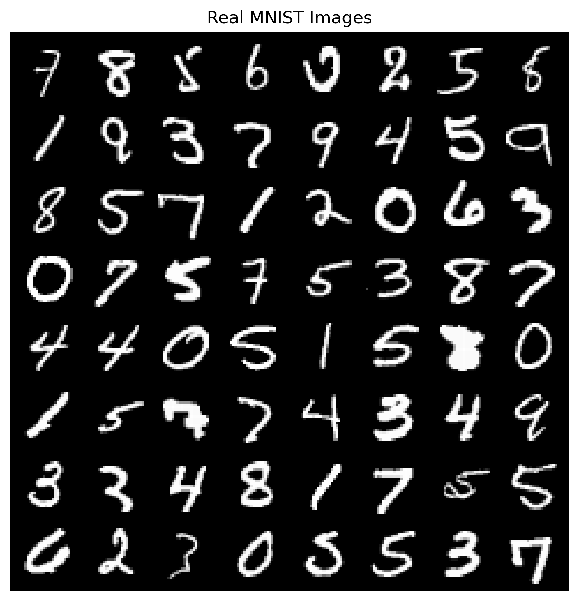

The real MNIST sample image shows the original handwritten digit images used to train the discriminator.

The discriminator uses these real images as positive examples and compares them against fake images produced by the generator.

## GAN Concept

A GAN contains two models:

### Generator

The generator takes random noise as input and tries to create fake images that look like real MNIST digits.

### Discriminator

The discriminator receives an image and predicts whether it is real or fake.

During training:

- The discriminator learns to distinguish real images from generated images.
- The generator learns to fool the discriminator.
- Both models improve through adversarial training.

## Fully Connected GAN

The first model was a basic fully connected GAN.

The generator used linear layers to convert random noise into a 28 × 28 image.

The discriminator used linear layers to classify images as real or fake.

## Fully Connected GAN Loss

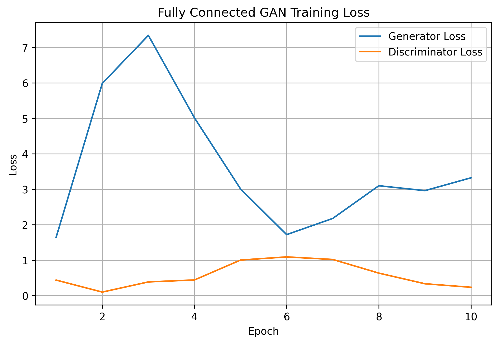

The fully connected GAN loss curves show the adversarial training process.

The generator loss and discriminator loss changed during training because both networks were improving against each other.

In GANs, the loss does not always decrease smoothly like in normal supervised learning. This is expected because the generator and discriminator are competing.

## Fully Connected GAN Generated Images

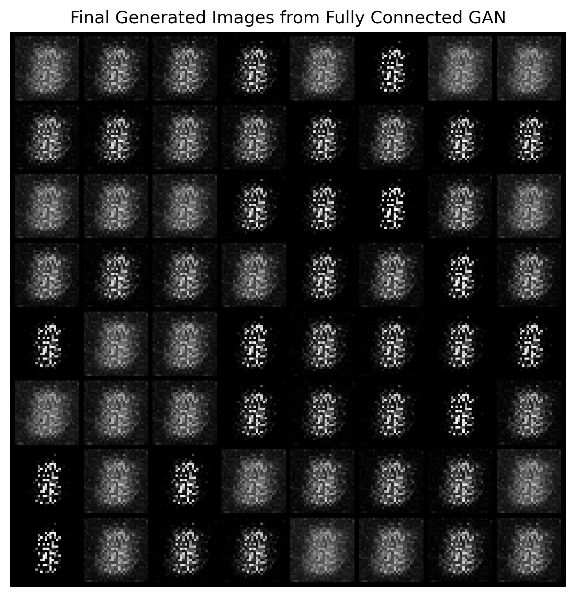

The fully connected GAN generated some digit-like shapes, but the outputs were noisy and repetitive.

Many generated images had similar patterns and did not clearly represent different digits.

This shows that fully connected layers can generate simple image patterns, but they do not preserve spatial structure very well.

## Task 1 — Changing Epochs and Layers

The tutorial required changing the number of epochs and layers.

A deeper fully connected GAN was created by adding more layers and more neurons.

## Deep Fully Connected GAN Loss

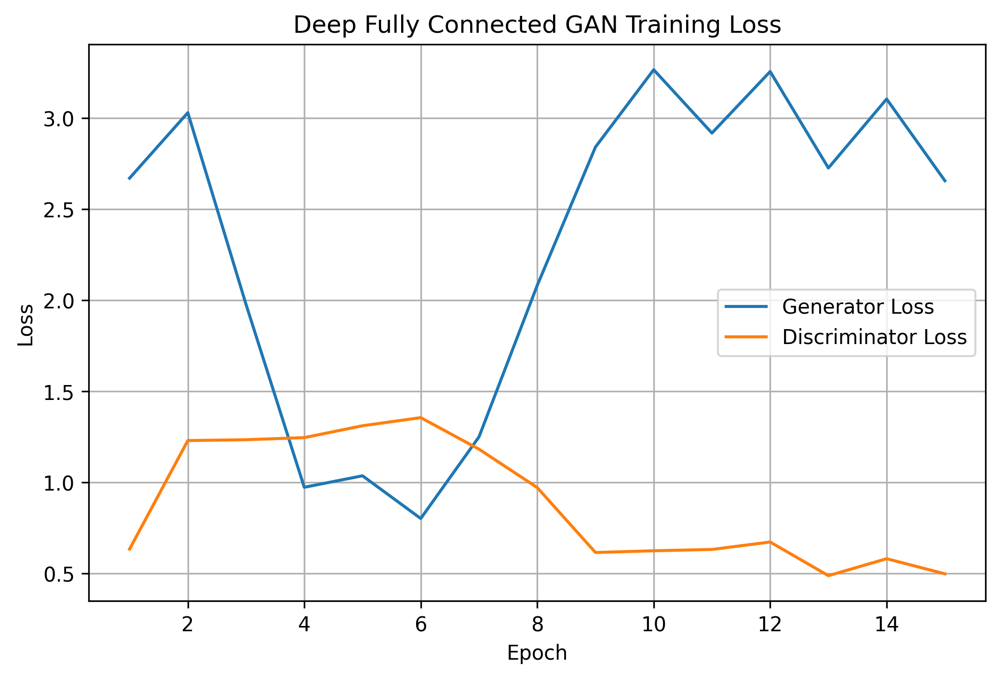

The deep fully connected GAN had a different loss behavior compared to the basic fully connected GAN.

The deeper model had more capacity, but this did not automatically produce better images. GAN training depends on the balance between the generator and discriminator, not only on model size.

## Deep Fully Connected GAN Generated Images

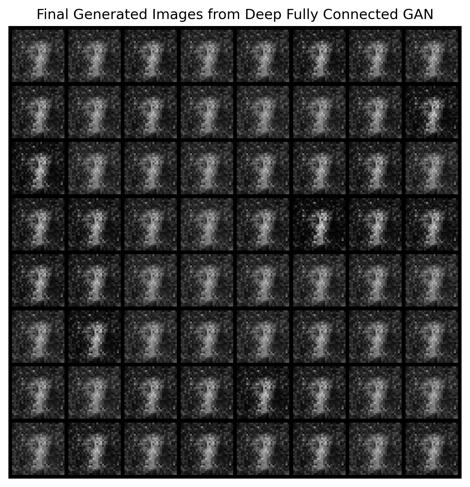

The deep fully connected GAN generated images that were still noisy and repetitive.

Although the model was deeper, the generated images did not improve significantly. Most images looked similar and lacked clear digit diversity.

This shows that simply adding more fully connected layers is not enough for good image generation.

## Task 2 — Replacing Fully Connected Layers with Convolutional Layers

The second task required replacing fully connected layers with convolutional layers.

A DCGAN-style model was implemented.

The generator used transposed convolutional layers to upsample from random noise to an image.

The discriminator used convolutional layers to classify real and fake images.

This architecture is more suitable for images because convolutional layers preserve spatial structure.

## DCGAN Loss

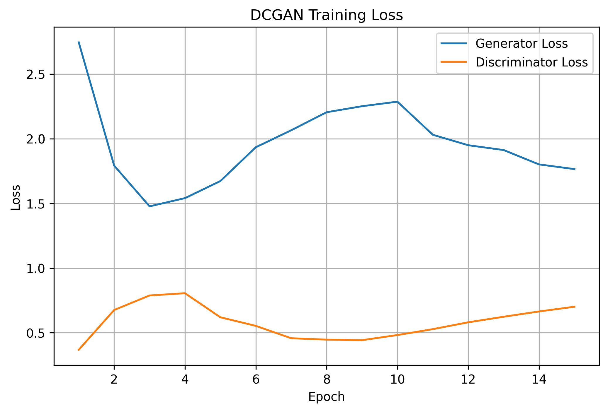

The DCGAN loss curves show the training behavior of the convolutional GAN.

The discriminator loss and generator loss moved against each other during training, which is expected in adversarial learning.

Compared to the fully connected GANs, the DCGAN produced visually better image samples.

## DCGAN Generated Images

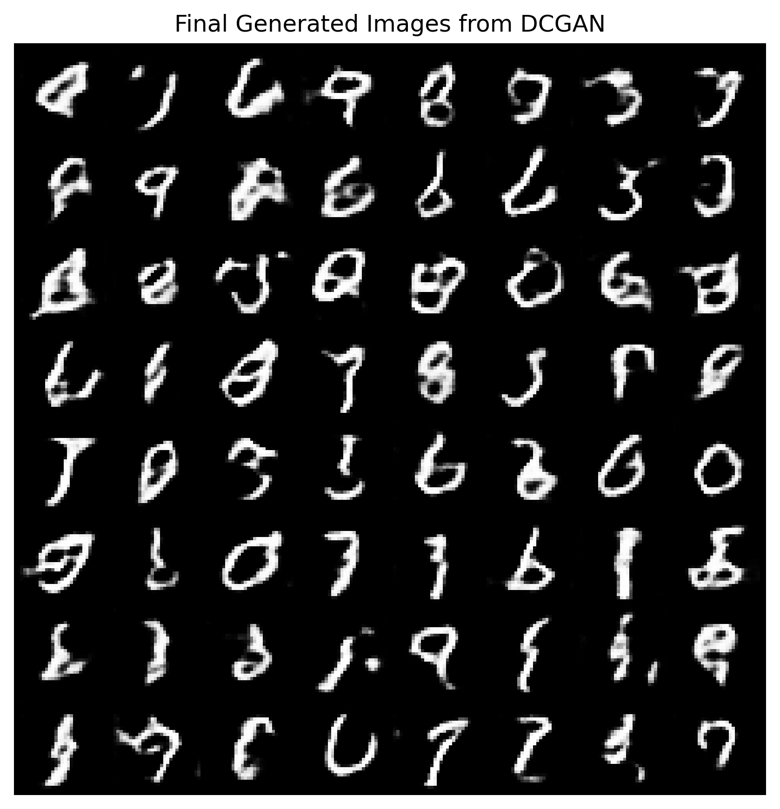

The DCGAN generated clearer digit-like images than the fully connected GANs.

Many generated samples looked like handwritten digits such as 0, 3, 6, 8, or 9.

The images were still not perfect, but the shapes were more recognizable. This confirms that convolutional layers are better suited for image generation.

## Task 3 — GAN for Augmented Images

The third task required developing the model for augmented images from a previous study.

For this, MNIST images were augmented using random affine transformations such as rotation, translation, and scaling.

The DCGAN model was then trained on the augmented MNIST dataset.

## Augmented MNIST Samples

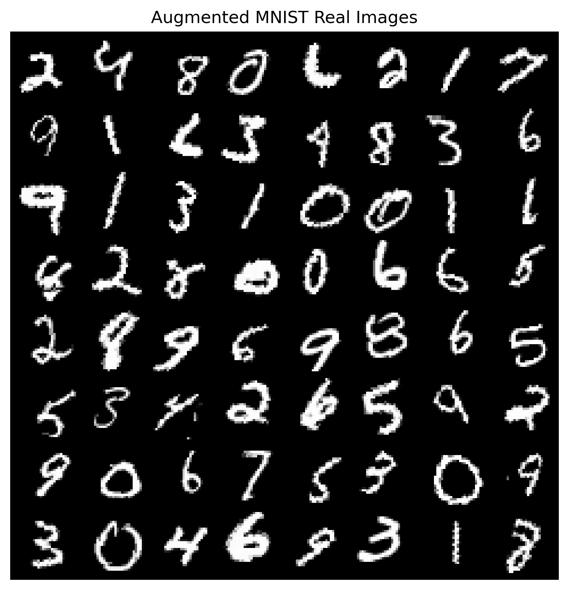

The augmented MNIST samples show transformed versions of handwritten digits.

The digits have different positions, rotations, and scales. This increases variation in the training data.

## Augmented DCGAN Loss

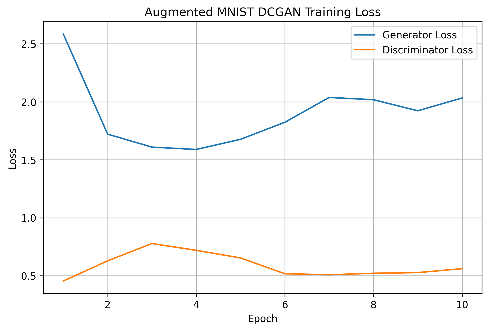

The augmented DCGAN loss curves show the training behavior on augmented images.

Since augmented data has more variation, the generator has a harder task compared to normal MNIST.

The loss curves show that the generator and discriminator continued to compete during training.

## Augmented DCGAN Generated Images

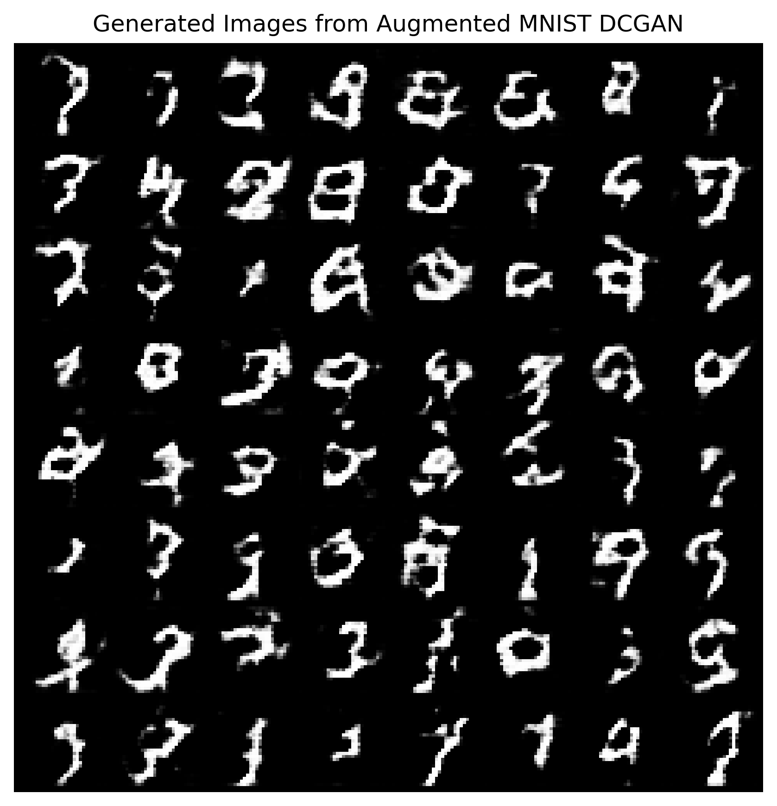

The augmented DCGAN generated digit-like images with more variation in shape and orientation.

Some outputs were recognizable as digits, while others were distorted. This is expected because the model was trained on augmented images that included transformations.

The augmented DCGAN produced more varied samples than the fully connected GANs.

## GAN Model Comparison

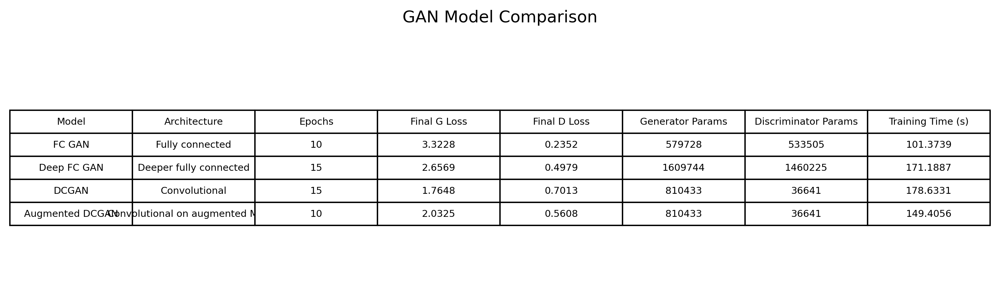

The comparison table summarizes all four GAN models.

The results were:

- FC GAN:
  - Epochs: 10
  - Final generator loss: 3.3228
  - Final discriminator loss: 0.2352
  - Generator parameters: 579,728
  - Discriminator parameters: 533,505

- Deep FC GAN:
  - Epochs: 15
  - Final generator loss: 2.6569
  - Final discriminator loss: 0.4979
  - Generator parameters: 1,609,744
  - Discriminator parameters: 1,460,225

- DCGAN:
  - Epochs: 15
  - Final generator loss: 1.7648
  - Final discriminator loss: 0.7013
  - Generator parameters: 810,433
  - Discriminator parameters: 36,641

- Augmented DCGAN:
  - Epochs: 10
  - Final generator loss: 2.0325
  - Final discriminator loss: 0.5608
  - Generator parameters: 810,433
  - Discriminator parameters: 36,641

The DCGAN had the lowest final generator loss among the tested models and produced the most recognizable digit-like images.

## Generator Loss Comparison

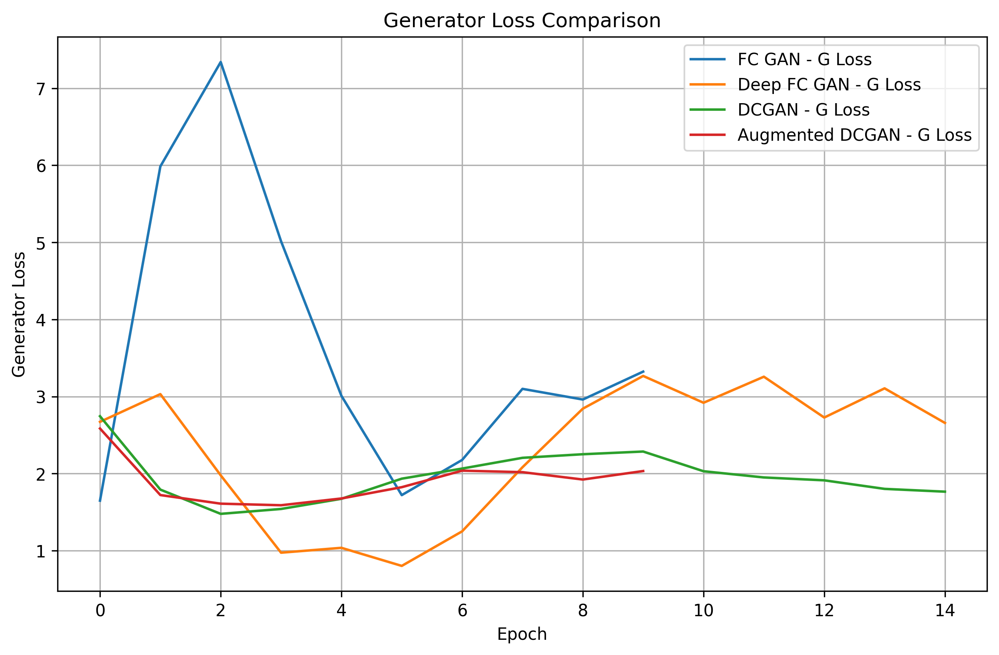

The generator loss comparison shows how the generator loss changed for each GAN model.

The DCGAN reached a lower generator loss than the fully connected models. This supports the visual result that the DCGAN generated better digit-like samples.

## Discriminator Loss Comparison

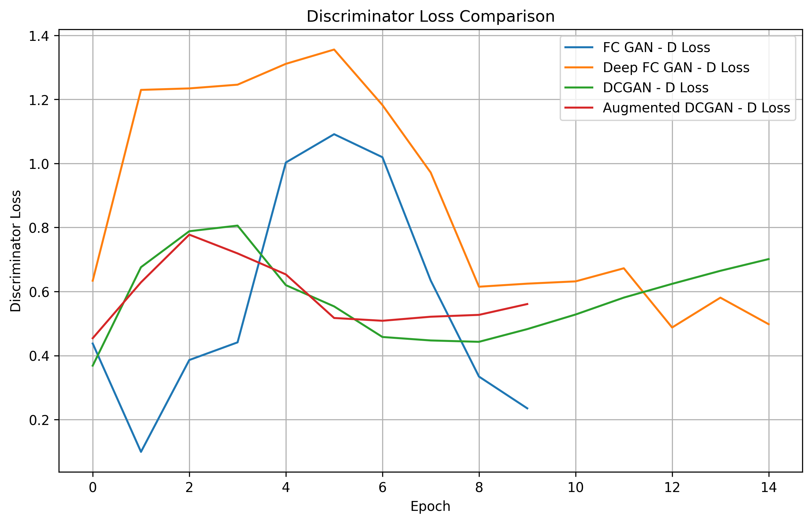

The discriminator loss comparison shows how well the discriminator separated real and fake images.

In GANs, a very low discriminator loss can mean the discriminator is too strong and the generator is struggling. A more balanced discriminator loss can indicate healthier adversarial training.

## Key Observations

- The fully connected GAN generated noisy and repetitive digit-like images.
- Increasing layers in the fully connected GAN increased model capacity but did not significantly improve visual quality.
- The DCGAN generated clearer and more recognizable digits.
- Convolutional layers worked better than fully connected layers for image generation.
- The augmented DCGAN generated more varied but sometimes more distorted images.
- GAN losses do not behave like normal supervised learning losses.
- GAN training depends on maintaining balance between generator and discriminator.
- The DCGAN gave the best overall visual result among the tested models.

## How to Improve the GAN Models

The GAN results can be improved by:

- Training for more epochs
- Using a larger dataset instead of a subset
- Using better DCGAN architecture
- Adding batch normalization carefully
- Tuning learning rate
- Using label smoothing
- Using LeakyReLU in the generator/discriminator
- Using Wasserstein GAN or Least Squares GAN
- Saving generated samples at more epochs to observe progression

## Conclusion

This tutorial helped in understanding how GANs generate new images.

The basic fully connected GAN was able to produce some digit-like patterns, but the results were noisy and repetitive. The deeper fully connected GAN increased the number of parameters, but it still did not generate high-quality digits.

The DCGAN performed better because convolutional layers are more suitable for image generation. It produced clearer and more recognizable handwritten digit-like images.

The augmented DCGAN showed that GANs can also be trained on augmented images, although the generated results became more varied and sometimes distorted.

Overall, this tutorial showed that GANs are powerful generative models, but they are harder to train than normal supervised models and require careful architecture and parameter tuning.
